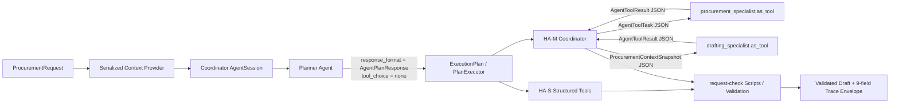

# First Task Architecture

確認日: 2026-08-29
対象: Repository scaffoldからHosted Agent Local / DevUI scaffoldまで

## 実行構成

### Plan generation boundary

`AgentPlanResponse(BaseModel)`だけをPlanner Invocationの`response_format`へ指定します。この
InvocationにはToolを登録せず、`tool_choice=none`を固定します。後続のTool実行は別Invocation
とapplication-owned loopで行うため、Structured outputとTool callが同じmodel turnで競合しません。

Modelが設定できるのは承認済みStepの`step_id`、`step_type`、`owner`、`input_refs`です。
status、attempt、timestamps、evidence、completionはModelから受け取りません。

| Structured result | Behavior |
|---|---|
| Valid approved sequence | `MODEL_STRUCTURED` |
| `{}`または`steps=[]` | `EMPTY_RESPONSE_FALLBACK` + warning |
| Schema/order/owner mismatch | deterministic template + warning |
| Plannerを使用しない | `DETERMINISTIC_DEFAULT` |

新規Planとresumeは別APIです。新規Planではselected item、evidence、draft、completed-step keyを
消去します。これにより空のmodel resultから古いSession値を再利用しません。

### Plan execution

`PlanExecutor`が`plan_version + step_id + input_hash`をidempotency keyとして保持します。
同じkeyの再実行は`DuplicateStepSuppressed`です。User入力が変わると宣言済み`input_refs`から
影響Stepと下流Stepだけを`INVALIDATED`にし、Plan versionを上げて再実行します。

不足情報は`WAITING_USER`です。Framework `AgentSession.to_dict()`でProvider stateをserializeし、
別のFactory instanceで`from_dict()`した後、application `AgentSession.restore()`から再開できます。

## Hosted Single

`hosted-procurement-single`が8つの論理Toolを持ちます。検索結果から商品コードを選択した後、
`get_catalog_item`のStructured outputでコードと単価を確定します。合計は許可済み
`calculate_request.py`、最終検証は`validate_request.py`の出力だけを使用します。

## Hosted Multi

CoordinatorのToolは次の2つだけです。

- `procurement_specialist.as_tool(propagate_session=False)`
- `drafting_specialist.as_tool(propagate_session=False)`

Coordinator Sessionが正本です。子Agentへ親Sessionを渡さず、Pydantic
`AgentToolTask`内の`ProcurementContextSnapshot`だけを入力します。戻り値の
`AgentToolResult`をSchema検証してからmergeし、Coordinatorが決定論的な最終検証を行います。
`propagate_session=True`は選択肢にしていません。

## Skill execution

Agent Framework `SkillsProvider.from_paths()`へ`AllowlistedSkillScriptRunner`を登録します。
runnerは2本の絶対パスだけを許可し、shellを使わず、JSON stdin/stdout、5秒timeout、最小環境で
subprocess実行します。HA-S/HA-Mの正常系もこのrunnerを経由します。

## Governance

Agent Governance Toolkit `PolicyEngine`を`GovernanceMiddleware`へ接続します。application loopは
`pre_input`、`pre_tool`、`post_tool`、`pre_output`を必ず通り、各decisionのpolicy version、
rule ID、stage、outcome、role、tool、plan/stepをSessionとSpanへ記録します。

defaultは`shadow`です。Hard Gate testは`enforce`を明示します。

## Observability

Spanには観測可能な実行境界、Eventには状態遷移を記録します。隠れた推論は記録しません。
Trace Evaluation Envelopeは次の9 Fieldを独立させます。

1. `user_input`
2. `response`
3. `retrieved_contexts`
4. `system_prompt`
5. `tool_definitions`
6. `tool_calls`
7. `tool_output`
8. `agent_trace`
9. `conversation`

各Run identityは`logical_pattern`、`agent_role`、`agent_definition_id`、
`foundry_resource_id`、`implementation_kind`を分離します。Localでは
`foundry_resource_id=null`です。

## Port boundary

`ProcurementToolPort`の8契約を`LocalJsonAdapter`が実装します。Azure Functions、Foundry
Toolbox/MCP、Azure AI Searchは同じPortへ差し替える前提です。AI Searchを追加しても、商品コード、
単価、納期はStructured get/estimate Toolで確定します。

## Deployment boundary

`procurement-hosted`は現行`ResponsesHostServer`を使うLocal Responses host scaffoldです。
Azure metadata、Bicep/azd、Agent Resource definitionはReview後のTaskへ延期しています。
Azure apply、Role assignment、deployment、deleteは実行していません。

将来のsource-code deploymentは`runtime: python_3_13`を使用します。Local/package metadataも
Python 3.13を基準にし、3.14は互換範囲に含めます。Container方式ではimage側runtimeを選べますが、
同一依存集合を比較できるよう本PoCでは3.13を共通基準とします。
