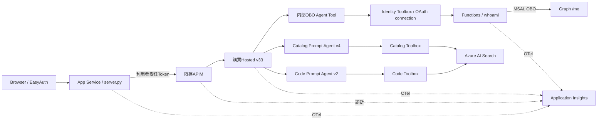

# Plan&Execute購買支援サンプルへのObservability統合ガイド

更新日: **2026-09-08**。対象は最新の作業ツリーと、指定RGへ配備したHosted v33／OAuth Web／OBO Functions。未コミットの実装を含むため、HEADだけでは内容を特定できない。関数・行番号・SHA-256は[ソース索引](source-map.md)を参照する。

今回の実装・配備・実ユーザーのWeb同意／名前表示確認は完了した。Web → APIM → Hosted → Toolbox → Functions → GraphのOBO成功とTrace相関を確認済み。Webからの購買全シナリオ、複数実ユーザー、同意失効後の再実行は未検証である。[検証記録](../report/validation-results-2026-09-08-obo.md)に実測範囲を記載した。

移植先のサンプルソースは未提供である。本書の「Planner」「Executor」「商品検索Tool」「部署検索Tool」は移植先の役割を指し、実在を確認したファイル名ではない。ソース内検索Toolを残したままOTelを組み込める。

## 1. 資料の読み方と現在の構成

| 資料 | 内容 |
| --- | --- |
| 本書 | コンポーネント別のrequirements、初期化、記録、userid、移植範囲 |
| [組み込みコード例](integration-examples.md) | 既存Plan&Execute／ソース内Toolへの挿入例、Functionsへの適用 |
| [Agent Toolの呼び出し順](hosted-agent-as-tool.md) | OBOとCatalog/Codeの登録・実行位置・再利用 |
| [App Service変更点](appservice-procurement-changes.md) | 旧OAuth版の再利用と今回追加した部分 |
| [OAuth/OBO実装詳細](oauth-wrapper-implementation.md) | 同意bridge、本人照合、SDKのTool名、配布方法 |
| [Azure設定資料](../deployment/configuration.md) | App Service／APIM／Hostedの実設定・認証・RBAC |
| [ソース索引](source-map.md) | 実ファイル・関数・行番号、Span/event/logging呼び出し、hash |



Webは購買Hostedを1つ呼ぶラッパーで、表示名を取得・送信しない。Hostedの内部に専用OBO AgentをToolとして組み込み、既存OBOサンプルのFoundryToolbox方式を再利用した。旧環境の遠隔OBO Agentインスタンスを呼ぶ構成ではない。追加のOBO用APIM経路もない。Functionsは現在、名前取得用の稼働コンポーネントである。

## 2. HostedAgent：requirementsと観測初期化

正本: [root requirements.txt](/home/hnakajima/work/foundry-procurement-agent/requirements.txt)、[requirements-lock.txt](/home/hnakajima/work/foundry-procurement-agent/requirements-lock.txt)。

| 依存 | 指定 | 役割 |
| --- | --- | --- |
| opentelemetry-api / opentelemetry-sdk | 各1.43.0 | Span／Context／Provider。MCP privacy hookもこの版に依存 |
| agent-framework-core | 1.16.0 | Agent／Chat／Functionの標準計装 |
| agent-framework-foundry-hosting | 1.0.0b260827 | ResponsesHostServer、Hostedの観測初期化 |
| agent-framework-foundry | 1.11.0 | FoundryAgent、FoundryToolbox、FoundryChatClient |
| agent-framework-openai | 1.14.1 | 現行モデルクライアント関連 |
| agent-framework-devui | 1.0.0b260821 | ローカルDevUI。OTel移植だけなら必須ではない |
| azure-identity / azure-ai-projects | 1.26.0b2 / 2.3.0 | Azure認証／Foundry接続 |

`-c requirements-lock.txt` はインストールされる依存の版を制約する。現行lockではHosted SDK → azure-ai-agentserver-core 2.1.0 → microsoft-opentelemetry 1.3.8 → Azure Monitor exporter 1.0.0b56が入る。Hostedのroot requirementsへexporterを直接追加していなくても、この依存経路で導入される。移植先で異なるSDKを使う場合は依存を再確認し、既存lockを丸ごと置き換えない。

| ID | ソース・関数 | 組み込む位置と内容 |
| --- | --- | --- |
| H-01 | [main](/home/hnakajima/work/foundry-procurement-agent/src/procurement_agent/hosted_app.py:150) | 起動時にGenAI message contentをfalse、propagatorを設定 |
| H-02 | [ProcurementResponsesHostServer](/home/hnakajima/work/foundry-procurement-agent/src/procurement_agent/hosted_app.py:99) | 既存HostへOAuth同意bridgeを統合。OTelだけなら同意bridge自体は不要 |
| H-03 | [configure_host_observability](/home/hnakajima/work/foundry-procurement-agent/src/procurement_agent/observability.py:45) | Host生成時のconfigure_observability callback。SDK Provider/exporterを初期化 |
| H-04 | [McpPrivacyProcessor](/home/hnakajima/work/foundry-procurement-agent/src/procurement_agent/observability.py:26) | MCP例外message／stacktrace／status descriptionをexport前に除去 |
| H-05 | [for_hosted_runtime](/home/hnakajima/work/foundry-procurement-agent/src/procurement_agent/observability.py:116) | Hostが構成するglobal Providerを使うRecorder。Planner／Executorへ渡す |
| H-06 | [_RequestCorrelationMiddleware](/home/hnakajima/work/foundry-procurement-agent/src/procurement_agent/hosted_app.py:26) | Responses metadataから相関ContextVarを設定し、finallyでreset |

`TelemetryRecorder()` の引数なし生成はローカルのInMemorySpanExporterを作る。HostedのAzure送信では `for_hosted_runtime()` を使う。Providerをリクエストごとに生成しない。Host初期化前にRecorderを構築する現行の順序ではglobal proxy providerが使われ、Host設定後の記録は構成済みProviderへ到達する。

MCP privacy processorは固定版OTel SDKの内部hook `_on_ending` を使用する。SDKを更新する際は `test_identity_tool.py` のexport前除去検証を行う。Agent／LLM／Tool本文、Token、氏名、OAuth同意URLを診断属性へ追加しない。

## 3. HostedAgent：実際に記録する部分

| 処理 | 記録箇所 | Span／主なevent・属性 | 移植先 |
| --- | --- | --- | --- |
| 構造化Plan生成 | [execute](/home/hnakajima/work/foundry-procurement-agent/src/procurement_agent/controller.py:722) | `plan.create`、`plan.created`、plan.id/version | Plannerの計画構築部分 |
| 商品検索 | [_run_catalog_step](/home/hnakajima/work/foundry-procurement-agent/src/procurement_agent/controller.py:502) | `plan.step.execute`、step.started/completed、handoff検証、結果拒否、retry | 商品検索stepを実行するExecutor |
| 部署・勘定科目検索 | [_run_code_step](/home/hnakajima/work/foundry-procurement-agent/src/procurement_agent/controller.py:580) | `plan.step.execute`、step.started/completed、result.rejected | 部署検索stepを実行するExecutor |
| 結果統合 | [_merge_validated](/home/hnakajima/work/foundry-procurement-agent/src/procurement_agent/controller.py:640) | `merge.validate`、根拠・コード・業務結果の検証 | merge／最終検証 |
| 応答確定 | [_finish](/home/hnakajima/work/foundry-procurement-agent/src/procurement_agent/controller.py:381) | `response.generate`、`response.status` | 正常・確認待ち・失敗すべての応答境界 |
| 名前取得 | [build_identity_tool](/home/hnakajima/work/foundry-procurement-agent/src/procurement_agent/identity.py:83) 内lookup | `identity.lookup`、lookup.status、error.stage/type/rpc_code | 任意OBO Tool。通常の検索OTelだけなら不要 |
| 検証専用 | [run_azure_validation](/home/hnakajima/work/foundry-procurement-agent/src/procurement_agent/azure_validation.py:70) | `semantic.evaluate` | Synthetic Stage B評価。通常業務へ必須移植しない |

現行 `plan.create` は `StructuredPlanBuilder.build()` の範囲であり、自然言語intakeのLLM処理全体ではない。PlannerのLLM SpanはFrameworkの標準計装で確認する。Agent/Chat/Functionの自動Spanを同名の手動Spanで二重生成しない。

`TelemetryRecorder.span()` が許可するのは `plan.create`、`plan.step.execute`、`merge.validate`、`response.generate`、`semantic.evaluate` の5種類。`identity.lookup` はglobal tracerで直接作成する。ソース内Tool用の独自Spanも標準Tool計装の有無を確認して直接tracerを使用する。[コード例](integration-examples.md)を参照。

結果は技術成否 `technical.status` と業務成否 `business.status` を分ける。通信成功でも候補なし・部署不明・確認待ちは起こる。実行していないMCPやSearchを成功扱いせず `NOT_RUN` 等で区別する。`test.case.id`、`app.turn.number`、plan.id/version/step.id、execution.attempt、Agent/Toolbox/index版、remote.task.id、gen_ai.response.idを適用可能なSpanへ記録する。

## 4. App Service：requirementsと初期化

稼働入口は **`backend/server.py`**。[startup.sh](/home/hnakajima/work/foundry-procurement-agent/src/webapp-foundry-oauth/startup.sh) が `uvicorn server:app --workers 1` を起動する。旧購買専用 `procurement.py` は配布ZIPに入らず、現在の移植元ではない。

| 依存 | 現行指定 | 役割 |
| --- | --- | --- |
| opentelemetry-instrumentation-asgi | 0.64b0 | 受信HTTP Span |
| opentelemetry-instrumentation-httpx | 0.64b0 | 実際に作成するHTTPX clientの送信Spanと伝播 |
| azure-monitor-opentelemetry-exporter | 1.0.0b56 | Azure MonitorへのTrace送信。OTel SDKは依存として導入 |
| msal / python-dotenv | 1.38.0 / 1.2.3 | OAuth token取得／設定読込み。観測ライブラリではない |
| fastapi / uvicorn / httpx | 0.138.0 / 0.52.4 / 0.28.1 | WebとHTTP通信 |

依存の正本は [requirements.txt](/home/hnakajima/work/foundry-procurement-agent/src/webapp-foundry-oauth/requirements.txt)。backendのrequirementsは `-r ../requirements.txt` を参照する。その他のFoundry依存も正本を使用する。現配布はLinux/Python 3.13の依存をZIPへ同梱し、Oryx buildを無効にしている。

| ID | ソース・関数 | 組み込み内容 |
| --- | --- | --- |
| W-01 | [lifespan](/home/hnakajima/work/foundry-procurement-agent/src/webapp-foundry-oauth/backend/telemetry.py:55) | 1workerで1回Provider／Resource(service.name=procurement-webapp)／BatchSpanProcessor／TraceExporterを生成し、終了時shutdown |
| W-02 | [server.py / FastAPI生成](/home/hnakajima/work/foundry-procurement-agent/src/webapp-foundry-oauth/backend/server.py) | FastAPI生成時にlifespan=telemetry.lifespanを指定 |
| W-03 | [Instrumentation](/home/hnakajima/work/foundry-procurement-agent/src/webapp-foundry-oauth/backend/telemetry.py:75) | ASGI middlewareを構成。receive/send補助Spanを除外 |
| W-04 | [BrowserBoundary](/home/hnakajima/work/foundry-procurement-agent/src/webapp-foundry-oauth/backend/telemetry.py:90) | Browserから持ち込まれたtraceparent/tracestate/baggageをSpan作成前に破棄 |
| W-05 | [http_client](/home/hnakajima/work/foundry-procurement-agent/src/webapp-foundry-oauth/backend/telemetry.py:45) | client生成ごとにHTTPXを計装し、job属性をrequest hookで付与 |
| W-06 | [job_context](/home/hnakajima/work/foundry-procurement-agent/src/webapp-foundry-oauth/backend/telemetry.py:108) | user hash／case／turnをContextVarとbaggageへ設定し、finallyで解除 |
| W-07 | [run](/home/hnakajima/work/foundry-procurement-agent/src/webapp-foundry-oauth/backend/procurement_flow.py:29) | `web.chat.job` → `auth.foundry.token` → `procurement.agent.invoke` を記録 |

`procurement.agent.invoke` には実際の `gen_ai.conversation.id`／`gen_ai.response.id` を付与する。会話作成とResponses送信は計装済みHTTPXを通す。バックグラウンドjobでも文脈を維持し、例外本文ではなく `error.type` とERROR statusを記録する。

## 5. useridと名前の連携

| 段階 | 実装 | 受け渡すもの |
| --- | --- | --- |
| Web利用者確定 | [_get_request_user](/home/hnakajima/work/foundry-procurement-agent/src/webapp-foundry-oauth/backend/server.py:349) | EasyAuthが渡したtid/oidから `SHA-256(lower(tid)+":"+lower(oid))` |
| 会話・job所有者 | [_conversation_state_key](/home/hnakajima/work/foundry-procurement-agent/src/webapp-foundry-oauth/backend/server.py:392) | 上記hashで利用者を分離。Browser指定の他人のjob/stateを使わせない |
| Token主体照合 | [_validate_delegated_subject](/home/hnakajima/work/foundry-procurement-agent/src/webapp-foundry-oauth/backend/server.py:638) | Foundry tokenのaud/tid/oid/scpを照合。署名検証はAPIM/Foundryが担当 |
| Web → Hosted | [run](/home/hnakajima/work/foundry-procurement-agent/src/webapp-foundry-oauth/backend/procurement_flow.py:29) | metadata: `app.user.id`, `test.case.id`, `app.turn.number`, `app.web.trace_id`, `app.identity.lookup` |
| Hosted相関 | [_RequestCorrelationMiddleware](/home/hnakajima/work/foundry-procurement-agent/src/procurement_agent/hosted_app.py:26) | `app.user.id`を観測属性 `user.id` へ対応付け、request終了で解除 |
| OBO本人確認 | [verified_name](/home/hnakajima/work/foundry-procurement-agent/src/procurement_agent/identity.py:52) | Functionsが返したsubjectHashとWebのhashを一致確認 |
| 氏名の業務反映 | [_execute_hosted_components](/home/hnakajima/work/foundry-procurement-agent/src/procurement_agent/hosted.py:467) | SUCCESS時のみ氏名/source=graph_obo。省略・失敗turnでは両方を消去 |

名前を取らない場合はnull。Webの表示名やBrowser入力を申請者名の代替にしない。同じ会話でOBO成功後に省略しても以前の名前を使わない。実際の氏名は必要な業務状態と画面応答に含むが、観測属性には含めない。hashは匿名化ではなく利用者相関用の仮名IDであり、認可用Tokenの代わりにはならない。

OBOを使う現在のWebは `refresh_token` モード。Web MIにFoundry権限を付けるだけでは利用者の委任文脈は作れない。各境界のToken・MI・call IDは[設定資料](../deployment/configuration.md)で区別する。

## 6. Functions：requirements、初期化、記録

現行Functionsは **whoamiのOBO処理へOTelを実装済み**。商品検索／部署検索はFunctionsに存在せず、現在もPrompt Agent → Toolbox → Azure AI Searchで実行する。

| 依存 | 指定 | 役割 |
| --- | --- | --- |
| opentelemetry-sdk | 1.43.0 | 明示的Provider・Span・W3C traceparent |
| azure-monitor-opentelemetry-exporter | 1.0.0b56 | Azure Monitor Trace送信 |
| mcp | >=1.28,<2 | FastMCP。2系では使用中APIが変わるため上限あり |
| msal / requests | >=1.31.0 / >=2.31.0 | MSAL OBO、Graph呼び出し |
| azure-functions / httpx | 正本参照（固定なし） | Functions ASGI／HTTP基盤 |

正本: [requirements.txt](/home/hnakajima/work/foundry-procurement-agent/src/functions-mcp-selfhosted/requirements.txt)。Web／Hostedと別のパッケージ環境で導入する。

| ID | ソース・関数 | 実装内容 |
| --- | --- | --- |
| F-01 | [mcp_telemetry.py](/home/hnakajima/work/foundry-procurement-agent/src/functions-mcp-selfhosted/mcp_telemetry.py) module初期化 | workerごとに1回Provider、service.name=procurement-obo-functions、BatchSpanProcessor／TraceExporterを構成 |
| F-02 | [carrier_from_mcp](/home/hnakajima/work/foundry-procurement-agent/src/functions-mcp-selfhosted/mcp_telemetry.py:33) | MCP request metadataのtraceparentを検査して抽出 |
| F-03 | [step](/home/hnakajima/work/foundry-procurement-agent/src/functions-mcp-selfhosted/mcp_telemetry.py:21) | Span開始、例外型とstatus記録。生例外本文は記録しない |
| F-04 | [whoami](/home/hnakajima/work/foundry-procurement-agent/src/functions-mcp-selfhosted/mcp_server.py:472) | `mcp.whoami` を開始し、MCP由来の親contextを適用 |
| F-05 | [build_whoami_response](/home/hnakajima/work/foundry-procurement-agent/src/functions-mcp-selfhosted/mcp_server.py:359) | `auth.obo.exchange`、`graph.me` をOBOとGraph呼び出しの前後に配置 |
| F-06 | [record_outcome](/home/hnakajima/work/foundry-procurement-agent/src/functions-mcp-selfhosted/mcp_telemetry.py:42) | lookup.statusと、成功時の検証済みuser.id hashを記録 |
| F-07 | [deploy-functions-zip.sh](/home/hnakajima/work/foundry-procurement-agent/src/functions-mcp-selfhosted/scripts/deploy-functions-zip.sh)／[deploy-functions-zip.ps1](/home/hnakajima/work/foundry-procurement-agent/src/functions-mcp-selfhosted/scripts/deploy-functions-zip.ps1) | 新規mcp_telemetry.pyをZIPの許可リストへ追加 |

受信TokenのoidとGraph /meのidが両方存在し一致することを確認する。結果はTool名／auth_mode／表示名／subjectHashを含む最小構造にし、全プロフィールやTokenを戻さない。Functions root Spanのuser.idが子Spanすべてへ自動コピーされるという意味ではない。子のOBO／Graphは親子関係とTrace IDで結ぶ。

## 7. Span、event、通常loggingの区別

| 種類 | 実装例 | 記録内容と確認先 |
| --- | --- | --- |
| OTel Span | Recorder.span / telemetry.observe / mcp_telemetry.step | 処理時間・親子関係・status。Application Insights requests/dependencies等 |
| Span event | Recorder.event / span.add_event | 計画作成、step完了、結果拒否。Exporterの変換先を確認 |
| Python logging | Web server.py、Functions mcp_server.py | 認証経路、状態変化、HTTP status等の診断。機密値を除いた出力 |
| 業務JSON | ScenarioResult.trace、Web SSE | 利用者へ返す契約。キー名traceだけではOTel送信を意味しない |
| APIM診断 | API diagnostic | W3C相関、100% sampling、headers空／body 0byte |

WebとFunctionsが明示的に構成するのはTraceExporterであり、Python logging用のOTel LogExporterは構成していない。App Service/Functionsプラットフォームによるstdout等の収集は別経路。全logger出力が同じTraceに自動相関するとは扱わない。現在のlogger箇所は[ソース索引](source-map.md)へ抽出した。OTel Logsが追加で必要な場合の最小例は[コード例](integration-examples.md)に分けた。

HostedではGenAI本文記録を無効にしMCP例外内容も除去する。Managed Prompt側のcontent recordingはサービス側の制約があり、全管理Spanの本文が必ず無効という保証はない。特定OBO成功Traceの内容検査と、環境全体の恒久的な保証を混同しない。

## 8. サンプルへの移植手順

| 構成 | 維持するもの | 追加・統合するもの |
| --- | --- | --- |
| A：ソース内Tool維持 | サンプルのPlanner／Executor／検索関数 | Hosted観測初期化、同じProviderのRecorder、各step境界・status・相関 |
| B：現行検索方式 | サンプルの業務フロー | Catalog/Code Agent Tool、構造化handoff、Toolbox/Search設定と権限 |
| C：Functionsへ検索外部化 | 検索の業務契約 | MCP検索実装、mcp_telemetry.py、traceparent metadataの抽出、配布設定 |
| 任意OBO追加 | A/B/Cいずれにも組み合わせ可能 | identity.py、Hosted同意bridge、nullable氏名、OAuth connection／whoami Functions |

1. サンプルの実ファイルとPlanner・Executor・Tool・Web入口の対応表を作る。
2. requirementsと既存Providerを照合し、process単位の初期化を統合する。
3. Planner、各attempt、Tool、merge、応答にSpan/eventを追加する。既存の業務順序を変えない。
4. Webの認証済みhashとcase/turn/会話IDを伝え、ContextVarの解除まで移植する。
5. OBOが必要ならTool・同意待ち・本人照合・null消去を一組で移植する。
6. Functions検索を新設する場合はwhoami固有のGraphコードではなく観測モジュールとMCP境界を再利用する。
7. ローカルで状態分離と成否を確認し、Azureで実際の親子Spanと属性を確認する。

`traceparent`を送るコードがあるだけで全経路の単一Trace成立を判定しない。今回の実Web OBOは同じOperationIdを確認済みだが、別sample・別SDK・別管理境界では再検証する。途切れた境界は `NOT_PROPAGATED`、プラットフォームが記録しない属性は `NOT_RECORDED_BY_PLATFORM` とし、Conversation／case／response／remote task IDで補完する。

## 9. 確認方法と完了範囲

2026-09-08の最終実装検証は **234 passed、1 skipped、2 subtests**。skipは明示的なAzure gateによる。今回の資料更新では実装を変更せず、Azure設定の再読取り、参照ソース・リンク・hashの検査を行った。

```kusto
union AppRequests, AppDependencies
| where TimeGenerated > ago(7d)
| where OperationId == "ac05d5d0796bca9975933c1647ace37f"
| project TimeGenerated, AppRoleName, Name, OperationId, Id, ParentId, Success,
          LookupStatus=tostring(Properties["app.identity.lookup.status"])
| order by TimeGenerated asc
```

上記はLog Analytics workspace側のテーブル名。Application Insights側のquery scopeでは `requests/dependencies`、`timestamp/operation_Id/customDimensions` 等へ読み替える。保持期間を過ぎた検証Traceは参照できない。

この実Web TraceでWeb、Hosted identity.lookup、Functions mcp.whoami、OBO、Graphの成功を確認し、利用者も「私は誰ですか」に名前が表示されたことを確認した。同一会話で名前取得→省略→nullになる挙動はHostedへの直接実行で確認した。詳細なcase／Trace／配布hash／未検証事項は[検証記録](../report/validation-results-2026-09-08-obo.md)にまとめている。
