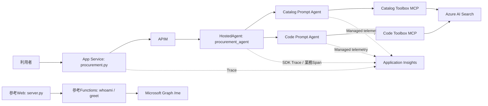
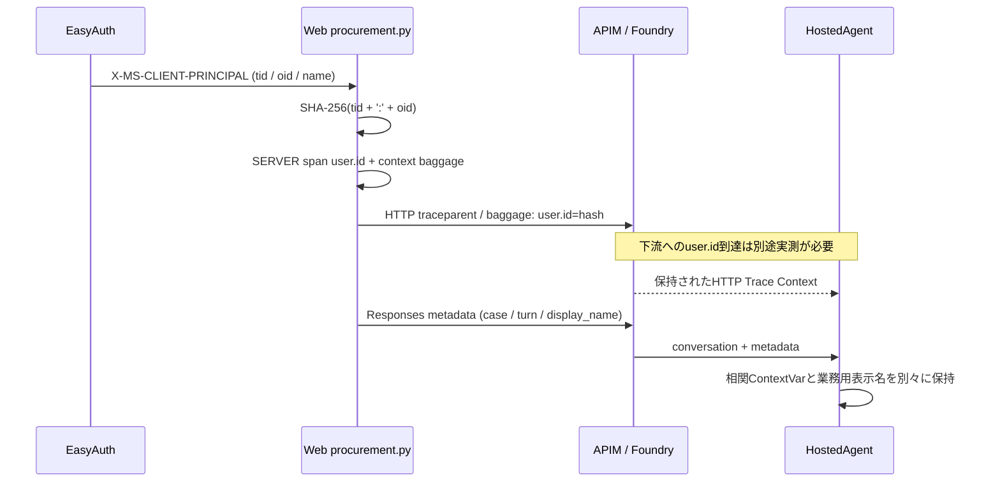

# Plan&Execute購買支援サンプルへのObservability組み込みガイド

作成日: 2026-09-06 / 調査対象: このリポジトリの作業ツリー

最終照合HEAD: `483d79c80a37c1dd6762c5fd97cbaf6b50963240` / branch: `main`

調査開始時HEAD: `8e255bffa922419563c4da5d2f8a3e25d2aea21f` / branch: `codex/deployment-reproduction-docs`

**移植の中心はHostedAgentの `observability.py`、Planner／Executor周辺のSpanとイベント、App Serviceの `backend/procurement.py` にある初期化と相関処理である。** 商品・部署検索をソース内Toolのまま残しても、これらを組み込める。

一方、`functions-mcp-selfhosted`にはOTelの明示的な初期化・業務Spanがまだない。現在の購買検索はPrompt Agent → Foundry Toolbox → Azure AI Searchで実行する。Functionsを検索Toolの配置先にする場合は、Toolの外部化とFunctionsへの計装を新規に行う。

本資料は次の3点で構成する。

| 資料 | 用途 |
| --- | --- |
| 本書 | 現行実装の詳細、移植範囲、Plan&Executeとの対応、設定、確認手順 |
| [組み込みコード例](/home/hnakajima/work/foundry-procurement-agent/docs/observability-integration/integration-examples.md) | ソース内Toolを残す例、Functionsへ新設する例、ログ送信を追加する例 |
| [ソース索引・調査時点のハッシュ](/home/hnakajima/work/foundry-procurement-agent/docs/observability-integration/source-map.md) | ファイル・関数・行番号と、参照した作業ツリーの同一性確認 |

移植先サンプルのソースは未提供のため、移植先の実ファイル名・SDK・シグネチャは未確認である。以下の「Planner」「Executor」「商品検索Tool」「部署検索Tool」は役割名であり、存在を確認した移植先ファイル名ではない。元サンプルの実装を変更せず、役割に対応する境界へ観測処理を追加する前提で説明する。

調査開始時に未コミット／未追跡だったFunctions・OAuth参考Web等も対象にした。作業中に共有リポジトリが上記の最終HEADへ更新され、参照ファイルをハッシュで再照合した。SDKの実装はローカル`.venv`も参照しているため、再現時はソース索引のSDKバージョンを合わせる。実行コードとSDK実装を優先し、過去のAzure配備報告は過去の実測として扱った。今回Azure環境の再照会・配備は行っていない。

## 1. 全体構成と移植する範囲

### 1.1 現行の2つの経路



Functionsの経路は購買E2Eとは別である。この区別は[リポジトリREADME](/home/hnakajima/work/foundry-procurement-agent/README.md:55)、起動コマンド、配備用ZIPの収録リストから確認した。

| 対象 | 現在の役割 | Traceの初期化 | アプリ独自の記録 | 移植方法 |
| --- | --- | --- | --- | --- |
| `procurement_agent` | Hosted親・Planner・業務Controller | `ResponsesHostServer`のSDK経由 | 4種類のSpan、状態イベント、相関属性 | 共通Recorderをコピーし、サンプルのPlanner／Executorへ挿入 |
| `webapp-foundry-oauth/backend/procurement.py` | 購買Webの実行入口 | 独自Provider＋Azure Monitor Trace Exporter | HTTP Spanへの利用者・会話・応答ID、伝播チェック | lifespan・ASGI・HTTPX・identity・metadataの組を移植 |
| `webapp-foundry-oauth/backend/server.py` | OAuth／OBO／Graph参考Web | 明示的なOTelなし | Python標準logging | 観測機能の移植元は `procurement.py` を使う |
| `functions-mcp-selfhosted` | `whoami`／`greet`参考MCP | 明示的なOTelなし | Python標準logging | OTel依存・初期化・Tool Spanを新設 |

### 1.2 サンプルへ適用する3つの構成

| 構成 | Toolの配置 | 必要な変更 | 今回のソースから利用するもの |
| --- | --- | --- | --- |
| A: ソース内Toolを維持 | サンプル内の商品検索／部署検索関数 | 観測初期化とPlanner／Executor／Toolへの計装 | Hosted共通Recorder、status／correlation属性、必要ならWeb観測機能 |
| B: 現行購買E2Eと同様にする | Prompt子＋Toolbox＋AI Search | 検索の委譲、入出力契約、接続・権限・配備を追加 | `FoundryAgent.as_tool()`、構造化handoff、2つのToolbox／Prompt定義 |
| C: 自作Functions MCPへ外部化 | Functionsに商品検索／部署検索を実装 | MCPサーバー・検索実装・通信契約・Functions計装を追加 | FunctionsのASGI/MCP骨格、WebのExporter例、Hostedの業務Span設計 |

Observabilityの導入だけならAで進められる。B/Cは検索の配置・実行方式も変更する。Cを選んでも、現在のFunctionsに商品検索や部署検索の実装は存在しないため、`whoami`をコピーするだけでは購買Toolにならない。

### 1.3 Trace、イベント、通常ログ、レスポンス内のtraceを区別する

| 記録形式 | このソースの例 | 何が分かるか | 注意点 |
| --- | --- | --- | --- |
| OTel Span | `telemetry.span("plan.step.execute", ...)` | 処理時間、親子関係、属性 | Application Insightsでは主に`requests`／`dependencies`で確認 |
| OTel Span event | `telemetry.event(span, "step.completed", ...)` | Span中の状態変化と時刻 | `logger.info()`とは別。Exporterが変換した保存先で確認 |
| Python logging | Functionsの`logger.warning(...)` | アプリの診断メッセージ | 標準loggingだけでOTel LogExporterが構成されたとは言えない |
| 業務レスポンスのJSON | `ScenarioResult.trace` | UI向けのイベントや代替相関情報 | JSONに`trace`というキーがあってもOTel送信ではない |
| SDK自動計装 | Agent、Chat、Function、HTTP Span | LLM／Tool／HTTPの実呼出し | 対象SDK経由で実行された処理を計装。普通の関数を直接呼ぶだけでは同じ保証にならない |

標準Agent Framework計装とExport先の設定は別の責務である。現在のHosted SDKがExportを構成し、Frameworkとアプリがそこへ記録する。[Agent Framework公式Observability](https://learn.microsoft.com/en-us/agent-framework/agents/observability)も計装とExporterを分けて説明している。

## 2. HostedAgent: procurement_agent

### 2.1 requirements.txtで移す依存関係

正本はプロジェクト直下の[requirements.txt](/home/hnakajima/work/foundry-procurement-agent/requirements.txt:1)。`src/procurement_agent/requirements.txt`ではない。

| 依存 | 現行指定 | 役割／移植要否 |
| --- | --- | --- |
| `opentelemetry-api` | `1.43.0` | trace、baggage、Span API。共通Recorderを使う場合に必要 |
| `opentelemetry-sdk` | `1.43.0` | Provider、Resource、Processor、テスト用Exporter。Recorderをそのまま移す場合に必要 |
| `agent-framework-core` | `1.16.0` | Agent／Chat／Functionの標準計装。移植先が同じFrameworkの場合 |
| `agent-framework-foundry-hosting` | `1.0.0b260827` | `ResponsesHostServer`、Hosted起動と観測初期化 |
| `agent-framework-foundry` | `1.11.0` | `FoundryAgent`／`FoundryChatClient`。B構成や同じモデルクライアントの場合 |
| `agent-framework-openai` | `1.14.1` | 現行クライアント関連依存。OTelだけの必須依存とはしない |
| `agent-framework-devui` | `1.0.0b260821` | ローカルDevUI。Observability移植だけなら必須ではない |
| `azure-identity`／`azure-ai-projects` | `1.26.0b2`／`2.3.0` | Foundryアクセス。Exporterそのものではない |

このrequirementsには `-c requirements-lock.txt` がある。constraintsは依存をインストールする命令ではなく、実際に導入される依存のバージョンを制約する。現行Hosted SDKの依存解決によって以下が入る。

```text
agent-framework-foundry-hosting
  -> azure-ai-agentserver-core==2.1.0
     -> microsoft-opentelemetry==1.3.8
        -> azure-monitor-opentelemetry-exporter==1.0.0b56
        -> OTel SDK / instrumentation / OTLP exporters
```

上記は[requirements-lock.txt](/home/hnakajima/work/foundry-procurement-agent/requirements-lock.txt:21)とローカル`.venv`の配布メタデータで確認した。**このリポジトリではHostedのrequirementsにAzure Monitor Exporterを直接書いていなくても、Hosted SDKの推移的依存として含まれる。** 別SDK／別バージョンへ同じ前提を持ち込まず、移植先の依存解決を確認する。

移植先に別のlockがある場合、プロジェクト全体のlockを丸ごと上書きしない。必要な依存を統合し、その環境で解決・固定する。現行ソースはPython `>=3.13,<3.15`、Hosted配備は`python_3_13`を指定している。

### 2.2 ソース内の初期化箇所

| 移植ID | 実ファイル・位置 | 処理 | サンプルで組み込む場所 |
| --- | --- | --- | --- |
| H-01 | [hosted_app.py:64](/home/hnakajima/work/foundry-procurement-agent/src/procurement_agent/hosted_app.py:64) `main()` | message content captureをfalse、propagator既定を設定 | プロセス起動時、Host生成前 |
| H-02 | [hosted_app.py:82](/home/hnakajima/work/foundry-procurement-agent/src/procurement_agent/hosted_app.py:82) | `ResponsesHostServer(bundle.parent)` | 既存Hosted起動処理。Hostが同じなら重複追加しない |
| H-03 | [observability.py:63](/home/hnakajima/work/foundry-procurement-agent/src/procurement_agent/observability.py:63) `TelemetryRecorder` | 共通Span／event／content保護 | サンプルの共通観測モジュール |
| H-04 | [observability.py:85](/home/hnakajima/work/foundry-procurement-agent/src/procurement_agent/observability.py:85) `for_hosted_runtime()` | global Providerを利用 | Hosted用Recorderの生成場所 |
| H-05 | [hosted.py:220](/home/hnakajima/work/foundry-procurement-agent/src/procurement_agent/hosted.py:220) | RecorderをControllerへ渡す | Planner／Executorに同じRecorderを注入 |

現行の起動コードの要点は次である。抜粋のためその他の起動処理は省略している。

```python
os.environ["OTEL_INSTRUMENTATION_GENAI_CAPTURE_MESSAGE_CONTENT"] = "false"
os.environ.setdefault("OTEL_PROPAGATORS", "tracecontext,baggage")
bundle = build_hosted_bundle(FoundryRuntimeSettings.from_env())
server = ResponsesHostServer(bundle.parent)
server.add_middleware(_RequestCorrelationMiddleware)
server.run(host=args.host, port=args.port)
```

`ResponsesHostServer`の基底Hostが、接続文字列を読み、`microsoft-opentelemetry`経由でTrace／Log等のProvider・Exporterを設定する。この呼出しはアプリの `observability.py` 内には書かれていない。ローカルにインストールされた `azure.ai.agentserver.core._base` と `_tracing` の実装まで確認した。

Foundry HostedではApplication Insights接続文字列をプラットフォームから注入する仕組みがあり、移植先でもProjectとApplication Insightsの接続を確認する。[Hosted Agent配備の公式資料](https://learn.microsoft.com/en-us/azure/foundry/agents/how-to/deploy-hosted-agent)

**注意する初期化の違い:**

- `TelemetryRecorder()`は独立Provider＋`InMemorySpanExporter`を作る。主にローカル検証用であり、これだけではApplication Insightsへ送らない。
- Hostedでは `TelemetryRecorder.for_hosted_runtime()` を使う。global Providerが後から初期化される場合のProxyも含め、Host側の送信経路を使用する。
- Web用の独立`TracerProvider`生成処理をHosted起動へ重ねて追加しない。標準Spanと業務Spanが同じProvider経路へ送られる構成にする。
- 別のHostedランナーを使うサンプルでは、そのランナーにProvider初期化があるか確認する。なければ別途Exporterを構成する必要がある。

### 2.3 ソース内で記録している部分

| Span／記録 | 実ファイル・位置 | 現行の計測範囲 | Plan&Execute側の挿入位置 |
| --- | --- | --- | --- |
| `plan.create` | [controller.py:780](/home/hnakajima/work/foundry-procurement-agent/src/procurement_agent/controller.py:780) | 構造化Planの検証・構築、version付与 | Planner結果をPlanとして確定する処理 |
| `plan.step.execute` 商品 | [controller.py:523](/home/hnakajima/work/foundry-procurement-agent/src/procurement_agent/controller.py:523) | 商品検索の呼出し、出力検証、結果判定 | 商品検索Stepの1 attempt全体 |
| `plan.step.execute` コード | [controller.py:603](/home/hnakajima/work/foundry-procurement-agent/src/procurement_agent/controller.py:603) | 勘定科目／部署コード取得と検証 | 部署検索／コード決定Stepの1 attempt全体 |
| `merge.validate` | [controller.py:655](/home/hnakajima/work/foundry-procurement-agent/src/procurement_agent/controller.py:655) | 商品・コードの統合、申請案、予算検証 | Executor結果をまとめる検証処理 |
| `response.generate` | [controller.py:405](/home/hnakajima/work/foundry-procurement-agent/src/procurement_agent/controller.py:405) | 最終machine statusの記録 | 成功・確認待ち・失敗の最終結果を返す処理 |
| 会話だけの応答status | [hosted.py:390](/home/hnakajima/work/foundry-procurement-agent/src/procurement_agent/hosted.py:390) | 挨拶・本人名確認のstatus | 検索を実行しない会話の終了処理 |
| Planner例外の分類 | [hosted.py:558](/home/hnakajima/work/foundry-procurement-agent/src/procurement_agent/hosted.py:558) | `error.type`、取得できる場合のHTTP status | Planner呼出しの例外処理 |

**計測時間の読み方:** 現行のPlanner LLM呼出しは [hosted.py:492](/home/hnakajima/work/foundry-procurement-agent/src/procurement_agent/hosted.py:492) にあり、`plan.create`の外である。`plan.create`のdurationをLLMの計画生成時間と解釈しない。`response.generate`も主にstatusイベントを記録する短いSpanであり、LLM応答生成やHTTPストリーミング全体の時間ではない。移植先でPlanner全体を囲む場合は計測範囲が変わることを資料・ダッシュボードに明記する。

#### 主要イベント

| イベント | 記録場所／契機 | 主な属性 |
| --- | --- | --- |
| `plan.created` | Plan構築完了 | `plan.id`, `plan.version` |
| `step.started` | 検索／統合開始 | `plan.step.id`, 検索時は`execution.attempt` |
| `handoff.payload_validated` | 構造化入力検証後 | `agent.role` |
| `handoff.output_rejected` | 子出力の形式／相関／呼出し失敗 | 制御された境界例外の`reason` |
| `step.completed` | 成功したStepの完了 | `plan.step.id` |
| `result.rejected` | 検索結果の不採用、仕様／予算不一致等 | `business.status`, 場所により`reason.code` |
| `step.retry_scheduled` | 商品検索の再試行を予定 | 次の`execution.attempt` |
| `plan.replanned` | 商品なしの再計画で利用者確認へ | `business.status=WAITING_USER` |
| `step.failed` | 再計画後も失敗 | `business.status`, `failure.layer` |
| `response.status` | 最終結果確定 | 各層status、case、turn、plan |

`PlanExecutor.events`は業務stateにも保存されるが、全要素が自動でOTelへ送信されるわけではない。OTelとして送るのは `telemetry.event()`を呼んだ箇所である。[plan.py](/home/hnakajima/work/foundry-procurement-agent/src/procurement_agent/plan.py)

#### 相関属性とstatusの共通化

移植元は [controller.py:191](/home/hnakajima/work/foundry-procurement-agent/src/procurement_agent/controller.py:191) の `operation_status_attributes()`、`correlation_attributes()`、`apply_operation_status()`。既存のサンプルのstatusモデルに合わせてこれらの辞書生成部分を移す。Controller全体をコピーする必要はない。

| 属性 | 意味と移植時の扱い |
| --- | --- |
| `test.case.id` | 実行の検索キー。Webでは同じ会話の複数turnに共通 |
| `app.turn.number` | Framework側のturn。Web送信番号はHosted middlewareで`app.web.turn.number`へ分ける |
| `app.session.id`／`app.session.id.hash` | Framework Session。現行は場所により生Session IDとhashが混在。全Spanがhashのみとは記載しない |
| `gen_ai.conversation.id` | Foundry会話ID。Framework Session IDと同一ではない |
| `plan.id`, `plan.version`, `plan.step.id`, `execution.attempt` | Planの世代、Step、試行番号 |
| `parent.invocation.id`, `remote.task.id` | アプリがUUIDで生成するhandoff相関ID。Foundryが発行したTask IDではない |
| `agent.role`, `agent.definition.id`, `toolbox.name`, `search.index.name` | 実際に呼ぶ役割・検索対象。ソース内Toolなら存在しないToolbox名を付けない |
| `http.status_code` | OperationStatus内のHTTP値。HTTP transportで実測した値と区別して確認 |
| `technical.status`, `outer.technical.status` | 内側処理と外側処理の技術的成否 |
| `mcp.status`, `search.status`, `parse.status` | MCP、検索、構造化応答パースの結果 |
| `business.status`, `inner.business.status` | 最終業務結果と内側業務結果 |
| `failure.layer`, `retryable`, `reason.code` | 障害層、再試行可否、制御された理由コード |

OTelの `Span.status` と上記の業務statusは別である。現行の `apply_operation_status()`は属性を設定するだけで、OTel statusをERRORへ変更しない。商品0件や利用者確認待ちはHTTP 200・technical SUCCESSでも成立する。トレースの`success=true`だけで購買処理成功と判定しない。

### 2.4 Hostedで受け取る相関とユーザー情報

1. [hosted_app.py:18](/home/hnakajima/work/foundry-procurement-agent/src/procurement_agent/hosted_app.py:18) `_RequestCorrelationMiddleware`がResponses本文の`conversation`と`metadata`を読む。
2. 検証済みの会話ID、case、turn、client contractを`request_correlation`のContextVarへ設定し、終了時にresetする。
3. [observability.py:23](/home/hnakajima/work/foundry-procurement-agent/src/procurement_agent/observability.py:23) `current_request_attributes()`がContextVarとbaggageを合成する。`user.id`は64桁の小文字16進hashの場合のみ採用する。
4. [hosted.py:141](/home/hnakajima/work/foundry-procurement-agent/src/procurement_agent/hosted.py:141) `ControllerContextProvider.before_run()`がcurrent Spanへ属性を追加し、Controller内の業務Spanにも渡す。
5. 最終結果には`trace.correlation`とFramework Session ID hashを付け、Webが限定的に利用する。

Trace ContextのHTTP抽出自体はHost SDKのmiddlewareが担当する。`_RequestCorrelationMiddleware`は本文metadataの抽出であり、手書きの `propagate.extract()`はない。

`app.authenticated.display_name`は別のContextVar `authenticated_applicant_name`へ格納する。申請者名として業務処理・会話stateで使うが、`request_correlation`やbaggageの属性には追加しない。これは本人名の業務連携であり、OTelの仮名化`user.id`とは用途が異なる。

### 2.5 content保護とコピー時の調整

[observability.py:53](/home/hnakajima/work/foundry-procurement-agent/src/procurement_agent/observability.py:53) `sanitize_attributes()`はキーに`secret`、`password`、`token`、`chain_of_thought`を含む属性を除く。値のPIIを検出する汎用マスキング機構ではない。例えば`reason`というキーへ生の例外文字列を入れると、その値の内容は保護されない。

`protect_content()`は入力のhashと文字数を生成し、明示的なsynthetic環境のcontent-on時だけrawを含める。この関数が存在することと、全runtime payloadが自動でhash化されることは別である。現行では主にローカルTrace評価の正規化処理から呼ばれ、Hostedの全リクエストに適用するmiddlewareではない。

移植先では、ユーザー入力、Tool引数／戻り値、氏名、claim、Authorization、例外本文を観測属性へ直接渡さず、件数・分類・理由コード・必要なIDを明示的に選ぶ。外部例外が`with telemetry.span(...)`の外へ伝播するとOTel標準の例外記録でメッセージが保存され得るため、Tool境界で例外型と制御された結果に変換する組み込み例を別紙に示す。

### 2.6 Hosted以外にも必要になる設定資産

| 資産 | 必要になる場合 |
| --- | --- |
| [scripts/package_hosted.py:14](/home/hnakajima/work/foundry-procurement-agent/scripts/package_hosted.py:14) | Source ZIPで移植モジュールとrequirements／constraintsを配備するとき |
| [scripts/deploy_foundry.py:69](/home/hnakajima/work/foundry-procurement-agent/scripts/deploy_foundry.py:69) | Foundry ProjectとApplication Insights接続を再現するとき。接続文字列を資料に転記しない |
| [azure.yaml:48](/home/hnakajima/work/foundry-procurement-agent/azure.yaml:48) | Hosted entrypoint、Python runtime、env設定の再現 |
| [Toolbox設定](/home/hnakajima/work/foundry-procurement-agent/docs/deployment/toolboxes-and-search-mcp.md) | B構成を採用するときだけ |
| [Prompt Agent設定](/home/hnakajima/work/foundry-procurement-agent/docs/deployment/prompt-agents.md) | B構成の子Agent／server-side telemetryを用意するときだけ |
| [trace_pipeline](/home/hnakajima/work/foundry-procurement-agent/src/trace_pipeline/envelope.py) | 同じ正規化・Failure Pattern評価も移植するときだけ |

標準計装と業務Spanの導入だけなら、PoCのS1～S5シナリオ、fault injection、detector、全業務Controller、ローカルMCP fixtureを丸ごと移す必要はない。

## 3. App Service: webapp-foundry-oauth

### 3.1 実際に動くソースとrequirementsを選ぶ

[startup.sh:18](/home/hnakajima/work/foundry-procurement-agent/src/webapp-foundry-oauth/startup.sh:18)は `uvicorn procurement:app --workers 1` を起動する。[package-procurement.py:12](/home/hnakajima/work/foundry-procurement-agent/src/webapp-foundry-oauth/scripts/package-procurement.py:12)が収録するPython本体も `backend/procurement.py` のみである。

| ファイル | 観測依存／設定 | 移植時の扱い |
| --- | --- | --- |
| [ルートrequirements.txt](/home/hnakajima/work/foundry-procurement-agent/src/webapp-foundry-oauth/requirements.txt:1) | 購買WebのOryx build入力 | こちらを基準に必要依存を統合する |
| [backend/requirements.txt](/home/hnakajima/work/foundry-procurement-agent/src/webapp-foundry-oauth/backend/requirements.txt:1) | OAuth/Graph参考Web。OTel依存なし | 観測依存の移植元にはしない |
| [backend/server.py:60](/home/hnakajima/work/foundry-procurement-agent/src/webapp-foundry-oauth/backend/server.py:60) | `logging.basicConfig()` | Python通常ログ。OTel初期化ではない |

現在の観測用直接依存は次の3つである。

```text
opentelemetry-instrumentation-asgi==0.64b0
opentelemetry-instrumentation-httpx==0.64b0
azure-monitor-opentelemetry-exporter==1.0.0b56
```

ASGIが受信HTTP、HTTPXが送信HTTPを計装し、ExporterがTraceをApplication Insightsへ送る。`opentelemetry-api`／`opentelemetry-sdk`はこのrequirementsでは推移的に導入される。別サンプルへ移植する場合は互換な組み合わせで固定する。

他の直接依存は `fastapi==0.138.0`, `uvicorn==0.52.4`, `azure-ai-projects==2.3.0`, `azure-identity==1.26.0b2`, `httpx==0.28.1`, `aiohttp==3.14.3`, `openai==2.54.0`。観測3依存を追加しても、実際に使用するHTTPクライアントが計装されていなければ送信Spanはできない。

### 3.2 ソース内の初期化箇所

全て以下の [procurement.py](/home/hnakajima/work/foundry-procurement-agent/src/webapp-foundry-oauth/backend/procurement.py) 内にある。

| 移植ID | 位置 | 処理 | 移植先への組み込み |
| --- | --- | --- | --- |
| W-01 | 26–33行 | OTel関連import | 同じ観測モジュールへ追加 |
| W-02 | 190–214行 `_lifespan()` | 独立Provider、Resource、BatchSpanProcessor、TraceExporter | 既存FastAPI lifespanの起動／終了へ統合 |
| W-03 | 204行 | Trace Context＋BaggageのCompositePropagator | 起動時に一度設定 |
| W-04 | 205–212行 | HTTPX client計装とSDKへの注入 | 実際にFoundryを呼ぶclientへ適用 |
| W-05 | 220–236行 `_Instrumentation` | ASGI request Span、receive/send細分Span抑制 | アプリmiddlewareへ登録 |
| W-06 | 112–126行 `_BrowserBoundary` | ブラウザ入力のtrace／baggage除去 | ASGI計装の外側で実行 |
| W-07 | 173–187行 `_ObservedTransport` | HTTP送信時のheader一致確認 | 初期導入時の伝播検証に利用 |

初期化の中心部分:

```python
app.state.provider = TracerProvider(
    resource=Resource.create({"service.name": "procurement-webapp"})
)
if os.environ.get("APPLICATIONINSIGHTS_CONNECTION_STRING"):
    from azure.monitor.opentelemetry.exporter import AzureMonitorTraceExporter
    from opentelemetry.sdk.trace.export import BatchSpanProcessor
    app.state.provider.add_span_processor(
        BatchSpanProcessor(AzureMonitorTraceExporter())
    )
```

このアプリはglobal Providerを置換せず、ASGI／HTTPXに `app.state.provider` を明示的に渡している。Webで独自Spanを追加するときも `request.app.state.provider.get_tracer(...)` を使うなど、同じProviderへ接続する。

`APPLICATIONINSIGHTS_CONNECTION_STRING`が未設定ならExporterを登録しない。起動とSpan生成が成功してもAzureにTraceが届くとは限らない。正常なlifespan終了では `provider.shutdown()` を呼ぶ。

HTTPXは以下の2行を組にして移す。instrumentorだけ追加してSDKが別clientを生成する状態にしない。

```python
HTTPXClientInstrumentor.instrument_client(http, tracer_provider=app.state.provider)
# 同じhttpをproject.get_openai_client(..., http_client=http)へ渡す
```

Middlewareの登録順は `_Instrumentation`、次に `_BrowserBoundary`。この実装では後者が外側で動き、ブラウザが指定したTrace IDや`user.id`をサーバー側のrootとして採用しない。Functionsなど信頼するサービス間の入口へ、このブラウザ用header除去をそのままコピーすると分散Traceを切断する。

### 3.3 ソース内で記録している部分

| 実装位置 | 対象Span | 記録内容 |
| --- | --- | --- |
| [procurement.py:180](/home/hnakajima/work/foundry-procurement-agent/src/webapp-foundry-oauth/backend/procurement.py:180) | HTTPX送信CLIENT | `app.propagation.traceparent_present`、`traceparent_matches_span`、`baggage_user_id_matches` |
| [procurement.py:347](/home/hnakajima/work/foundry-procurement-agent/src/webapp-foundry-oauth/backend/procurement.py:347) | Web受信SERVER | `user.id` |
| [procurement.py:377](/home/hnakajima/work/foundry-procurement-agent/src/webapp-foundry-oauth/backend/procurement.py:377) | Web受信SERVER | `gen_ai.conversation.id`, `app.turn.number`, `test.case.id` |
| [procurement.py:390](/home/hnakajima/work/foundry-procurement-agent/src/webapp-foundry-oauth/backend/procurement.py:390) | 非streamのWeb受信SERVER | `gen_ai.response.id` |
| [procurement.py:323](/home/hnakajima/work/foundry-procurement-agent/src/webapp-foundry-oauth/backend/procurement.py:323) | streamのWeb受信SERVER | 完了イベントで`gen_ai.response.id` |
| [procurement.py:399](/home/hnakajima/work/foundry-procurement-agent/src/webapp-foundry-oauth/backend/procurement.py:399) | 非streamエラー | OTel status ERROR、`error.type`。例外本文を出さない |
| [procurement.py:330](/home/hnakajima/work/foundry-procurement-agent/src/webapp-foundry-oauth/backend/procurement.py:330) | stream中断／エラー | OTel status ERROR、`error.type` |

`_ObservedTransport`はheaderを注入する関数ではなく、HTTPXの自動計装が注入したheaderを実際の送信地点で検査する。値そのものは保存せずbooleanを記録する。独自検証属性はAzure Monitorの標準HTTP属性変換に埋もれないよう `app.propagation.*` を使う。

現行 `procurement.py`には `logger.info()`、独自`span.add_event()`、LogExporter、MetricReaderがない。業務statusはHostedの応答からUIに投影しており、Web Spanへ全statusを再設定してはいない。通常ログをApplication Insightsの`traces`でも確認したい場合の追加例は別紙に示す。

### 3.4 useridを連携している部分



| 移植ID | 場所 | 内容 |
| --- | --- | --- |
| U-01 | [procurement.py:52](/home/hnakajima/work/foundry-procurement-agent/src/webapp-foundry-oauth/backend/procurement.py:52) `_identity()` | EasyAuthのtid/oidを検証しSHA-256で仮名化。欠落は401 |
| U-02 | [procurement.py:83](/home/hnakajima/work/foundry-procurement-agent/src/webapp-foundry-oauth/backend/procurement.py:83) `_state()` | 署名Cookieのuserとログイン利用者を照合 |
| U-03 | [procurement.py:348](/home/hnakajima/work/foundry-procurement-agent/src/webapp-foundry-oauth/backend/procurement.py:348) | root Spanへ`user.id`、active contextへbaggageを設定 |
| U-04 | [procurement.py:363](/home/hnakajima/work/foundry-procurement-agent/src/webapp-foundry-oauth/backend/procurement.py:363) | Conversation metadataの`owner`を照合／作成 |
| U-05 | [procurement.py:286](/home/hnakajima/work/foundry-procurement-agent/src/webapp-foundry-oauth/backend/procurement.py:286) `_response_metadata()` | case、turn、client contract、任意の表示名をHostedへ渡す |
| U-06 | [procurement.py:295](/home/hnakajima/work/foundry-procurement-agent/src/webapp-foundry-oauth/backend/procurement.py:295) と337行 | stream generator内でもbaggage attach/detach |
| U-07 | [procurement.py:407](/home/hnakajima/work/foundry-procurement-agent/src/webapp-foundry-oauth/backend/procurement.py:407) | request contextをfinallyでdetach |

```python
# _identity()の戻り値生成
return hashlib.sha256(f"{tenant}:{oid}".encode()).hexdigest(), display_name.strip()

# chat()での利用
span.set_attribute("user.id", user)
token = context.attach(baggage.set_baggage("user.id", user))
# Foundry呼出し...
# finally: context.detach(token)
```

SHA-256は安定した仮名化であり、完全な匿名化を保証するものではない。`_identity()`のBase64 decodeはJWT署名検証ではなく、EasyAuthが認証して付与したheaderを読む処理である。移植先もEasyAuthを使う場合は[authsettingsV2](/home/hnakajima/work/foundry-procurement-agent/infra/webui.bicep:117)の認証必須・HTTPS・issuer／audience設定と組にする。他の認証方式なら、その認証済みidentityから同等の観測IDを作る。[App ServiceのユーザーID取得仕様](https://learn.microsoft.com/en-us/azure/app-service/configure-authentication-user-identities)

#### 3種類のID／名前を混同しない

| 情報 | 現行の渡し方 | 用途 |
| --- | --- | --- |
| 仮名化`user.id` | Web Span属性＋baggage | トレース相関。認証／認可の証明には使わない |
| `app.authenticated.display_name` | Responses本文のmetadata | 申請者名・利用者名の業務機能。Spanやbaggageへ入れない |
| Managed Identity access token | SDKのAuthorization | WebからFoundryを呼ぶ認証。利用者のdelegated tokenではない |

Responses本文のmetadataに`user.id`を入れる実装はない。Conversation metadataの`owner`も、Webが会話の所有者を管理するための値であり、Hostedへのuserid passthroughではない。

`user.id`を送信してもOBOは発生しない。観測機能だけを移植するなら、参考 `server.py` のtoken取得／OBO、FunctionsのGraph認証処理を追加する必要はない。

#### ストリーミングと非同期実行

request関数でcontextを設定するだけでなく、遅れて実行されるstream generatorでもattach/detachしている。移植先がバックグラウンドjobやqueue方式なら、そのjob全体を覆うSpan寿命とcontext受け渡しを実装構造に合わせる。HTTP requestが終了した後の処理を、終了済みrequest Spanへの属性追加だけで観測しない。

### 3.5 App Settingsと配備に含めるもの

| 設定 | 現行の指定／用途 |
| --- | --- |
| `APPLICATIONINSIGHTS_CONNECTION_STRING` | Traceの送信先。値は環境設定から供給 |
| `OTEL_PROPAGATORS=tracecontext,baggage` | W3C trace contextとbaggage。コード側でも明示設定 |
| `OTEL_TRACES_SAMPLER=always_on` | PoCの収集方針。データ量増加も含め移植先で選択 |
| `ENABLE_SENSITIVE_DATA=false` | 設定上の方針。Web独自loggerの内容を自動消去するスイッチではない |
| `PROJECT_ENDPOINT`／`AGENT_NAME` | 接続先。現行はAPIM proxy＋named Hosted endpoint |
| `WEB_APP_URL` | HTTPS origin。POSTのOrigin検証にも使用 |
| `WEBUI_SESSION_SIGNING_KEY` | 会話Cookieの署名用。32 bytes以上。観測Exporterの認証とは別 |

根拠は [infra/webui.bicep:94](/home/hnakajima/work/foundry-procurement-agent/infra/webui.bicep:94)。現行Webは1 worker／1 instanceを前提に全turnを1つの`asyncio.Lock`で直列化している。これは観測設定ではない。サンプルの会話管理を置換する場合、owner／turn相関の整合性を別途保つ。

新しい共通観測ファイルを作った場合は、[package-procurement.py](/home/hnakajima/work/foundry-procurement-agent/src/webapp-foundry-oauth/scripts/package-procurement.py:12)の収録リストにも追加する。requirementsだけ変えても新モジュールは自動収録されない。

### 3.6 参考server.pyの既存ログを移植する場合

`server.py`にもTool開始／完了等の通常ログがあるが、購買WebのTrace処理とは別である。

| 場所 | 既存ログ | 観測移植時の扱い |
| --- | --- | --- |
| [server.py:695](/home/hnakajima/work/foundry-procurement-agent/src/webapp-foundry-oauth/backend/server.py:695) | Responses接続先・Agent・previous response ID | 必要なIDのみ新Spanへ移す |
| [server.py:799](/home/hnakajima/work/foundry-procurement-agent/src/webapp-foundry-oauth/backend/server.py:799)、885行 | Tool開始／完了、call ID | Tool lifecycleの挿入位置の参考 |
| [server.py:977](/home/hnakajima/work/foundry-procurement-agent/src/webapp-foundry-oauth/backend/server.py:977) | response完了／不完全stream | 完了条件と応答IDの相関を参考にする |
| [server.py:757](/home/hnakajima/work/foundry-procurement-agent/src/webapp-foundry-oauth/backend/server.py:757) | raw SSEの一部をDEBUG記録 | content-offの見本としてコピーしない |
| [server.py:1101](/home/hnakajima/work/foundry-procurement-agent/src/webapp-foundry-oauth/backend/server.py:1101) | HTTPエラー本文preview | 例外型・HTTP status・理由コードへ絞る |
| [server.py:1139](/home/hnakajima/work/foundry-procurement-agent/src/webapp-foundry-oauth/backend/server.py:1139) | 例外text／traceback | LogExporter接続前に記録内容を見直す |

旧logger全体にLogExporterを付けるだけでは、現行購買Webの本文非記録と同じ動作にはならない。

## 4. Functions: functions-mcp-selfhosted

### 4.1 要求項目に対する現状

| 要求項目 | 調査結果 | ソース |
| --- | --- | --- |
| requirementsのObservability設定 | OTel／Azure Monitor Python依存なし | [requirements.txt:1](/home/hnakajima/work/foundry-procurement-agent/src/functions-mcp-selfhosted/requirements.txt:1) |
| ソース内のObservability初期化 | Provider／Exporter／OTel middlewareなし | [mcp_handler:1](/home/hnakajima/work/foundry-procurement-agent/src/functions-mcp-selfhosted/mcp_handler/__init__.py:1) |
| ソース内のOTelロギング | 明示的なSpan／event／user相関なし。通常loggingのみ | [mcp_server.py:15](/home/hnakajima/work/foundry-procurement-agent/src/functions-mcp-selfhosted/mcp_server.py:15) |
| Functions Hostの接続先 | BicepにApplication Insightsとconnection stringあり | [main.bicep:70](/home/hnakajima/work/foundry-procurement-agent/src/functions-mcp-selfhosted/infra/azure/main.bicep:70)、134行 |
| HostのOTel mode | `telemetryMode`なし | [host.json:1](/home/hnakajima/work/foundry-procurement-agent/src/functions-mcp-selfhosted/host.json:1) |
| 商品検索／部署検索 | 未実装。Toolは`whoami`／`greet` | [mcp_server.py:459](/home/hnakajima/work/foundry-procurement-agent/src/functions-mcp-selfhosted/mcp_server.py:459) |

現在のrequirementsは次だけである。

```text
azure-functions
msal>=1.31.0
requests>=2.31.0
httpx
# mcp 2.x removed mcp.server.fastmcp, which mcp_server.py still uses.
mcp>=1.28,<2
```

Application Insights接続文字列があることは、Python WorkerでTool Spanや分散Traceが実装された証明ではない。Functions標準監視のログ収集経路と、アプリがOTel APIで記録する経路を分けて確認する。

### 4.2 現在のソース内ロギング箇所

全て [mcp_server.py](/home/hnakajima/work/foundry-procurement-agent/src/functions-mcp-selfhosted/mcp_server.py) のPython標準loggingである。

| 位置 | 関数／場面 | 記録する情報 |
| --- | --- | --- |
| 15–29行 | モジュール起動 | loggerレベル、Graph scopes設定状況 |
| 47、58行 | 数値envパース | 不正値、既定値 |
| 107–108行 | Bearer抽出 | 抽出例外 |
| 120–139行 | `log_inbound_token_summary()` | token受信有無、claimの存在有無 |
| 218行 | Graph scopes選択 | scopes |
| 258–283行 | `acquire_graph_token_via_obo()` | 試行、retry成功、MSAL失敗詳細 |
| 312–337行 | `call_graph_api()` | HTTP status、retry、例外、最終失敗 |
| 362–389行 | `build_whoami_response()` | token検証／OBO失敗、MSAL相関ID |
| 405–426行 | 同上 | ユーザー不一致、識別子の有無、成功・試行回数 |
| 446–451行 | 同上 | Graph呼出し失敗 |
| 480行 | `whoami` | Tool開始 |

この中のMSALレスポンス`trace_id`／`correlation_id`はOTelのTrace IDとは別である。`OTEL_INSTRUMENTATION_GENAI_CAPTURE_MESSAGE_CONTENT=false`を設定しても、通常loggerが出す文字列は自動的には消えない。

特に405–409行にはGraph user IDの生値、362–366行にはtoken検証details、269–283行にはMSALのerror descriptionがある。これらをそのまま新しいLogExporterへ流すのではなく、例外型、HTTP status、attempt、理由コードに限定する。署名検証やOBOの設計は観測ID連携とは独立に扱う。

### 4.3 Functionsで新規に追加する箇所

以下は**現行ソースに未実装の移植設計**である。実行可能な小さな部品例は別紙に示す。

| 移植ID | 追加／変更場所 | 実装内容 |
| --- | --- | --- |
| F-01 | Functions独自の`requirements.txt` | OTel API／SDK、Azure Monitor Exporter、必要なASGI／HTTP計装。通常ログも送るならLogExporter関連 |
| F-02 | 新規観測モジュール、または`mcp_handler`配下 | process起動でProvider／Exporterを一度だけ構成 |
| F-03 | `host.json`とApp Settings | HostのOTel mode、送信先、Workerの監視方式を選択 |
| F-04 | `mcp_handler/__init__.py`のASGI入口 | HTTP contextを取り込む。Host／Worker／ASGIのSpan重複を確認 |
| F-05 | 新設の商品検索／部署検索Tool | ToolごとのSpan、開始・完了event、status／件数／理由 |
| F-06 | 新設の検索client | 実際のSearch／DB／HTTP dependencyを計装 |
| F-07 | Tool内の業務logger | active Span中で許可した属性だけ記録 |
| F-08 | 配備用ZIP作成script | 新規観測モジュール／constraintsを収録 |

`mcp_server.py:490`の `app()` はHTTP requestごとにFastMCPを生成する。ここや `create_mcp_server()` 内へProvider／Exporter生成を置くと毎回初期化されるため、process起動の位置へ置く。

HostのOTel出力には`host.json`の`telemetryMode: OpenTelemetry`を設定する。PythonではWorkerの自動監視を利用する方式と、コードでProvider／Exporterを初期化する方式を重ねない。公式文書では `PYTHON_APPLICATIONINSIGHTS_ENABLE_TELEMETRY=true` を使う場合は手動の `configure_azure_monitor()` を省略できるため、採用runtimeでどちらが初期化を担当するか確定する。[FunctionsのOpenTelemetry設定](https://learn.microsoft.com/en-us/azure/azure-functions/opentelemetry-howto?pivots=programming-language-python)

このサンプルは `function_app.py` のPython v2形式ではなく、`mcp_handler/__init__.py`＋`function.json`のASGI入口を持つ。公式サンプルのファイル名だけを当てはめず、実際の入口に初期化／wrapperを接続する。

独自のFunctions Providerを作る案、Host modeと組み合わせる際の確認事項、HTTPの伝播とMCPの`params._meta`の違いは別紙で詳述する。

### 4.4 Functionsへ検索Toolを移す場合の結果契約

| 実行結果 | 技術的status | 業務status／付加情報 |
| --- | --- | --- |
| 正常・検索結果あり | SUCCESS | SUCCESS、件数、検索対象、必要なsource version |
| 正常・0件 | SUCCESS | NOT_FOUND、result count=0 |
| timeout | ERROR | BLOCKED、timeout分類、retryable、attempt |
| 検索先403 | ERROR | BLOCKED、PERMISSION_DENIED、retryable=false等を実際の原因に合わせる |
| index不在 | ERROR | INDEX_MISSING。0件検索とは区別 |
| 戻り値の形式不正 | 呼出し成否と区別 | parse SCHEMA_INVALID、業務BLOCKED |
| 有効な結果だが要求仕様に合わない | SUCCESS | VALIDATION_FAILED。技術エラーへまとめない |

現行の分類モデルは [OperationStatus](/home/hnakajima/work/foundry-procurement-agent/src/procurement_agent/models.py:198) を参考にできる。ただし `mcp_contract.py`はローカルのrecorded transcript分類器であり、実稼働FunctionsのSearch実装ではない。

ソース内Toolの構成AではMCPを呼ばないため `mcp.status=NOT_RUN` とする。リモートMCPサーバーを作る構成Cでは、JSON-RPC/MCPプロトコル上の結果とTool内の検索／業務結果を分ける。Tool内で処理を始めた時点では、まだMCPレスポンス送信の成功を確認できていない。

### 4.5 配備漏れを防ぐための変更点

[deploy-functions-zip.sh:54](/home/hnakajima/work/foundry-procurement-agent/src/functions-mcp-selfhosted/scripts/deploy-functions-zip.sh:54)と[deploy-functions-zip.ps1:94](/home/hnakajima/work/foundry-procurement-agent/src/functions-mcp-selfhosted/scripts/deploy-functions-zip.ps1:94)は、収録ファイルを明示的にコピーする。新規`observability.py`をルートへ置くなら双方の収録対象へ追加する。`mcp_handler`配下へ置くなら既存のディレクトリコピーに含まれるかZIPで確認する。

Functions ZIPにリポジトリ直下のHosted用requirementsや`procurement_agent`は自動で入らない。Hosted用`observability.py`を参照するimportだけ追加しても、配備先でimportできるとは限らない。Functionsの配備では`pyproject.toml`だけでなく、実際にremote buildに使うFunctions側`requirements.txt`を変更する。

## 5. コンポーネントをまたぐ相関

### 5.1 相関情報の契約

| 相関対象 | キャリア | 受け渡し元→先 | 移植上の条件 |
| --- | --- | --- | --- |
| Trace ID／親Span | HTTP `traceparent`, `tracestate` | HTTPX → APIM／Foundry → Host | 各境界が保持し、受信側がextractすること |
| 仮名化利用者 | HTTP `baggage`の`user.id` | Web → 下流 | Trace Contextとは独立。到達とSpan属性への採用を別々に確認 |
| Foundry会話 | Responses `conversation` | Web → Hosted | named Hosted endpointのConversationを使用 |
| case／Web turn | Responses `metadata` | Web → `_RequestCorrelationMiddleware` | 形式検証とContextVar resetを維持 |
| 業務Stepのhandoff | 構造化JSONの`correlation` | Hosted → Prompt子 → Hosted | 入力と出力のcorrelation一致を検証 |
| 応答の特定 | `gen_ai.response.id`等 | SDK／Web／Managed Trace | Trace IDが変わる境界の代替検索キー |
| MCP Tool呼出し | MCP `params._meta`、またはHTTP headers | MCP client → server | HTTPキャリアとMCP本文のキャリアを区別。受信方式を明示 |

HTTPにbaggageが到着しても、OTelがその全キーを自動で全Span属性にコピーするわけではない。現行Hostedは `current_request_attributes()` が許可した`user.id`を業務Spanへ付ける。その他の自動Spanまで同じ属性が付くとは限らない。[OpenTelemetry Pythonの伝播仕様](https://opentelemetry.io/docs/languages/python/propagation/)

Agent Frameworkがプロセス内で開くMCP transportには`params._meta`を使う伝播があるが、Foundryサービスが発行するMCPリクエストは別の境界である。HTTP ASGI middlewareはMCP本文の`_meta`を自動で抽出しない。移植先のSDKとtransportで実際のcarrierを確認する。[Agent FrameworkのMCP trace propagation](https://learn.microsoft.com/en-us/agent-framework/agents/observability#mcp-trace-propagation)

### 5.2 実装済みと実測済みを分ける

今回再確認したローカル実装では、Web送信地点におけるTrace Contextと`user.id` baggageの一致チェックがある。Hosted側にもbaggageの`user.id`を読む実装がある。**両端のコードが存在しても、Managed境界を越えて届くことの証明にはならない。**

保存済みの[2026-09-06検証レポート](/home/hnakajima/work/foundry-procurement-agent/docs/report/validation-results-2026-09-06.md:94)では、特定caseでWeb→Hosted→Prompt子→Toolboxが同じTraceになった一方、Managed下流の`user.id`は `NOT_PROPAGATED`。別Traceになるcaseではresponse IDで代替相関している。これは既存レポートの記録であり、今回のAzure再測定結果ではない。

Webの `PLATFORM_PROPAGATION` は固定文字列で、各リクエストの受信結果を動的に判定する値ではない。移植先でそのまま「伝播確認済み」の表示に使わず、実測結果または未検証状態に合わせる。

| 判定 | 意味 |
| --- | --- |
| 送信地点で一致 | WebのHTTPX Spanとoutgoing headerが一致した |
| 受信地点で一致 | 下流SpanのTrace ID／親子関係を照合した |
| `NOT_PROPAGATED` | 必要な相関が境界を越えていない |
| `NOT_RECORDED_BY_PLATFORM` | 対象情報／Spanがプラットフォームの記録から得られない |
| 未検証 | まだ受信／保存結果を照合していない |

仮名化`user.id`の本文metadataによるfallbackは現行未実装である。別環境で必要なら、送信者の認証、許可フィールド、保存範囲を確定したうえで追加する。LLMにIDを推測・復元させず、認可判断の根拠にも使用しない。

### 5.3 APIM／Managed Agentにも確認が必要

[infra/apim.bicep:89](/home/hnakajima/work/foundry-procurement-agent/infra/apim.bicep:89)はW3C相関、sampling、client IP非収集、request／response bodyの`bytes=0`、記録headerの空リストを定義する。Webが本文を記録しなくても、中継側が記録する設定なら保存範囲は変わる。

Hostedのcontent captureをfalseにしても、Managed Prompt子のserver-side content保存が一律に無効になるわけではない。既存レポートもこれを制約として記録している。B構成を移植する場合は、Application Insightsの接続だけでなく、Managed Agentの実際の収集内容を確認する。

## 6. Plan&Executeサンプルへ組み込む作業順

| 順序 | 作業 | 完了時の確認 |
| --- | --- | --- |
| 1 | サンプルの起動入口、Framework／SDK、Planner、Executor、Tool登録／呼出し、会話stateを特定 | 実ファイルと関数に本書H/W/F/Uの移植IDを対応付ける |
| 2 | A/B/CのTool配置を確定 | 観測だけの変更か、リモートTool化も含むかが明確 |
| 3 | 各processのrequirements／constraintsとExporter所有者を決定 | Hosted／Web／Functionsで別々に依存解決できる |
| 4 | 起動初期化と1つのSpan送信を接続 | 送信先でserviceを識別できる |
| 5 | Planner／Executorへ4種類のSpanと状態eventを追加 | Plan ID、version、step、attemptが一貫する |
| 6 | ソース内ToolまたはMCP Toolを計装 | 標準Tool Spanと二重にならず、結果件数・失敗分類を確認できる |
| 7 | Webのuser／conversation／turnとHTTP contextを接続 | 非stream／stream両方でcontext漏れなし |
| 8 | B/CならManaged／Functions境界の伝播を実測 | 送信／受信／保存の3点を照合。欠落も明示する |
| 9 | 最終結果に公開可能なTrace ID／会話ID／statusを追加 | 実行失敗時も調査キーを取得できる |
| 10 | ZIP内容、依存、正常／負例、収集内容を確認 | 文書上の設定と実際の配備物・Traceが一致する |

Plannerの実装、実行順序、再計画のロジックそのものは、Observabilityを入れるためだけにこのControllerへ置換しない。既存ループにSpanとeventを差し込み、retryが実際に発生する場所でattemptを増やす。

サンプル側に対応するモデルがある場合は、`models.py`から全業務型をコピーせず、相関／statusの辞書変換を合わせる。サンプル側にない検索index名やRemote Task IDを記録して実在するように見せない。

## 7. 移植後の確認方法

### 7.1 必須の動作確認ケース

| ケース | 確認するTrace／結果 |
| --- | --- |
| 商品・部署検索の正常完了 | Planner、各Tool、統合、応答のSpanを確認。technicalとbusinessの両方が成功 |
| 商品／部署が0件 | 呼出し成功と業務NOT_FOUNDを区別。取得件数0を記録 |
| timeout／外部403 | 例外型・障害層・attemptを記録。生の例外本文やtokenを含めない |
| schema不正 | parse失敗と外側HTTP／technical statusを区別 |
| retry／replan | attempt単位のSpan、同じ／新しいPlan version、実際の追加呼出しとの一致 |
| 利用者へ確認して再開 | 同じ会話、増えるturn、適切なFramework Session、WAITING_USERと再開の追跡 |
| 2ユーザーの並行実行 | `user.id`、会話owner、ContextVar／baggageが混線しない |
| streaming途中失敗 | HTTP 200が先に返っていても最終technical ERRORとSpan ERRORが確認できる |
| ブラウザに偽traceparent／baggageを指定 | Webがサーバー側rootと認証済みuserから相関を作る |
| B/C構成で既知Trace Contextを送信 | 下流の実受信と保存済みSpanまで照合。HTTPとMCP `_meta`の両carrierを識別 |
| content-off | 検索本文、結果本文、氏名、claim、token、Graph ID、生例外が観測データに入らない |
| 配備と終了 | 新モジュールがZIPにあり、正常終了でbufferを送信。重複初期化／二重送信なし |

`always_on`でも、プロセス異常終了、export失敗、Managed側の収集方針による欠落がなくなるわけではない。Spanがないことだけで「処理を実行していない」と断定しない。

### 7.2 Application Insightsでの照会例

以下は[既存KQL](/home/hnakajima/work/foundry-procurement-agent/infra/observability/kql/core-status-correlation.kql)を基に、caseからTrace全体をたどるための追加案。今回Azureで実行していない。Application Insightsのテーブル名を使う。Log Analytics Workspaceの`AppRequests`／`AppDependencies`等へ直接照会する場合はテーブル・列名を対応させる。

```kql
let targetCase = "REPLACE_WITH_TEST_CASE_ID";
let relatedOperations = materialize(
    union isfuzzy=true requests, dependencies, traces, customEvents
    | where timestamp > ago(24h)
    | where tostring(customDimensions["test.case.id"]) == targetCase
    | distinct operation_Id
);
union isfuzzy=true requests, dependencies, traces, customEvents
| where timestamp > ago(24h)
| where operation_Id in (relatedOperations)
| extend conversation = coalesce(
             tostring(customDimensions["gen_ai.conversation.id"]),
             tostring(customDimensions["azure.ai.agentserver.conversation_id"])),
         userHash = coalesce(tostring(customDimensions["user.id"]), tostring(user_Id)),
         technical = tostring(customDimensions["technical.status"]),
         business = tostring(customDimensions["business.status"]),
         step = tostring(customDimensions["plan.step.id"]),
         attempt = toint(customDimensions["execution.attempt"])
| project timestamp, itemType, cloud_RoleName, name, operation_Id,
          operation_ParentId, id, conversation, userHash, technical, business, step, attempt
| order by timestamp asc
```

case属性が全てのManaged Spanに付く保証はないため、一度case付きの行から`operation_Id`集合を取得し、そのTrace全体へ広げる。`user.id`はExporterによって標準`user_Id`へ変換される場合があるため両方を見る。別Traceになった下流はこのクエリだけでは回収できないので、response ID、構造化handoffの相関IDを別途照合する。

ローカルで確認したAzure Monitor Exporter `1.0.0b56`では、通常Span eventを`MessageData`（`traces`）、`exception` eventを`ExceptionData`（`exceptions`）へ変換する。例えば`plan.created`は通常のイベント名として`traces.message`を調べ、`operation_ParentId`を元SpanのIDと照合する。イベントにSpanの全属性が自動複製されるわけではない。別Exporterでは変換先を再確認する。Python loggingの`traces`が空でも、WebのSpanが`requests`／`dependencies`へ正常に出ている可能性がある。

### 7.3 この資料を作る際に確認した範囲

- ファイル・起動コマンド・requirements・SDK配布メタデータ・初期化ソースを照合した。
- Web／Hostedの既存相関・content保護テストを実行し、**27 passed、2 warnings**を確認した。
- 最初の実行ではsandboxがlocalhost socket生成を禁止しWeb fixtureが失敗した。localhost模擬HTTPサーバーの実行を許可した環境で同じ対象を再実行し成功した。Azureには接続していない。
- 資料内のPython 13ブロックを構文解析し、うち独立した組み込み例9ブロックをcompile確認した。ローカルリンク275件の実在・行番号、参照ファイル62件のハッシュも照合した。

実行したコマンド:

```bash
env TMPDIR=/tmp .venv/bin/python -m pytest -q -s --tb=short \
  tests/unit/test_webui.py \
  tests/unit/test_hosted_protocol_v2.py \
  tests/unit/test_hosted_factory_v2.py \
  tests/trace/test_envelope_v3.py
```

未検証事項は、移植先サンプルとのAPI／state統合、Functions追加案の実行・依存解決・Azure収集、Managed境界の最新のuserid伝播、今回のKQLの実環境結果である。移植済み・デプロイ済みという意味ではない。
