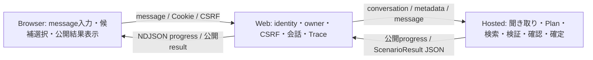

# App Service: 購買支援エージェント向けに変更した部分

更新日: 2026-09-07。基準ソースは [Snapshot](/home/hnakajima/work/foundry-procurement-agent/docs/observability-integration/source-snapshot.json)。この資料は、リポジトリに残る元のOAuth／Graph用 `server.py` と、現在起動する購買用 `procurement.py` を比較する。

**購買Webは、認証・会話管理・Hosted呼出し・公開応答の表示を担当する。商品検索や聞き取り、確認・確定の業務判断はHosted側にある。** Observabilityだけを移す場合は [本書のApp Service章](/home/hnakajima/work/foundry-procurement-agent/docs/observability-integration/README.md) の初期化・相関部分を組み込む。購買UIも採用する場合は、以下のAPI・応答契約・会話管理を一緒に合わせる。

なお、前回2026-09-06のSnapshotに収録したApp Service関連6ファイルと `test_webui.py` は、今回もhash・行数が一致している。「前回資料以降にWebの仕様が変わった」という意味ではなく、既に実装されていた購買向けの変更を今回詳述する。frontendも今回のSnapshotへ追加した。

## 1. 元サンプルとの比較と移すソース

| 観点 | 元OAuth／Graph版 | 現在の購買版／移植対象 |
| --- | --- | --- |
| backend | [server.py](/home/hnakajima/work/foundry-procurement-agent/src/webapp-foundry-oauth/backend/server.py) | [procurement.py](/home/hnakajima/work/foundry-procurement-agent/src/webapp-foundry-oauth/backend/procurement.py)。観測・owner管理・購買Agent接続を持つ |
| frontend | [index.html:16](/home/hnakajima/work/foundry-procurement-agent/src/webapp-foundry-oauth/backend/static/index.html:16)、[app.js](/home/hnakajima/work/foundry-procurement-agent/src/webapp-foundry-oauth/backend/static/app.js): OAuth説明、Who am I等、Tool Logs、承認／同意 | [procurement.html:28](/home/hnakajima/work/foundry-procurement-agent/src/webapp-foundry-oauth/backend/static/procurement.html:28)、[procurement.js:26](/home/hnakajima/work/foundry-procurement-agent/src/webapp-foundry-oauth/backend/static/procurement.js:26): 購買チャット、商品候補ボタン、最新turnのstatus／相関情報 |
| Web→Foundryの認証 | [server.py:577](/home/hnakajima/work/foundry-procurement-agent/src/webapp-foundry-oauth/backend/server.py:577): OBO／forward／MI等のmode選択、既定OBO | [procurement.py:205](/home/hnakajima/work/foundry-procurement-agent/src/webapp-foundry-oauth/backend/procurement.py:205): `ManagedIdentityCredential` とSDK client |
| chat入力 | `{conversationId, userMessage}` | [procurement.py:107](/home/hnakajima/work/foundry-procurement-agent/src/webapp-foundry-oauth/backend/procurement.py:107): `{message}` のみ。余分なfieldを拒否 |
| 実行方式 | [server.py:1259](/home/hnakajima/work/foundry-procurement-agent/src/webapp-foundry-oauth/backend/server.py:1259): background jobを作成し202、job API／SSE／pollで取得 | [procurement.py:343](/home/hnakajima/work/foundry-procurement-agent/src/webapp-foundry-oauth/backend/procurement.py:343): request内でResponsesを実行、JSONまたはNDJSON streamを返す |
| 会話継続 | browser UUID、serverの `previous_response_id`／in-memory state | Foundry Conversationとowner付きmetadata、利用者に結び付けた署名Cookie |
| ブラウザ保存 | [app.js:43](/home/hnakajima/work/foundry-procurement-agent/src/webapp-foundry-oauth/backend/static/app.js:43): localStorageにmessages／Tool logs／job等 | localStorageを使用せず、chat表示はDOM、CSRFはJSメモリ。会話参照はHttpOnly Cookie |
| MCP承認・同意 | [server.py:1349](/home/hnakajima/work/foundry-procurement-agent/src/webapp-foundry-oauth/backend/server.py:1349): `/api/continue`、approve／deny、同意後再開 | 現行購買API・UIにその操作はない。Prompt子／Toolboxを構成済みとしてHostedへ依頼する |
| ログ | [server.py:60](/home/hnakajima/work/foundry-procurement-agent/src/webapp-foundry-oauth/backend/server.py:60): Python通常logger | [procurement.py:173](/home/hnakajima/work/foundry-procurement-agent/src/webapp-foundry-oauth/backend/procurement.py:173): OTel Trace、相関属性、送信headerの検証boolean |
| 配備対象 | 元サンプルのファイル一式 | [package-procurement.py:12](/home/hnakajima/work/foundry-procurement-agent/src/webapp-foundry-oauth/scripts/package-procurement.py:12) の6ファイルallowlist |

現行の配備単位は、`backend/procurement.py`、`backend/static/procurement.html`、`backend/static/procurement.js`、`backend/static/styles.css`、Webルートの `requirements.txt`、`startup.sh`。新モジュール／assetを作る場合はpackagerにも加える。

起動は [startup.sh:18](/home/hnakajima/work/foundry-procurement-agent/src/webapp-foundry-oauth/startup.sh:18) の `uvicorn procurement:app --workers 1`。`backend/requirements.txt` は元版の依存定義であり、購買版のOryx build入力は [Webルートrequirements.txt](/home/hnakajima/work/foundry-procurement-agent/src/webapp-foundry-oauth/requirements.txt) である。

## 2. Browser・Web・Hostedの責務



WebはAI Searchを直接呼ばず、商品／部署検索Toolも持たない。Hostedの `response_text` を業務文章の正本とし、Webは `draft` や内部の `trace.events` から確認票や成功文章を再構築しない。

### 現行APIと組み込む場所

| API | ソース | 入力・処理・戻り値 |
| --- | --- | --- |
| `GET /` | [procurement.py:239](/home/hnakajima/work/foundry-procurement-agent/src/webapp-foundry-oauth/backend/procurement.py:239) | identityを確認し購買HTMLをno-storeで配信 |
| `GET /static/{name}` | [procurement.py:245](/home/hnakajima/work/foundry-procurement-agent/src/webapp-foundry-oauth/backend/procurement.py:245) | `procurement.js`／`styles.css` のみ配信 |
| `GET /api/state` | [procurement.py:252](/home/hnakajima/work/foundry-procurement-agent/src/webapp-foundry-oauth/backend/procurement.py:252) | 署名Cookieを確認しconversation ID・CSRFを返す。会話本文は返さない |
| `POST /api/conversation` | [procurement.py:265](/home/hnakajima/work/foundry-procurement-agent/src/webapp-foundry-oauth/backend/procurement.py:265) | Origin／CSRF確認後、Cookieの会話参照を外しCSRFを更新 |
| `POST /api/chat` | [procurement.py:343](/home/hnakajima/work/foundry-procurement-agent/src/webapp-foundry-oauth/backend/procurement.py:343) | `{message}` を受け、owner確認・turn予約後、Responsesを呼び公開JSONを返す |
| `POST /api/chat/stream` | [procurement.py:381](/home/hnakajima/work/foundry-procurement-agent/src/webapp-foundry-oauth/backend/procurement.py:381)、[294行](/home/hnakajima/work/foundry-procurement-agent/src/webapp-foundry-oauth/backend/procurement.py:294) | 同じ前処理の後、NDJSONの進捗と最終結果を返す。現行Browserはこちらを使用 |

移植先が元版のAPIを使用している場合、bodyのfield名、非同期jobの有無、stream形式が変わるため、backendだけ差し替えず呼出し側も合わせる。

## 3. 購買会話の段階とUIの実装

| 段階 | Webが表示・送信するもの | 判断を行う場所 |
| --- | --- | --- |
| 購買依頼 | textareaから `message` を送信。[procurement.js:95](/home/hnakajima/work/foundry-procurement-agent/src/webapp-foundry-oauth/backend/static/procurement.js:95) | Hostedが商品queryとIntakeを抽出 |
| 候補提示 | `WAITING_USER` かつ `missing_fields` に `selected_product_code` がある場合のみ、最大5件の商品ボタン。[procurement.py:145](/home/hnakajima/work/foundry-procurement-agent/src/webapp-foundry-oauth/backend/procurement.py:145) | HostedのCatalog結果・選択待ち判定 |
| 商品選択 | ボタンから `商品コード <code> を選びます。` を通常messageとして送信。[procurement.js:40](/home/hnakajima/work/foundry-procurement-agent/src/webapp-foundry-oauth/backend/static/procurement.js:40) | Hostedが保存候補との一致を検証。Browserが選択stateを直接書き換えない |
| 数量・部署・メモ | Hostedの問いかけを表示し、同じtextareaで回答を送信 | Hostedが入力を保存し、不足項目を判定。Webに専用form／段階stateはない |
| 確認表示 | `response_text` 内の申請者・商品・単価・数量・金額・部署・勘定科目・メモを表示 | [hosted.py:307](/home/hnakajima/work/foundry-procurement-agent/src/procurement_agent/hosted.py:307) が保存済み確認内容から文章生成 |
| 確定 | 利用者が `確定` と通常入力。専用確定API／buttonはない | Hostedが保存Catalog／Codeを検証・再利用してmerge_validateを実行 |
| 追加入力待ち・失敗 | 公開応答と許可されたstatusを表示 | Hostedの業務判定。WebがHTTP 200だけで成功文章を作らない |

確定で生成されるのは購買申請案。現行ソースの公開応答にも [提出・発注を行わない旨:345](/home/hnakajima/work/foundry-procurement-agent/src/procurement_agent/hosted.py:345) があり、外部購買システムへの提出・発注処理を組み込んだ状態ではない。

候補の公開項目はcode／name／unit_priceに限る。[procurement.py:145](/home/hnakajima/work/foundry-procurement-agent/src/webapp-foundry-oauth/backend/procurement.py:145) と [166行](/home/hnakajima/work/foundry-procurement-agent/src/webapp-foundry-oauth/backend/procurement.py:166) でコード形式、価格形式、名称の長さ等を検査する。部署の聞き直しなどで商品選択が不要な場合は候補ボタンを出さない。

[procurement.js:26](/home/hnakajima/work/foundry-procurement-agent/src/webapp-foundry-oauth/backend/static/procurement.js:26) の `show()` は `textContent` を使って応答・候補・statusを表示する。[procurement.html:38](/home/hnakajima/work/foundry-procurement-agent/src/webapp-foundry-oauth/backend/static/procurement.html:38) のdetails内には最新turnの相関IDとstatusを表示する。これらは利用者向けの診断情報であり、内部Tool引数や推論過程の表示機能ではない。

## 4. Hostedとの公開応答契約

WebからのResponses metadataは [_response_metadata():286](/home/hnakajima/work/foundry-procurement-agent/src/webapp-foundry-oauth/backend/procurement.py:286) で組み立てる。

| metadata | 用途 |
| --- | --- |
| `app.client.contract=web-json-v1` | Hostedに構造化最終応答を要求する |
| `test.case.id` | 同一Web会話の検索キー |
| `app.turn.number` | Webが予約した送信番号 |
| `app.authenticated.display_name` | EasyAuth由来の任意の表示名。申請者名の業務連携 |

[hosted.py:184](/home/hnakajima/work/foundry-procurement-agent/src/procurement_agent/hosted.py:184) はclient contractに応じて `ScenarioResult.model_dump_json()` を返し、それ以外は公開文章を返す。Webの [_public_result():129](/home/hnakajima/work/foundry-procurement-agent/src/webapp-foundry-oauth/backend/procurement.py:129) はこのJSONから `response_text`、許可status、候補等を抽出する。

**移植先Agentが自由文だけを返す場合、そのまま現行Webへ接続するとJSON契約のパースに失敗する。** 移植先Agentの結果を同等の公開schemaへ変換するか、Webのprojectionをそのサンプルの確定した契約に合わせる。観測のために内部payload全体をBrowserへ渡す必要はない。

Conversation metadataの `contract=procurement-intake-v2` は会話stateの互換性を管理する値で、Responses metadataの `web-json-v1` は応答形式の値。両者を同じversion文字列へ置換しない。

## 5. 会話管理とuserid連携

| 情報 | 保持先／参照箇所 | 移植時に保つ動作 |
| --- | --- | --- |
| 仮名化利用者ID | [_identity():52](/home/hnakajima/work/foundry-procurement-agent/src/webapp-foundry-oauth/backend/procurement.py:52) | EasyAuthのtid／oid双方を必須とし `SHA-256(tid + ':' + oid)` を作る。欠落401 |
| Cookie | [_sign():78](/home/hnakajima/work/foundry-procurement-agent/src/webapp-foundry-oauth/backend/procurement.py:78)、[_state():83](/home/hnakajima/work/foundry-procurement-agent/src/webapp-foundry-oauth/backend/procurement.py:83) | user、csrf、exp、conversation参照をHMAC署名。署名は暗号化ではない |
| Cookie送信設定 | [procurement.py:100](/home/hnakajima/work/foundry-procurement-agent/src/webapp-foundry-oauth/backend/procurement.py:100) | `__Host-procurement`、Secure／HttpOnly／SameSite=strict、1日有効 |
| POSTの検証 | [_validate_post():258](/home/hnakajima/work/foundry-procurement-agent/src/webapp-foundry-oauth/backend/procurement.py:258) | `WEB_APP_URL` とOriginを照合し、CSRFを比較する |
| 会話所有者 | [procurement.py:362](/home/hnakajima/work/foundry-procurement-agent/src/webapp-foundry-oauth/backend/procurement.py:362) | Foundry Conversationの `metadata.owner` をログイン利用者と照合。不一致403 |
| turnとcase | [procurement.py:371](/home/hnakajima/work/foundry-procurement-agent/src/webapp-foundry-oauth/backend/procurement.py:371) | 新規会話にowner／turn／case／contractを持たせ、実行前にturnを予約 |
| 観測用userid | [procurement.py:347](/home/hnakajima/work/foundry-procurement-agent/src/webapp-foundry-oauth/backend/procurement.py:347) | Web Spanの `user.id` とbaggageへ設定。終了時detach |
| 業務の聞き取りstate | [session_state.py](/home/hnakajima/work/foundry-procurement-agent/src/procurement_agent/session_state.py) | HostedのAgentSession側で管理。Cookieに商品・メモ等を格納しない |

新しい会話ボタンはCookieのconversation参照を外す操作であり、Foundryの会話をDELETEしない。元版のClear Historyもserverの会話参照を破棄する処理なので、どちらもremote履歴削除の実装として移植しない。

リロードすると `GET /api/state` から同じ会話を継続できるが、Browserは過去の文章を再取得しないため画面上のchatは復元されない。旧contractの会話を見つけた場合は新しいConversationを作り `conversationReset=true` を返す。次の応答生成には `previous_response_id` ではなく `conversation` を使う。

全利用者のturnは1つの `asyncio.Lock` で直列化し、1 worker／1 instanceを前提としている。[procurement.py:198](/home/hnakajima/work/foundry-procurement-agent/src/webapp-foundry-oauth/backend/procurement.py:198)、357行。これは現行PoCの会話更新方式であり、観測導入だけで移植先の並行制御を置換する必要はない。

観測用 `user.id`、業務用表示名、Foundry認証用Managed Identity tokenは用途が異なる。表示名をbaggageへ入れず、観測IDを認可の根拠にしない。元版のOBO関連処理を、このMI方式へ観測機能の一部として追加する必要はない。

## 6. ストリーミングを変えた部分

現行Browserへのstreamは **NDJSON**。WebはFoundry Responses SDKのイベントを受け取り、公開progressと最終resultに変換する。元版のjob APIのSSE形式とは異なる。

```text
Browser: POST /api/chat/stream {"message":"..."}
  → Web: identity / Cookie / CSRF / owner確認、turn予約
  → Foundry: responses.create(conversation=..., metadata=..., stream=True)
  ← Foundry: response.output_text.delta
  ← Browser: {"type":"progress","text":"..."} の行
  ← Foundry: response.completed
  ← Browser: {"type":"result","value":{公開応答・status・相関ID等}} の行
```

上記は契約の形を示す模式図。実装は [_stream_turn():294](/home/hnakajima/work/foundry-procurement-agent/src/webapp-foundry-oauth/backend/procurement.py:294) と [procurement.js:67](/home/hnakajima/work/foundry-procurement-agent/src/webapp-foundry-oauth/backend/static/procurement.js:67)。

- [_stream_progress():274](/home/hnakajima/work/foundry-procurement-agent/src/webapp-foundry-oauth/backend/procurement.py:274) はstep／stateの許可リスト、messageの長さと改行を検査する。raw delta全体やTool引数をBrowserへ中継しない。
- [procurement.py:317](/home/hnakajima/work/foundry-procurement-agent/src/webapp-foundry-oauth/backend/procurement.py:317) は最終 `response.completed` と `status=completed` を確認してresultを返す。deltaを受け取っただけでは成功扱いしない。
- stream中のエラーはHTTP 200送信後にも発生し得る。[procurement.py:330](/home/hnakajima/work/foundry-procurement-agent/src/webapp-foundry-oauth/backend/procurement.py:330) でSpanをERRORにし、公開resultのtechnical ERRORと相関IDを返す。
- generator自身でもbaggageをattach／detachし、終了時にlockを解放する。request関数の外で動くstreamの相関を維持する。
- [procurement.js:74](/home/hnakajima/work/foundry-procurement-agent/src/webapp-foundry-oauth/backend/static/procurement.js:74) は改行単位でJSONを読む。最終resultがなければ通信中断・完了未確認と表示する。進捗表示は最終responseへ置き換える。
- 送信中は入力・送信・新しい会話を無効にし、終了時に戻す。現行に旧版のjob cancel／cursor再開APIはない。

## 7. Observabilityと配備を一緒に合わせる

`_lifespan()` では、署名key／HTTPS originの検証、会話lock、OTel Provider、Managed Identity、計装HTTPX、named Agent clientを構成する。[procurement.py:190](/home/hnakajima/work/foundry-procurement-agent/src/webapp-foundry-oauth/backend/procurement.py:190)。サンプルへ初期化を移す際は、観測用Providerと実際にSDKへ渡すHTTPX clientの対応を保つ。

必要なWeb設定は `APPLICATIONINSIGHTS_CONNECTION_STRING`、`PROJECT_ENDPOINT`、`AGENT_NAME`、`WEB_APP_URL`、`WEBUI_SESSION_SIGNING_KEY` とEasyAuth設定。[infra/webui.bicep:94](/home/hnakajima/work/foundry-procurement-agent/infra/webui.bicep:94)。接続文字列・署名key・tokenの値はソースや資料に埋め込まない。

userid伝播の実装詳細は本書3.4節、OTel依存は3.1節、初期化は3.2節、ログ記録は3.3節を参照。`PLATFORM_PROPAGATION` やHTMLの伝播注記は固定値であり、毎requestのManaged下流到達を計測した表示ではない。

## 8. 移植時の対応順と確認項目

| 順序 | 組み込むもの | 完了を確認する観点 |
| --- | --- | --- |
| 1 | Agentの公開応答契約 | `web-json-v1` の最終JSONから公開文章・候補・statusを取得できる |
| 2 | backendの認証・会話管理 | 未認証、別owner、CSRF不一致を拒否し、正しい利用者は会話を継続できる |
| 3 | frontendとAPI | `{message}`、候補ボタン、NDJSON、通信中断時の表示が対応する |
| 4 | 購買の対話 | 商品選択 → 数量 → 部署 → メモ → 確認 → 確定を進め、追加情報待ちも正しく表示する |
| 5 | OTel初期化・相関 | Web送信Spanのtraceparent／baggage一致、会話・turn・response IDを確認する |
| 6 | requirements・startup・ZIP | 実際に起動する購買backendと必要asset／観測依存が同梱される |
| 7 | 配備先での確認 | MI権限、EasyAuth、Named Agent接続、Trace収集・Managed境界を実測する |

ローカルの根拠テストは [test_webui.py](/home/hnakajima/work/foundry-procurement-agent/tests/unit/test_webui.py) と [test_conversation_intake.py](/home/hnakajima/work/foundry-procurement-agent/tests/integration/test_conversation_intake.py)。今回の資料更新ではブラウザ実操作・Azure再測定・移植先との統合は実施していない。
