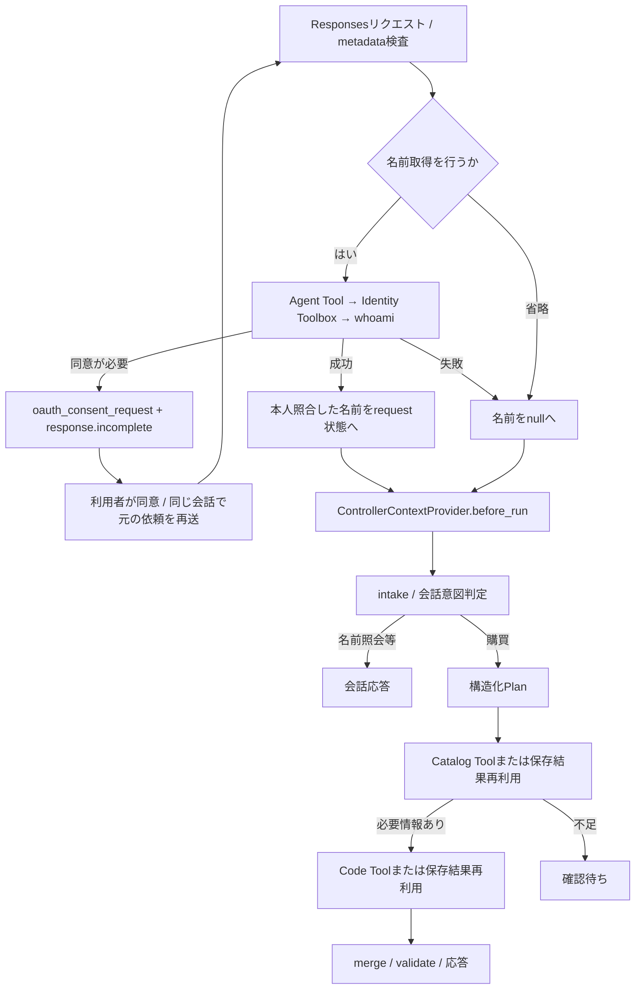

# HostedAgent：agent_as_toolの組み込み位置と呼び出し順

更新日: 2026-09-08。Hosted `procurement-parent-agent` v33の実装を基準とする。[統合ガイド](README.md)／[Hosted設定](../deployment/hosted-agent-settings.md)も参照。

## 1. 登録する3つのTool

| 親に登録するTool名 | Agentの実体 | 生成箇所 | 実行箇所 |
| --- | --- | --- | --- |
| obo_identity_agent | Hosted内の専用Agent。DeterministicChatClientでGraph取得を固定実行 | [build_identity_tool](/home/hnakajima/work/foundry-procurement-agent/src/procurement_agent/identity.py:83) の `Agent.as_tool(..., propagate_session=False)` | [_handle_response](/home/hnakajima/work/foundry-procurement-agent/src/procurement_agent/hosted_app.py:111) → `invoke_identity()` |
| catalog_search_agent | 登録済み遠隔Prompt Agent `catalog-search-agent` v4 | [build_hosted_bundle](/home/hnakajima/work/foundry-procurement-agent/src/procurement_agent/hosted.py:200) の `FoundryAgent.as_tool()` | Controllerの `_run_catalog_step()` → invoker |
| code_determination_agent | 登録済み遠隔Prompt Agent `code-determination-agent` v2 | 同上 | Controllerの `_run_code_step()` → invoker |

親Agentの `tools=[identity_tool, catalog_tool, code_tool]` は登録であり、配列の順に自動実行する仕組みではない。OBOはHostのprotocol adapter、商品／部署検索はControllerが明示的に呼ぶ。親の応答clientも決定的な処理で、LLMが3つのToolの順序を自由に決める構成ではない。

## 2. 実行順

同意待ちではPlanner／Catalog／Codeはまだ実行されない。Graph結果を使う場合はController前に取得し、通常失敗・省略ならnullで購買へ進む。WebのFoundry委任Token取得自体が失敗した場合はHostedを呼べず、名前取得だけの失敗とは扱わない。

## 3. OBOの実呼び出し

[invoke_identity](/home/hnakajima/work/foundry-procurement-agent/src/procurement_agent/identity.py:145) は固定引数 `{"task":"lookup"}` とFunctionInvocationContextで `tool.invoke()` を呼ぶ。購買prompt・親会話履歴・TokenをTool引数へ渡さない。lookupがfalseならToolを呼ばずSKIPPEDを返す。

専用Agentのlookup処理はrequestごとに `FoundryToolbox` を作成・closeし、SDKが公開した `toolbox.functions` からwhoamiを1つ選んで `FunctionTool.invoke()` を実行する。2026-09-08の公開名は **`whoami_func___whoami`**。ソースは公式記載の `whoami_func.whoami` も受け入れる。文字列を固定した `call_tool()` ではremote名やmetadataが失われるため、公開FunctionToolを使う。

FoundryToolboxへの認証はHosted credentialとプラットフォーム提供の `x-agent-foundry-call-id`。OAuth connectionからFunctionsへの利用者委任、FunctionsからGraphへのOBOは別の境界である。旧遠隔OBO Agentインスタンスを呼び出す設定はない。

結果は `parse_whoami_result()` → `verified_name()` で構造・auth_mode・subjectHashを検証し、氏名をrequest ContextVarへ保持する。Agent Toolのテキスト出力はstatusのみで、Controllerへ氏名を渡す経路は検証済みの内部状態である。SKIPPED/FAILEDでは保存済みの氏名/sourceも消去する。

## 4. Catalog／Codeの実呼び出し

[_execute_hosted_components](/home/hnakajima/work/foundry-procurement-agent/src/procurement_agent/hosted.py:467) がCatalog／Code用のinvokerをControllerへ渡す。[_invoke_remote_tool](/home/hnakajima/work/foundry-procurement-agent/src/procurement_agent/hosted.py:443) はPydantic payloadをJSON化して `tool.invoke()` を実行する。遠隔Prompt Agentの応答を型付き結果へ正規化し、[invoke_validated](/home/hnakajima/work/foundry-procurement-agent/src/procurement_agent/controller.py:347) がhandoff契約を検証する。

入力はCatalogSearchInput／CodeDeterminationInput。Code入力には検証済みの商品・所属部署と相関情報を使う。子へ親Session全体を共有せず、`propagate_session=False` と最小snapshotで呼ぶ。Foundry Conversation ID、Framework AgentSession、remote task IDは別のIDであり、同一値と仮定しない。

| turn／状態 | 実行順と再利用 |
| --- | --- |
| 最初の商品依頼 | OBO（有効時）→intake/plan→Catalog。数量・部署・選択等が不足すれば確認待ち |
| 商品選択・部署等の補足 | OBO→保存済みCatalog根拠の検証／再利用→Code→確認応答 |
| 確認済み申請の確定 | OBO→保存済みCatalog/Codeの再検証・再利用→merge.validate |
| 直接の完全な購買入力（保存根拠なし） | OBO設定に従う→Catalog→Code→merge.validate |
| 名前照会 | OBO→本人情報の会話応答。検索Toolは不要 |
| Catalog/Code失敗、入力不足 | 失敗層・statusに応じて停止／確認待ち。後続Toolを無条件に実行しない |

保存結果の再利用は [execute](/home/hnakajima/work/foundry-procurement-agent/src/procurement_agent/controller.py:722)、[_saved_confirmation_context](/home/hnakajima/work/foundry-procurement-agent/src/procurement_agent/controller.py:311)、`PlanExecutor.reuse()` にある。新しいSpanのためだけに検索Toolを再実行しない。完了stepの再利用と実際のremote呼び出しを区別して観測する。

## 5. サンプルへの移植単位

OTelだけなら既存のPlan&Execute順序を維持し、共通Recorderと各step Spanを移す。Agent Tool方式まで採用するなら、登録だけでなくinvoker・構造化契約・保存状態・再利用判定も対応付ける。OBOを採用するならidentity.py、Host同意bridge、request状態の解除、nullable氏名、OAuth設定を一組で組み込む。

Agent/Chat/Function/MCPはSDK標準Span、業務stepはplan.step.execute、OBO全体はidentity.lookupで観測する。Tool登録名を `agent_as_tool` という追加Span名に置き換えない。確認根拠と最新関数行番号は[ソース索引](source-map.md)を参照。
