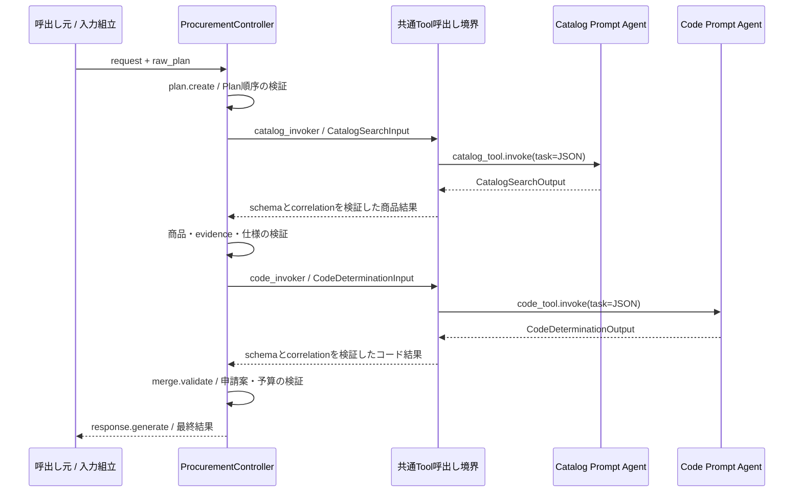

# HostedAgent: 子AgentをToolとして呼ぶ箇所と実行順序

更新日: 2026-09-07。基準ソースは [本書のSnapshot](/home/hnakajima/work/foundry-procurement-agent/docs/observability-integration/source-snapshot.json)。移植先サンプルのファイル名は未確認のため、移植先は処理の役割で示す。

**現在の購買処理は、ControllerがCatalog → Code → merge_validateの順序を制御する。** 子Agentは `FoundryAgent.as_tool()` でTool化し、Controllerのinvokerから `tool.invoke()` を呼ぶ。親Agentの `tools=[catalog_tool, code_tool]` は登録であり、その配列だけで実行順序が決まるわけではない。

## 1. 何を登録し、どこから呼ぶか

| 段階 | 現行ソース | 役割／移植先の挿入位置 |
| --- | --- | --- |
| 接続設定 | [hosted.py:79](/home/hnakajima/work/foundry-procurement-agent/src/procurement_agent/hosted.py:79) `FoundryRuntimeSettings` | Project endpoint、親model、子Agent名・versionを環境設定から解決する |
| 子Agentのproxyを生成 | [hosted.py:201](/home/hnakajima/work/foundry-procurement-agent/src/procurement_agent/hosted.py:201)、209行 | Foundryに登録されたCatalog／CodeのPrompt Agentを指定する。ローカルで子のLLM実装を新設する処理ではない |
| CatalogをTool化 | [hosted.py:217](/home/hnakajima/work/foundry-procurement-agent/src/procurement_agent/hosted.py:217) | `catalog_proxy.as_tool(name="catalog_search_agent", ...)` |
| CodeをTool化 | [hosted.py:222](/home/hnakajima/work/foundry-procurement-agent/src/procurement_agent/hosted.py:222) | `code_proxy.as_tool(name="code_determination_agent", ...)` |
| Controllerへ渡す | [hosted.py:241](/home/hnakajima/work/foundry-procurement-agent/src/procurement_agent/hosted.py:241) | 同じRecorderと2つのToolを `ControllerContextProvider` へ渡す |
| 親Agentへ登録 | [hosted.py:245](/home/hnakajima/work/foundry-procurement-agent/src/procurement_agent/hosted.py:245) | `tools`、history／Controller context provider、middlewareを接続する |
| 各turnの処理入口 | [hosted.py:142](/home/hnakajima/work/foundry-procurement-agent/src/procurement_agent/hosted.py:142) `before_run()` | 通常turnは `_execute_hosted_components()`。検証metadataがある場合の別経路は後述 |
| invokerの接続 | [hosted.py:501](/home/hnakajima/work/foundry-procurement-agent/src/procurement_agent/hosted.py:501) | `ProcurementController` の `catalog_invoker`／`code_invoker` に、Toolと親sessionを閉じ込めたlambdaを渡す |
| Catalogの実行 | [controller.py:537](/home/hnakajima/work/foundry-procurement-agent/src/procurement_agent/controller.py:537) | `_run_catalog_step()` → `invoke_validated(self.catalog_invoker, ...)` |
| Codeの実行 | [controller.py:617](/home/hnakajima/work/foundry-procurement-agent/src/procurement_agent/controller.py:617) | `_run_code_step()` → `invoke_validated(self.code_invoker, ...)` |
| 共通のremote呼出し | [hosted.py:437](/home/hnakajima/work/foundry-procurement-agent/src/procurement_agent/hosted.py:437) `_invoke_remote_tool()` | 入力をJSON文字列にし、許可判定を通して `tool.invoke()` を実行する |
| 入出力検証 | [controller.py:349](/home/hnakajima/work/foundry-procurement-agent/src/procurement_agent/controller.py:349) `invoke_validated()` | 入力model、出力model、入出力correlationの一致を検証する |

### Tool化するコード

以下は `build_hosted_bundle()` の実コード抜粋。`catalog_proxy`／`code_proxy` は上記の `FoundryAgent` インスタンスである。

```python
catalog_tool = catalog_proxy.as_tool(
    name="catalog_search_agent",
    description="Run the registered catalog Prompt Agent with CatalogSearchInput JSON.",
    propagate_session=False,
)
code_tool = code_proxy.as_tool(
    name="code_determination_agent",
    description="Run the registered code Prompt Agent with CodeDeterminationInput JSON.",
    propagate_session=False,
)
```

`propagate_session=False` により、親のFramework Sessionを子Agentの会話sessionとして渡さない。`FunctionInvocationContext` に親sessionを入れるのは親側のmiddleware／state処理のためであり、この設定と矛盾しない。子へ必要な検索条件と相関は構造化payloadで渡す。これはHTTPのTrace Context伝播を無効にする設定ではない。

根拠はインストール済みSDKの [Agent.as_tool:608](/home/hnakajima/work/foundry-procurement-agent/.venv/lib/python3.13/site-packages/agent_framework/_agents.py:608) と、子の `run()` にsessionが渡らないことを確認する [既存テスト:79](/home/hnakajima/work/foundry-procurement-agent/tests/unit/test_hosted_factory_v2.py:79)。SDKファイルは参照用であり、移植対象ではない。

### 実呼出しと境界の検証

[hosted.py:437](/home/hnakajima/work/foundry-procurement-agent/src/procurement_agent/hosted.py:437) の前半の実コードは次のとおり。Toolの外側で `invoke_validated()` が契約を検証するため、この抜粋だけを単独の呼出し実装として移さない。

```python
arguments = {"task": payload.model_dump_json()}
context = FunctionInvocationContext(function=tool, arguments=arguments, session=session)
result: dict[str, Any] = {}

async def invoke() -> None:
    result["raw"] = await tool.invoke(
        arguments=arguments, context=context, skip_parsing=True,
    )

await ToolGovernanceFunctionMiddleware().process(context, invoke)
```

`task` が `as_tool()` の入力引数で、その値は `CatalogSearchInput` または `CodeDeterminationInput` のJSON文字列。戻り値は後続処理でmodel／dict／JSON文字列／text content listからdictへ揃える。`skip_parsing=True` は業務schema・相関の検証を不要にする指定ではない。

`ToolGovernanceFunctionMiddleware.process()` は [_invoke_remote_tool内:447](/home/hnakajima/work/foundry-procurement-agent/src/procurement_agent/hosted.py:447) から明示的に呼ぶ。親AgentのLLMによるTool選択経由とは異なるため、親のmiddleware登録だけに依存しない。許可する名前は [middleware.py:34](/home/hnakajima/work/foundry-procurement-agent/src/procurement_agent/middleware.py:34) の2つのTool名と合わせる。

## 2. 順序を決める箇所

| 制御 | ソース | 実際の制約 |
| --- | --- | --- |
| Plannerの役割 | [hosted.py:526](/home/hnakajima/work/foundry-procurement-agent/src/procurement_agent/hosted.py:526) | `ProcurementIntake` とPlanを1回の構造化LLM呼出しで生成。`tools=[]`、`tool_choice="none"` のため、この呼出しで検索Toolを選ばない |
| 許可するPlan | [plan.py:25](/home/hnakajima/work/foundry-procurement-agent/src/procurement_agent/plan.py:25) `APPROVED_STEPS` | `catalog` → `code` → `merge_validate` の順序・owner・入力参照を定義 |
| Planの正規化 | [plan.py:48](/home/hnakajima/work/foundry-procurement-agent/src/procurement_agent/plan.py:48) `StructuredPlanBuilder.build()` | PlannerのPlanが契約と異なれば理由を付けて既定Planへ戻す |
| 順序・試行数 | [plan.py:84](/home/hnakajima/work/foundry-procurement-agent/src/procurement_agent/plan.py:84) `PlanExecutor` | 次Stepとattempt上限を確認。既定の `max_attempts=2` |
| 実行分岐 | [controller.py:724](/home/hnakajima/work/foundry-procurement-agent/src/procurement_agent/controller.py:724) `execute()` | 待機、再試行、保存結果の再利用、停止を判定して各Stepを実行 |
| 親の最終応答 | [hosted.py:245](/home/hnakajima/work/foundry-procurement-agent/src/procurement_agent/hosted.py:245) | `DeterministicChatClient(controller_result_handler)` がController結果を返す |

Code入力はCatalogの選択商品コード・カテゴリと依頼の部署を必要とする。merge_validateは商品・コード・evidenceを必要とする。2つの子を並列実行する制御はない。

次の図は、必要項目を持つ `ProcurementRequest` をControllerへ直接渡し、正常終了する場合の処理順。通常Webの聞き取りは次節のように複数turnへ分かれる。



図の共通境界には `invoke_validated()` と `_invoke_remote_tool()` をまとめている。各Prompt Agentの先のToolbox／AI Searchは [構成図](/home/hnakajima/work/foundry-procurement-agent/docs/observability-integration/README.md) を参照。

## 3. 通常Webでは、どのturnに何を呼ぶか

**「すべての入力でCatalogとCodeを毎回呼ぶ」という動作ではない。** 通常の初回入力は `ProcurementIntakeRequest` でControllerへ渡す。候補や確認結果をsession stateに保存し、後続turnで再利用する。

| 条件／段階 | Catalogのremote呼出し | Codeのremote呼出し | 結果と根拠 |
| --- | --- | --- | --- |
| 挨拶、本人名の確認 | なし | なし | Hostedの会話応答のみ。[hosted.py:491](/home/hnakajima/work/foundry-procurement-agent/src/procurement_agent/hosted.py:491) |
| 検索queryなし | なし | なし | Planを作成した後、追加情報待ち。[controller.py:801](/home/hnakajima/work/foundry-procurement-agent/src/procurement_agent/controller.py:801) |
| 新しい商品検索 | 通常1回 | なし | Catalog成功でもいったん候補選択／次の情報入力を待つ。[controller.py:948](/home/hnakajima/work/foundry-procurement-agent/src/procurement_agent/controller.py:948)、954行 |
| 商品0件または再試行可能な失敗 | 初回に加え最大1回 | 商品結果が確定しなければなし | 再試行可能性を確認し、2回目も不成立ならWAITING_USER／BLOCKED。[controller.py:964](/home/hnakajima/work/foundry-procurement-agent/src/procurement_agent/controller.py:964) |
| 保存候補を選択したが数量・部署・メモ等が不足 | なし | なし | 保存Catalogを保持して不足項目を聞く。[controller.py:855](/home/hnakajima/work/foundry-procurement-agent/src/procurement_agent/controller.py:855) |
| 保存商品と必要項目が揃った | 再利用、remote呼出しなし | 1回 | Codeを取得して確認表示へ進み、確定入力を待つ。[controller.py:894](/home/hnakajima/work/foundry-procurement-agent/src/procurement_agent/controller.py:894)、899行、944行 |
| 部署が未登録 | 保存商品を再利用 | 当該入力で1回 | 部署を未入力へ戻し、聞き直す。無条件の即時Code再試行はしない。[controller.py:914](/home/hnakajima/work/foundry-procurement-agent/src/procurement_agent/controller.py:914) |
| 有効な確認内容に対し「確定」 | 再利用、remote呼出しなし | 再利用、remote呼出しなし | 保存結果と依頼の一致を検証後、merge_validateで申請案を確定。[controller.py:806](/home/hnakajima/work/foundry-procurement-agent/src/procurement_agent/controller.py:806) |
| 確定時の保存結果が不整合 | なし | なし | VALIDATION_FAILEDで停止。検索し直して別商品を確定するfallbackはない。[controller.py:807](/home/hnakajima/work/foundry-procurement-agent/src/procurement_agent/controller.py:807) |
| 商品queryを変更 | 保存結果を破棄後、再検索 | 新しい商品が確定するまでなし | 候補・選択・コードの古い結果をクリア。[hosted.py:554](/home/hnakajima/work/foundry-procurement-agent/src/procurement_agent/hosted.py:554) |

商品選択ボタンが送る `商品コード X を選びます。` と厳密な `確定` は、保存Intakeがある場合、Planner LLMも省略する。[hosted.py:511](/home/hnakajima/work/foundry-procurement-agent/src/procurement_agent/hosted.py:511)。選択コードは保存候補にあるかを確認する。

最終確定の再利用条件は [_saved_confirmation_context():313](/home/hnakajima/work/foundry-procurement-agent/src/procurement_agent/controller.py:313)。query、数量、部署、メモ、制約、申請者、商品コード、session、grounding、仕様を確認する。再利用は [PlanExecutor.reuse():145](/home/hnakajima/work/foundry-procurement-agent/src/procurement_agent/plan.py:145) に記録される。再利用turnで子Agent／検索Spanが存在しないことだけを、Trace欠落と判定しない。

最新の [_with_response_text()](/home/hnakajima/work/foundry-procurement-agent/src/procurement_agent/hosted.py:292) は、商品選択待ちの場合、最大5件の候補・商品コード・単価・選択方法を公開文章へ含める。Webの候補ボタンに加え、Playground等の文章応答でも選べる。

## 4. Observabilityをどこへ重ねるか

| 観測境界 | 記録方法 | 順序との関係 |
| --- | --- | --- |
| Plan構築 | `plan.create` | Planner LLM呼出しの後。LLM時間全体を含まない |
| Catalogの1 attempt | `plan.step.execute`、`agent.role=catalog_search`、step／attempt／相関属性 | `invoke_validated()` とremote呼出しを含める |
| Codeの1 attempt | `plan.step.execute`、`agent.role=code_determination`、step／attempt／相関属性 | Catalog検証後の実呼出しを含める |
| Agent／Chat／Function | 使用中のFramework SDKの標準計装 | アプリから同じ意味のSpanを追加しない。収集後のSpan名・親子関係は実Traceで確認 |
| 保存結果の再利用 | 業務stateの `step.reused` 等 | 全state eventが自動でOTel送信されるわけではない。検索の所要時間として新しいSpanを作らない |
| 統合・最終結果 | `merge.validate` → `response.generate` | 確認前の聞き取りturnにはmerge_validateがない |

`agent_as_tool` は呼出し方式の名称であり、このアプリに同名の関数や手書きSpanがあるわけではない。`TelemetryRecorder` は `agent_as_tool`／`tool.invoke` 等の標準計装と重なる名前を禁止する。[observability.py:32](/home/hnakajima/work/foundry-procurement-agent/src/procurement_agent/observability.py:32)

## 5. 最新ソースにあるSynthetic検証経路

通常購買経路とは別に、[hosted_app.py:52](/home/hnakajima/work/foundry-procurement-agent/src/procurement_agent/hosted_app.py:52) のmiddlewareで次の条件をすべて満たす場合だけ、検証profileを採用する。

| 条件 | 必須値 |
| --- | --- |
| 環境変数 | `PROCUREMENT_ENABLE_SYNTHETIC_INJECTIONS=true` |
| Responses metadata | `synthetic="true"` |
| validation contract | `app.validation.contract="stage-b-v1"` |
| profile | `app.validation.profile` がソースの `_VALIDATION_PROFILES` 許可リスト内 |
| case ID | `test.case.id` が `AZURE-CORE-` で始まり、英数字・underscore・hyphenの1～128文字 |

採用時は [hosted.py:155](/home/hnakajima/work/foundry-procurement-agent/src/procurement_agent/hosted.py:155) から `run_azure_validation()` を呼び、通常Plannerを省略する。Catalog／Codeのremote invokerは同じものを渡し、[azure_validation.py:70](/home/hnakajima/work/foundry-procurement-agent/src/procurement_agent/azure_validation.py:70) と [stage_b.py](/home/hnakajima/work/foundry-procurement-agent/src/trace_pipeline/stage_b.py) のHarnessが固定Synthetic入力、Failure Pattern注入／Healthy対照、評価を実行する。この経路の例外的な呼出しを通常購買の順序説明へ混ぜない。

最新の追加観測は次のとおり。

- [azure_validation.py:187](/home/hnakajima/work/foundry-procurement-agent/src/procurement_agent/azure_validation.py:187): `semantic.evaluate` Spanに `app.validation.*` を付け、`evaluation.completed` eventを記録する。detector計算はSpanを開く前なので、durationは評価計算全体の時間ではない。
- [azure_validation.py:113](/home/hnakajima/work/foundry-procurement-agent/src/procurement_agent/azure_validation.py:113): system promptとTool定義のhash・文字数を生成する。Traceにはhash等の限定属性を載せる。
- [azure_validation.py:189](/home/hnakajima/work/foundry-procurement-agent/src/procurement_agent/azure_validation.py:189): S5では固定 `X` 文字列をproperty／messageへ送って保存長を測る。実ユーザーの入力をcontent-onにする機能ではない。
- `trace_complete` は評価に必要なartifact項目から求めた値であり、Azureに全Spanが保存されたことの保証ではない。保存済みの [9月7日更新レポート:76](/home/hnakajima/work/foundry-procurement-agent/docs/report/validation-results-2026-09-06.md:76) でもS5の保存長観測とbackend Span欠落を別々に報告している。

### コピー範囲と配備設定

Observabilityのみを移植するなら、Recorderと必要な業務境界を既存サンプルへ挿入すればよい。子Agent化も移す場合は、接続設定 → proxy／as_tool → invoker → 入出力契約 → Controllerの順序・再利用 → 観測、の組で移す。

**最新の `hosted.py` をそのまま移す場合は、検証を無効にしてもimport依存が残る。** `hosted.py` → `azure_validation.py` → `trace_pipeline` をimportするため、[package_hosted.py:25](/home/hnakajima/work/foundry-procurement-agent/scripts/package_hosted.py:25) と同様に `trace_pipeline/__init__.py`、`detectors.py`、`envelope.py`、`stage_b.py` を同梱する。共通Recorderだけを移す構成にはこの依存はない。

現行PoCの [deploy_foundry.py:157](/home/hnakajima/work/foundry-procurement-agent/scripts/deploy_foundry.py:157) は検証用環境変数を `true` にする。移植先の通常購買で検証Harnessを使わない場合は、移植先の配備設定で未設定または `false` とする。検証を再現する場合に限り、固定profileとgateを一緒に移す。

## 6. 移植後に確認する順序

1. 2つのTool名、子Agent名・version、許可リスト、入力modelが対応している。
2. 不正なPlan順序を渡してもCatalog → Code → merge_validateが維持される。
3. 初回商品検索、追加入力、確認、確定を分け、各turnの実際の子呼出し数を確認する。
4. 保存候補にない選択、仕様不一致、部署なし、確定時の不整合で、後続Stepが誤って走らない。
5. 子出力のschema／correlation不一致が境界で拒否され、生の例外本文がTraceへ流れない。
6. 通常リクエストに `semantic.evaluate` がなく、必要なSynthetic gateが揃った検証だけに現れる。

現行の根拠テストは [test_plan_v2.py](/home/hnakajima/work/foundry-procurement-agent/tests/unit/test_plan_v2.py)、[test_hosted_factory_v2.py](/home/hnakajima/work/foundry-procurement-agent/tests/unit/test_hosted_factory_v2.py)、[test_conversation_intake.py](/home/hnakajima/work/foundry-procurement-agent/tests/integration/test_conversation_intake.py)、[test_hosted_protocol_v2.py](/home/hnakajima/work/foundry-procurement-agent/tests/unit/test_hosted_protocol_v2.py)、[test_azure_validation_v2.py](/home/hnakajima/work/foundry-procurement-agent/tests/integration/test_azure_validation_v2.py)。ローカルテストの結果と実Azureの伝播・収集結果は区別する。
