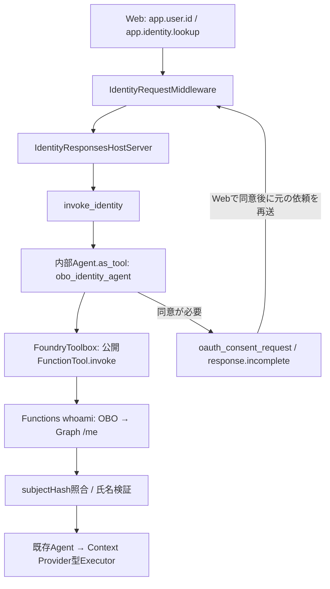

# HostedAgentのOBO・user.id移植用抜粋

作成日: 2026-09-10。基準ソース: main `781db92`。対象SDKはagent-framework-core 1.16.0、agent-framework-foundry-hosting 1.0.0b260827、opentelemetry-sdk 1.43.0。

[移植用Pythonファイル](examples/hosted_obo_userid.py)に、OBO Agent Tool、本人照合、request context、OTel設定、OAuth同意bridgeをまとめた。HostedAgentBundleや購買Controllerへのimportはない。単独アプリではないため、ファイルを置くだけでは呼び出されない。以下のHost接続と、既存Executorへの氏名・Span属性の反映が必要である。移植先の実ソース・SDK・Azure設定は未提供。

## 1. user.idとOBO氏名の役割

| 値 | 生成／取得する場所 | Hostedでの用途 |
| --- | --- | --- |
| `app.user.id` | WebがEasyAuthのtenant IDとuser IDを小文字化し、`SHA-256(tid:user_id)`を計算 | Responses metadataで受信する64桁hex |
| `user.id` | Hostedが上記metadataを検査して設定 | OTel相関と、OBO結果の本人照合 |
| `subjectHash` | Functionsが受信TokenのoidとGraph /meのidを照合した後、同じ式で計算 | Webから届いたhashと一致するかをHostedで確認 |
| `displayName` | FunctionsのGraph /me結果 | 照合成功時だけrequest ContextVarへ保持し、申請者名へ反映 |

**user.idはOBO成功時に初めて生成されるものではない。** OBOを省略・失敗しても、Webから正しいmetadataが届けば相関用user.idを利用できる。一方、氏名は省略・失敗時にnullとなる。

64桁hexの形式検査自体は認証ではない。既存のEasyAuth、Foundryの利用者委任、Toolboxの認証を維持する。Webのuser IDがEntraのoidと対応しない設定ならFunctionsのhashと一致せず、氏名は採用しない。生のoid、氏名、TokenをSpan属性やbaggageへ追加しない。

## 2. 呼び出し経路と、抜き出した元コード



| 元ファイル・関数 | 抜粋内容 | 移植用ファイルでの扱い |
| --- | --- | --- |
| [identity.py](../../src/procurement_agent/identity.py)の`build_identity_tool`、`invoke_identity` | Agent Tool生成、MCP実呼出し、status | 処理をそのまま収録 |
| 同`parse_whoami_result`、`verified_name`、`_consent` | 結果構造、本人照合、同意例外の取り出し | 処理をそのまま収録 |
| [framework.py](../../src/procurement_agent/framework.py)の`DeterministicChatClient` | LLMを使わず固定のlookup処理を実行するAgent client | 必要な型・importと一緒に収録 |
| [observability.py](../../src/procurement_agent/observability.py)の`request_correlation`、`current_request_attributes` | user.id等のrequest context | そのまま収録。Recorder／評価処理は不要 |
| 同`McpPrivacyProcessor`、`configure_host_observability` | HostのProvider初期化、MCP同意例外の秘匿 | そのまま収録 |
| [hosted.py](../../src/procurement_agent/hosted.py)の`authenticated_applicant_name`、`applicant_lookup_status` | request単位の氏名・status | 共通ファイルへ移動 |
| [hosted_app.py](../../src/procurement_agent/hosted_app.py)の`_RequestCorrelationMiddleware` | Web metadataの受け取り・finally reset | `IdentityRequestMiddleware`へ限定抽出。旧Webの氏名metadata受入れとSynthetic評価条件は含めない |
| 同`ProcurementResponsesHostServer._handle_response` | OBO先行実行、同意待ちの中断、request状態のreset | 処理をそのまま収録。constructorだけ`parent_agent, identity_tool`へ変更 |
| [hosted.py](../../src/procurement_agent/hosted.py)の`ControllerContextProvider.before_run`、`_execute_hosted_components` | Span属性設定、氏名の購買stateへの反映 | 購買固有なのでファイルには収録せず、下記の接続例を使用 |

コードリンクはこの資料の配置場所からの相対パス。移植用ファイルの冒頭と各抜粋に元のモジュール・関数名も記載している。

## 3. MCPを実際に呼んでいる部分

`build_identity_tool()`のlookup内で、requestごとにToolbox sessionを開く。元コードの主要部分は以下。例外処理・同意判定も含む完全な関数はPythonファイルを使用する。

```python
async with toolbox_factory(
    credential,
    url=os.environ["PROCUREMENT_IDENTITY_TOOLBOX_ENDPOINT"],
    name="procurement-identity-toolbox",
    parse_tool_results=parse_whoami_result,
) as toolbox:
    matches = [f for f in toolbox.functions if f.name in {
        "whoami_func___whoami", "whoami_func.whoami",
    }]
    if len(matches) != 1:
        raise ValueError("whoami_tool_unavailable")
    function = matches[0]
    raw = await function.invoke(
        arguments={},
        context=FunctionInvocationContext(function=function, arguments={}),
        skip_parsing=True,
    )
    name = verified_name(raw, current_request_attributes().get("user.id", ""))
    result = IdentityResult("SUCCESS", name)
```

これは購買promptやTokenを引数にして呼ぶToolではない。Functions whoamiへの引数は空。Agent Toolの外側の引数は固定の`{"task": "lookup"}`であり、`propagate_session=False`。Agent Toolのテキスト結果はstatusだけで、氏名は`identity_result`に格納する。

Toolboxの`server_label`は現コードでは`whoami_func`を前提とする。別環境で変更するなら、実際の`tools/list`が返す公開名と照合する。SDKが発見したFunctionToolを使い、そのremote名・metadataを保持する。

HostedのcredentialはToolboxへの認証用。利用者文脈はHost platformとSDKのrequest call IDによって連携される。App B/CのsecretをこのPythonファイルへ持ち込まない。FoundryToolboxが認証とrequest call ID転送を扱うことは[Microsoft公式資料](https://learn.microsoft.com/en-us/azure/foundry/agents/how-to/tools/use-toolbox-hosted-agent)でも説明されている。

## 4. 既存Agent／Hostへ接続する

`hosted_obo_userid.py`を移植先のimport可能な場所へ配置する。下のimportは同階層へ配置する例。既存Agent作成処理は維持する。

```python
import os
from hosted_obo_userid import (
    IdentityRequestMiddleware,
    IdentityResponsesHostServer,
    build_identity_tool,
    configure_host_observability,
)


def serve_existing_agent(parent_agent, credential):
    # 配布時はSDK計装の開始前から環境変数を設定する。
    os.environ["OTEL_INSTRUMENTATION_GENAI_CAPTURE_MESSAGE_CONTENT"] = "false"
    os.environ["ENABLE_SENSITIVE_DATA"] = "false"
    os.environ.setdefault("OTEL_PROPAGATORS", "tracecontext,baggage")

    identity_tool = build_identity_tool(credential)
    server = IdentityResponsesHostServer(
        parent_agent,
        identity_tool,
        configure_observability=configure_host_observability,
    )
    server.add_middleware(IdentityRequestMiddleware)
    server.run()
```

`parent_agent`は既存の`Agent(..., context_providers=[executor])`等で作ったAgent。Hostが`invoke_identity()`を明示実行するため、親の`tools`へidentity_toolを重複登録する必要はない。元ソースには登録もあるが、その配列がOBOの実行順を決めているわけではない。

既存Hostに独自の`_handle_response`処理がある場合は、このHostを追加で起動せず、その処理へOBO先行部分を統合する。ResponsesHostServerが会話履歴を管理するので、既存history providerの二重ロードも避ける。現在の移植元は`history_provider.load_messages=False`としてHostへ渡している。

同意が必要なら`oauth_consent_request`と`response.incomplete`を返し、既存Agent／Executorはまだ実行しない。同じWebは同意後、同じFoundry conversationへ元の依頼を再送する。bridgeを省いて例外を握りつぶすと、この同意フローが成立しない。

`_handle_response`、`_create_response_event_stream`、`consent_url_from_error`、OTelの`_on_ending`等は固定SDKの内部APIを含む。移植先SDKが違う場合、importだけで互換性があるとは扱わない。

## 5. user.idをSpanへ設定する部分

Webの[server.py](../../src/webapp-foundry-oauth/backend/server.py)の`_get_request_user()`がhashを生成し、[procurement_flow.py](../../src/webapp-foundry-oauth/backend/procurement_flow.py)が次のキーで送る。

```python
metadata = {
    "app.user.id": user["storage_key"],
    "test.case.id": flow["case_id"],
    "app.turn.number": str(flow["turn"]),
    "app.web.trace_id": job["traceId"],
    "app.identity.lookup": str(lookup).lower(),
}
```

Hosted middlewareは`app.user.id`を64桁hexとして検査し、`request_correlation`の`user.id`へ移す。元ソースの対応は以下。

```python
value = metadata.get("app.user.id")
if isinstance(value, str) and re.fullmatch(r"[a-f0-9]{64}", value):
    attributes["user.id"] = value
```

これだけではすべてのSpanへ属性が付くわけではない。`current_request_attributes()`がrequest contextを返し、`identity.lookup`はその属性を使用して作成される。既存Executorにも次を入れる。

```python
from opentelemetry import trace
from hosted_obo_userid import current_request_attributes

# 既存Executorのbefore_run等、Agent実行のSpanが有効な場所
attributes = current_request_attributes()
trace.get_current_span().set_attributes(attributes)
```

先に説明した[最小observed関数](examples/minimal_agent_tool_otel.py)で独自Spanを作る場合、共通属性を明示的に渡す。

```python
with observed("plan.create", **current_request_attributes()) as span:
    steps = await self.plan(context, state)
    span.set_attribute("plan.step.count", len(steps))

for step in steps:
    attributes = {**current_request_attributes(), "plan.step.id": step["id"]}
    with observed("plan.step.execute", **attributes):
        result = await self.execute(step, session, state)
    # 既存の結果反映・停止・再試行処理を維持する。
```

**Traceの親子関係とSpan属性の継承は別。** 親Spanにuser.idを付けても、子Spanへ属性は自動コピーされない。元の`TelemetryRecorder.span()`は共通属性を毎回mergeしている。今回の移植用ファイルはRecorderを持たないので、上のように渡す。

SDK標準SpanすべてやToolboxより先のサービスへ、この処理だけでuser.idが設定される保証はない。Functionsは自身の検証済み結果からuser.idを設定する。別サービスのTrace接続は実測で確認し、conversation／case／response IDも併用する。

## 6. 取得した氏名を既存Executorへ反映する

HostはOBO結果を次のrequest ContextVarに設定してから親Agentを実行し、終了時にfinallyでresetする。Executorも**同じ移植用モジュールのContextVar**をimportする。別モジュールに同名ContextVarを新設しても値は共有されない。

```python
from hosted_obo_userid import (
    authenticated_applicant_name,
    applicant_lookup_status,
)

# 既存Executorが購買stateをロードした後、計画／応答へ利用する前
status = applicant_lookup_status.get()
name = authenticated_applicant_name.get()
state.applicant_name = name if status == "SUCCESS" else None
state.applicant_source = "graph_obo" if state.applicant_name else None
```

`state.applicant_name`等は移植先の対応項目に置き換える。元コードは`state.request`が既にある場合もその`applicant_name`を更新し、stateを保存する。確認画面や確定済み入力のコピーを保持するサンプルでは、その参照先も更新する。以前成功した氏名を、今回のSKIPPED／FAILEDで残さない。

購買schemaの氏名は`str | None`として扱い、氏名未取得を購買の必須入力不足にしない。OBO未使用でも購買を継続させるためには、Tool呼出し側だけでなくこの業務条件も移植する。

## 7. OBOツールが存在しない場合の現行挙動

以下は元ソースと移植用ファイルに共通の分岐。購買継続は、上記のnullable氏名処理も接続した場合を指す。

| 状況 | 名前取得の結果 | 次の処理 |
| --- | --- | --- |
| metadataの`app.identity.lookup`が`"true"`以外／未指定 | `SKIPPED`、氏名null | Toolを呼ばず購買へ進む |
| 内部identity Agent Toolはあるが、`PROCUREMENT_IDENTITY_TOOLBOX_ENDPOINT`が未設定 | 呼出し時のKeyErrorを捕捉し`FAILED`、氏名null | 購買へ進む。Tool生成時はendpointをまだ読まない |
| Toolboxでwhoamiが見つからない、期待名と違う、候補が複数 | `whoami_tool_unavailable`を捕捉し`FAILED`、氏名null | 購買へ進む |
| Toolbox／Functions／Graphから通常のエラーが返る | 同意要求でなければ`FAILED`、氏名null | 購買へ進む |
| 有効なuser.idを得られない／subjectHash不一致 | `FAILED`、氏名null | 別利用者の名前を採用せず購買へ進む |
| OAuth同意が必要 | `WAITING_USER`、氏名null | 購買開始前に中断。Webから同意後に再送 |
| `identity_tool=None`を渡し、lookupがtrue | `invoke_identity()`の`tool.invoke`でAttributeError | 通常のFAILEDへ変換されず、購買継続を保証しない |
| OBOのHost bridge自体を移植していない | OBOを呼ぶ処理がない | 通常の親Agentが動く。Webが代わりに氏名を取得することはない |

`identity_tool=None`と「Toolboxにwhoamiがない」は別。元のfactoryは`build_identity_tool(credential)`を常に呼ぶため、通常の配備で起こるのはendpoint／remote Tool側の未設定である。親の`tools`一覧にidentity Toolを載せていなくても、Hostが有効なTool参照を持っていれば直接呼び出せる。

未導入期間はWebの`IDENTITY_LOOKUP_ENABLED=false`で既定のlookupを省略できる。ただしこれはAPIの`lookupApplicant`で上書きできる既定値であり、Hosted側での機能禁止設定ではない。

移植先でToolオブジェクト自体を任意にしたい場合は、次のguardを`invoke_identity()`冒頭へ追加する設計にできる。**このguardは元コード／抜粋ファイルには追加していない。** 追加する場合は、未構成をSKIPPEDとして扱うという動作変更になる。

```python
identity_result.set(IdentityResult())
if not lookup_requested.get() or tool is None:
    return identity_result.get()
```

## 8. App Serviceは同じものをデプロイしてよいか

**現在の`webapp-foundry-oauth`一式を再利用できる。** `server.py`だけではなく、`procurement_flow.py`、`telemetry.py`、frontend、requirements、startupを含める。起動先は`server:app`、現在の実装は1worker。

ただし、同じソースでも環境設定が一致しなければ、Hostedへの利用者委任や同意再開は成立しない。別環境で最低限照合する設定は次のとおり。

| 対象 | 条件 |
| --- | --- |
| Web `PROJECT_ENDPOINT`／`AGENT_NAME` | 移植先のAPIM project base URLと購買Hosted名 |
| Web `WEB_APP_URL` | 実際に配布したWebのorigin |
| Web `FOUNDRY_USER_AUTH_MODE` | 現方式は`refresh_token`。OBO lookupを使う場合、MIだけの認証にしない |
| Web `IDENTITY_LOOKUP_ENABLED` | OBOを既定で呼ぶなら`true`。未設定時のコード既定は`false` |
| Web App Aの設定 | tenant／client ID／有効なsecretをPythonが読む設定名で供給。既存aliasで足りれば重複不要 |
| Web EasyAuth | 有効化、認証済みtid／oid、`login.tokenStore.enabled=true`、refresh tokenを取得する`offline_access`等のscope |
| Web App A／利用者 | Foundry委任scope・同意、移植先Agentを実行する利用者の権限 |
| APIM | 対象projectへの経路、利用者委任Tokenを許可・転送、SSE対応 |
| Hosted | 対象Toolbox endpoint、Hosted実行IDのToolboxアクセス権、Host／Executorへの本コードの接続 |
| Hosted protocol | 同じAgent endpointのconversations／Responses API、SSE応答、OAuth同意itemに対応 |
| Identity Toolbox | 現コードでは`server_label=whoami_func`、`allowed_tools=[whoami]`、`require_approval=never`。OAuth同意は別途必要 |
| Foundry connection／Functions | 移植先projectで参照可能なOAuth connection、App C redirect URI、App B scope・Graph OBO、whoamiの戻り値契約 |
| OTel | 各コンポーネントの送信先設定。必要な依存を含めて配布 |

WebのEasyAuth既存設定を一律に置き換えない。今回の配備スクリプトが変更したauthsettingsV2はtokenStoreとloginParametersの2か所で、既存App Aのclient ID／issuer／allowedAudiencesは維持した。refresh tokenの取得とtoken storeの関係は[Microsoft公式資料](https://learn.microsoft.com/en-us/azure/app-service/configure-authentication-oauth-tokens)を参照。

Web用secretのalias優先順やOAuth connectionの環境差は、[既存の環境差分ガイド](minimal-environment-and-executor.md)の2～4節に記載している。WebのFoundry Token取得が失敗する場合はHostedに到達しないため、「OBOの名前だけnullで継続」とは別のエラーになる。

## 9. 検証範囲

移植用ファイルはAzureを呼ばないローカル検証で、実SDKのAgent Tool invoke、Toolの公開名／metadata保持、本人照合、成功後のskip／failureで氏名消去、同意待ちの中断／再開、MCP例外内容除去を確認した。

追加で、endpoint未設定、Toolなし／候補複数、user.id欠落、ToolオブジェクトNone、Web形式metadataからHost／Executorへのcontext受け渡しとresetを確認した。

| ローカル検証 | 結果 |
| --- | --- |
| 抽出ファイルを直接importした一時smokeテスト | 15 passed |
| 移植元のidentity／Host protocol／氏名状態に関する関連テスト | 18 passed |
| App ServiceのOAuth購買ラッパーテスト | 14 passed |
| 抽出した16シンボルとHost応答handlerのAST比較 | 元コードと一致 |
| Python例の構文、資料リンク、git diff --check | 成功 |

Webテストはサンドボックス内のTestClient起動でタイムアウトし、同じモック通信テストを制限外で再実行して成功した。Azureは呼んでいない。別環境のAzure接続・同意と、未提供Executorへの実接続は未検証。稼働ソースやAzure設定は変更していない。
