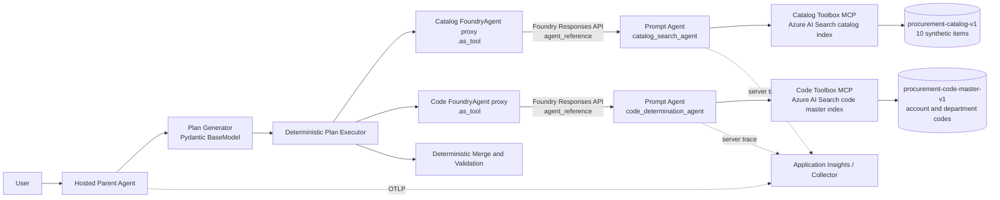

# Microsoft Foundry 購買申請 Agent 改訂構成・Observability 検証計画

- 作成日: 2026-08-31
- 更新日: 2026-09-03
- 状態: 承認済み構成の実装・Azure実測を進行中。個別の完了/未検証結果は検証報告を参照
- 対象 Repository: `ms-foundry-observability-verify`
- 対象 Foundry project: `observability-verify/proj-default`（2026-09-03 Azure inventoryで実名を確認）
- 調査基準日: 2026-08-31

## 1. この資料の位置付け

本資料は、4つの論理構成（Prompt/Hosted × Single/Multi）を比較する旧計画を、次の1つの購買申請 Agent に整理するための Architecture Decision と検証計画である。

- 親: Microsoft Agent Framework で実装する Hosted Agent
- 子: Microsoft Foundry の Prompt-based Agent 2つ
- 子の役割: カタログ検索、コード判定
- データ Tool: Azure AI Search indexをFoundry ToolboxのMCP-compatible endpointから利用する検索Tool

旧資料 `docs/codex-handoff-foundry-procurement-observability-evaluation-poc-2026-08-28.md` は履歴として残すが、本資料が承認された後は、構成、責務、Observability の検証範囲について本資料を優先する。旧資料にある4構成比較と88-run Matrixは、新PoCのDone Definitionには含めない。14 Failure Patternは4構成比較用の実行Matrixではなく、TraceからSilent Semantic Failureを検知するEvaluator仕様として新構成へ移植する。S1〜S5のE2Eでは、業務シナリオから自然に誘発できる6パターンだけをStage Bへ割り当て、全14パターンの検知契約はStage AのTrace fixtureで維持する。

## 2. 結論

提案された構成で、S1〜S5の業務シナリオと主要な計装確認は実装できる。ただし、次の修正が必要である。

1. Managed Prompt AgentはHosted Agentと別の実行境界にあるが、`FoundryAgent(project_endpoint, agent_name, agent_version)`をremote proxyとしてHosted親プロセスに置き、そのproxyを`FoundryAgent.as_tool()`でFunction Tool化できる。子Prompt Agentの実体をHosted containerへ含める必要はない。
2. `FoundryAgent.as_tool()`を親へ常時登録するだけでは、モデルが委譲の要否と順序を決めるため、カタログ検索 → コード判定という順序を保証しない。親には、LLMが機械可読な計画を作り、Controllerが現在Stepに対応するToolだけを公開または強制選択するPlan & Executeを置く。
3. 同一Traceになることと、親Spanの任意属性が子Spanへ複製されることは別である。W3C Trace Contextが伝播すればTrace IDは共通にできるが、`test.case.id`などのSpan属性は自動継承されない。非機密の相関IDを子のStructured inputにも明示して、子側Spanへ再設定する。
4. S1〜S5だけではV1〜V21を網羅しない。特にV10、V11、V15〜V17、V20、V21には横断プロファイルまたは追加の基盤シナリオが必要である。
5. V12、V14、V18、V19は単一実行では判定できない。継続評価設定、反復実行、集計クエリ、課金量の観測期間が必要である。
6. 14 Failure PatternはTrace/Evaluator仕様として維持する。全14パターンをStage A fixtureで検証し、S2へTV-02/TV-03、S3へSD-03/SD-05、S4へMA-04/MA-05をStage B E2Eとして割り当てる。S1とS5はHealthy controlとする。

したがって、PoCの中心である「親子をまたぐTrace」「コンテンツ記録」「障害切り分け」は実現可能である一方、閉域、RBAC、継続評価、コストは別のAzure検証Trackとして扱う。

## 3. 要求構成の確認と補正

### 3.1 論理構成



親Agentの責務は次のとおりとする。

- 自然言語依頼をStructured inputへ抽出する。
- `ExecutionPlan`をPydantic `BaseModel`として生成する。
- 空または不正な計画に対して、最小の安全な既定計画を適用する。
- Plan stepを明示的な順序で実行する。
- 子Agentへ必要な情報と相関IDをStructured inputで渡す。
- 子のStructured outputを検証して統合する。
- コード、価格、分類をLLMの推測で補わない。
- 最終結果とbusiness statusを確定する。

子Agentは、それぞれ1つの責務と1つのデータ境界だけを持つ。

| Agent | 入力 | Tool | 出力 |
|---|---|---|---|
| `catalog_search_agent` | 商品名、数量、条件、相関ID | Catalog Toolbox MCP → Azure AI Search catalog index | 候補、採用品番、単価、検索根拠 |
| `code_determination_agent` | 採用品番、商品分類、申請者の部、相関ID | Code Toolbox MCP → Azure AI Search code master index | 勘定科目コード、部課コード、根拠 |

コード判定では、勘定科目コードは商品分類から照会する。部課コードは商品分類から推測せず、申請者情報またはユーザーが確認した部名から照会する。粒度は営業部、情報システム部などの「部」までとし、課、チーム、係は扱わない。Schema上は`department_code`と`department_name`を用いる。

### 3.2 `agent.as_tool()`に関する実装判断

Agent Frameworkの`Agent.as_tool()`は、Agent objectを同一プロセスの`FunctionTool`へラップし、Tool実行時に対象objectの`run()`を呼ぶAPIである。ここで「同一プロセス」なのはAgent objectとFunction Tool wrapperであり、Agentの実処理runtimeまで同居する必要はない。

`agent-framework-foundry`の`FoundryAgent`は、Foundryに登録済みのPrompt AgentまたはHosted Agentを`project_endpoint`、`agent_name`、`agent_version`で参照するremote proxyである。`FoundryAgent`はAgent Frameworkの`RawAgent`を継承するため、次の構成が可能である。

```python
catalog_agent = FoundryAgent(
    project_endpoint=project_endpoint,
    agent_name="catalog-search-agent",
    agent_version="1",
    credential=credential,
)

catalog_tool = catalog_agent.as_tool(
    name="catalog_search_agent",
    description="商品名と条件から商品候補、型番、単価を確定する",
    propagate_session=False,
)
```

この場合、Hosted containerに含まれるのは`FoundryAgent` proxy、認証client、Function Tool wrapperである。子Prompt Agentのmodel、instructions、hosted tools、version、実行はFoundry Agent Service側に残る。proxyの`run()`はFoundry project endpointへ`agent_reference`を付けたResponses API requestを送る。したがって、本PoCの第一候補は`implementation.kind=foundry_agent_as_tool_remote_proxy`とする。

各Prompt Agent定義には、担当indexだけを含むFoundry Toolboxを接続する。ToolboxはAzure AI Search Toolをまとめ、MCP-compatible endpointとして公開する。`catalog_search_agent`にはCatalog Toolboxだけを、`code_determination_agent`にはCode Toolboxだけを割り当てる。ToolboxとAzure AI Search connectionはFoundry側に保存されるため、Hosted親containerへ検索用Python callable、OpenAPI service、Azure Functionsを含めない。

提示されたTools OverviewのPython例で設定されている`azure_endpoint`は、Managed子Agentのendpointではなく`OpenAIChatCompletionClient`が使うAzure OpenAI model endpointである。その例だけではremote Agentを示さないが、別の公式`FoundryAgent` integrationがremote Prompt Agentを標準Agent interfaceへ接続する。

なお、標準`as_tool()`がモデルへ公開する引数schemaは1つの文字列`task`で、戻り値も最終response textである。本PoCでは`task`へJSONを渡し、呼出し前後をPydantic `BaseModel`でvalidationする。別のtyped `FunctionTool`は作らず、Machine-readable I/Oの不一致は親Controllerがreject/retryする。

### 3.3 確定した前提

- 旧記載の「部下コード」は「部課コード」を指す。今回必要な粒度は部までであり、`department_code`と`department_name`を正規field名にする。
- V1の「二つの実行方式」は、同一E2E内の「Hosted親runtime」と「Prompt-based子runtime」の2つとして扱う。旧4構成の比較は行わない。
- 本資料でいうデータToolはMCP Toolである。Azure AI Search indexをFoundry Toolboxへ`azure_ai_search` Toolとして登録し、Prompt-based子runtimeがToolboxのMCP-compatible endpointを介して利用する。独自のPython Function、OpenAPI service、Azure Functionsはデータ照会経路に使用しない。`FoundryAgent.as_tool()`が親内部で作るAgent wrapperは別物として残す。
- 第一候補は「Foundry Toolbox内のAzure AI Search Tool」である。Azure AI Search Knowledge Baseをstandalone MCP serverとして公開する方式は、V6で必要な返却fieldを第一候補で取得できない場合だけ比較する。PoC本線で両方式を同時実装しない。

### 3.4 Microsoft Agent Framework優先の実装原則

会話、Session、Context Provider、Agent Tool、Middleware、serialization、Observabilityについて、Microsoft Agent Frameworkに同等機能がある場合はFramework標準機能を使用する。独自実装は購買Domain Model、Planの業務状態、検証規則、EvaluatorなどFrameworkが購買仕様を知り得ない部分に限定する。

現行checkoutの`src/procurement_agent/memory.py`には独自`AgentSession`と`InMemoryContextProvider`があり、独自`AgentSession.conversation`へ会話を二重保存している。独自`InMemoryHistoryProvider`というclassは現行ファイルにはないが、会話履歴の責務を独自Sessionで実装している点が置換対象である。また`src/procurement_agent/framework.py`の`SerializedProcurementContextProvider`は、Framework `AgentSession.state`へ独自Session全体をJSON文字列として格納しており、Sessionが二重になっている。

移行後は次を正本とする。

| 責務 | 採用するFramework機能 | 独自実装の扱い |
|---|---|---|
| 会話履歴 | `InMemoryHistoryProvider("procurement-history", load_messages=True)` | `ConversationMessage`、`add_message()`、独自conversation listを削除 |
| Session lifecycle | `agent.create_session()`と`agent_framework.AgentSession` | 独自`AgentSession` classを削除 |
| Session永続化 | Framework `AgentSession.to_dict()` / `AgentSession.from_dict()` | 独自`serialize()` / `restore()`とFramework Session内へのnested JSON保存を削除 |
| 業務実行状態 | Framework `AgentSession.state["procurement.execution.v2"]` | Pydantic `ProcurementExecutionState`をJSON互換dictとして保存。Session class自体は作らない |
| Invocation前後の拡張 | 必要な場合だけFramework `ContextProvider` / `SessionContext` | 会話履歴やSession機能を再実装しない最小の`ProcurementExecutionContextProvider`に限定 |
| ToolからSession参照 | `FunctionInvocationContext.session` | SessionをLLM可視のTool引数や独自globalへ渡さない |
| 親から子Agent呼出し | `FoundryAgent.as_tool(propagate_session=False)` | 子へ親Sessionを共有せず、必要情報だけをStructured snapshotで渡す |
| Middleware | `AgentMiddleware` / `ChatMiddleware` / `FunctionMiddleware`と各Framework context | 独自pipeline dispatcherを作らない |
| Telemetry | Agent Framework標準計装 + 必要最小限のcustom business Span/Event | 標準Agent/Chat/Function Spanを同名で二重生成しない |

`InMemoryHistoryProvider`は明示的に1つだけ`load_messages=True`で登録する。診断用History Providerを追加する場合は`load_messages=False`とし、同じ履歴を複数Providerからmodel contextへ注入しない。

Hosted Responses実装補足（2026-09-03、採用SDK実constructorで確認）: `ResponsesHostServer`は既存Providerの`load_messages=True`を拒否し、受信transcript用のFramework標準History Providerを自身で登録する。この入口に限り`procurement-history`を`load_messages=False`に切り替え、保存・`get_messages()`・Session serialize/restoreは維持する。Local agent.runは従来どおりTrue。独自History/Sessionを追加せず、Hostedでもloaderは1つだけとする。SDKのmessage content取得は既定がTrueのため`OTEL_INSTRUMENTATION_GENAI_CAPTURE_MESSAGE_CONTENT=false`を起動時に明示する。

親Agentは各Turnで同じFramework `AgentSession`を`agent.run(..., session=session)`へ渡す。Function ToolまたはFunction Middlewareは`FunctionInvocationContext.session`から同じSessionを取得し、`session.state`内のnamespaced業務状態を読み書きする。`ctx.session is None`はprogramming/configuration errorとしてfail closedにし、新しいSessionをTool内で暗黙作成しない。

`ProcurementExecutionState`には、Plan、現在Step、request、取得済み根拠、選択商品、application draft、governance decision、turn number、idempotency keyを保存する。保存値は`model_dump(mode="json")`によるJSON互換dictとし、読出し時に`model_validate()`する。Framework `AgentSession.session_id`、`service_session_id`、history provider stateは独自schemaへ複製しない。

### 3.5 App Service / APIM入口（2026-09-03追加指示）

Browser → App Service EasyAuth / WebUI backend → APIM → Hosted親 → FoundryAgent proxy → Prompt子 → 担当Toolbox MCP → Searchを1つの本線とする。
WebUIの配置元は `src/webapp-foundry-oauth`。その中の `backend/procurement.py` を稼働入口とし、提供されたOAuth/Graphサンプルは参照用に保存するがdeploy packageへ含めない。

- Browser認証はEasyAuth、Foundry認証はApp Service system MI。APIMは当該MIのtenant/audience/oidを検証してBearerを転送する。購買申請の申請者名取得にはOBO/Graphを使わない。Functions + Entra confidential clientでGraph `/me`を呼ぶOBO相互運用確認は別経路・別ADRとして後続構築できるが、購買Agentの依存関係にしない。
- Foundry Conversationを会話の正本として作成し、後続Responses bodyへIDを渡す。Framework AgentSessionとの対応は別途実測する。
- 会話cookieは署名・owner binding・Secure/HttpOnly/SameSite。クライアント指定の任意Conversation IDは受理しない。
- 1 turnのApp Service server spanをrootとする。Browserの任意traceparent/tracestate/baggageは捨てる。HTTP client自動計装を使い、tracecontext,baggageを伝播する。
- user.idはEasyAuth tid/oidのSHA-256。確認画面に限り、EasyAuthの検証済み`name` claimを申請者名として表示する。氏名はcustom Span属性へ保存せず、raw claims、token、email、oid、CoTをUI/Traceへ出さない。出力本文の自動Telemetry収集は無効のままとする。
- APIMのResponsesに加えてConversations create/get/updateを公開する。リアルタイム進捗のため、後続承認に従い対象RG内にDeveloper APIMを新設して切り替える。参照RGは変更しない。
- Local HTTPの成功はAPIM/Managed Foundry境界の成功ではない。Azureでは親子関係、conversation/case/turn/user.idを実測し、非伝播はNOT_PROPAGATEDとする。
- Searchはユーザー選択肢1に従い、West Central USのServerless Developerを使用する。Storageは後続指示の3.6に従う。T4追加なし。

実装・what-if・未検証事項は `docs/webapp-apim-readiness-2026-09-03.md` に記録する。

### 3.6 Blob Indexer取込（2026-09-03後続指示）

ユーザーの明示指示により、Storageを作らない初期方針とPushを主経路にする方針を次の範囲で変更する。既存Serverless Developerを継続し、Free Search `rag-ais-02`への移行・既存Searchの削除は行わない。

Repository JSON → 既存のdocument生成処理 → 専用Blob StorageのJSON配列 → 2 Data source → 2 Indexer → 既存2 Index → 担当Toolbox MCP → Prompt子を本線とする。2026-09-04にSynthetic名刺を追加した商品11件・Code Master 10件、source_version、document_id、検索可能content projectionを維持する。Index追加・再作成、Agent/containerへのデータ埋込はしない。

- Storage用途はSynthetic JSONのIndexer入力のみ。Foundry Conversation/Framework Sessionの保存先にはしない。
- 対象RG内のStorageV2 / Standard LRS / Hot / West Central US、非公開コンテナー2つ。共有キーと匿名Blobアクセスを無効化し、HTTPS/TLS1.2を使用する。Private Endpoint等は作らない。
- Search system MIに各コンテナーのStorage Blob Data Reader、投入担当に各コンテナーのStorage Blob Data Contributor。Foundry/ToolboxのSearch query権限は変更しない。
- IndexerはjsonArray、document_idの明示mapping、失敗許容0、scheduleなしのオンデマンド実行。キー/SASではなくResourceIdによるMI接続を使う。
- 削除済みBlob/コンテナーの保持7日。稼働JSONの自動削除なし。JSON配列の要素削除は既存Index文書削除へ自動反映されないため、削除同期は今回の範囲外。文書削除が必要なら別途承認・明示的処理を行う。
- Serverless一覧取得は2026-08-01-previewのpageSize指定で実測する。旧APIのページングエラーをIndexer非対応と解釈しない。
- AcceptanceはBlob read-back一致、Indexer実行成功/処理件数/エラー、全Index文書のRepository projection一致、Toolbox実検索。既存Push済み文書が読めただけでIndexer成功にしない。
- 非破壊rollbackはIndexer停止と既存Pushスクリプトへの切戻し。StorageやIndex削除は自動実行しない。

S1〜S5、Stage A全14、Stage B指定6件、S1/S5 Healthy controlとV1〜V21の検証範囲は変更しない。

### 3.7 対話intakeと実行中progress（2026-09-03追加指示）

「ノートPCを購入したい」のような情報不足はschema failureではなくWAITING_USERとする。親LLMは1回の構造化応答でnullableなintakeとExecutionPlanを返す。ユーザー入力は商品、数量、所属部署、メモの4項目とし、申請IDと用途は要求しない。メモがない場合も省略から推測せず、UI/Agent応答で「メモ（ない場合は『なし』）」と明示して回答を求める。ユーザーが「なし」「特になし」等を明示した場合は、業務stateの`memo`へ正規化値`なし`を保存する。申請IDは確定時にHosted親が内部生成する。申請者名はEasyAuthの検証済み`name` claimをApp ServiceからHosted親へ渡し、ユーザー入力やLLM推測では補わない。OBOやGraph `/me`は使わない。

新規turnは購買意図を表す入力だけをPlan & Executeへ入れ、一般的な挨拶は通常会話としてToolを呼ばずに応答する。完了した購買Planは、その終端応答とSession証跡を保存した後、次turn開始時に業務stateを初期化する。したがって完了後の「確定」は直前Planを再実行しない。本人確認はWebではEasyAuthの検証済み表示名を本人にだけ返し、PlaygroundではEasyAuth claimを利用できないことを明示する。Playgroundで実際のGraph `/me`を確認する場合は、購買経路から分離したOAuth Identity Passthrough MCP＋OBOを使用し、詳細はADR-0001を正本とする。

Framework Sessionの業務stateへintake、EasyAuth申請者名、Catalog候補、選択商品を保存し、商品候補はCatalog Prompt→Toolbox→Search経路で取得する。quantity=nullは探索用で、擬似注文数量ではない。候補は対応するproduct EvidenceがあるものだけUIへ出す。検索語と商品codeまたは商品名が完全一致し、該当するSearch根拠付き候補が1件だけなら、決定論的controllerがその商品を選択する。それ以外は前turnの候補にあるcodeをユーザーが明示選択した場合だけ受理する。商品未検出時は後続の数量・所属部署・メモを保存せず、新しい商品名または型番を求める。旧Versionで失敗後の先取り項目が残ったSessionに同じ購入依頼を明示し直した場合だけ、その失敗探索と先取り項目を消して商品stepを再実行する。商品決定後は数量→所属部署→メモ→確定の順に不足項目を1つずつ案内し、詳細入力turnでは保存済み候補を再利用してCatalogを再実行しない。4項目が揃った時点でCode Prompt→Toolbox→Searchにより所属部署と勘定科目を照合し、未登録ならその部署値を業務stateから消して再入力を求める。照合成功後は、EasyAuthで検証した申請者名、商品名/code/分類/仕様/単価/数量/小計、部署名/code、勘定科目名/code、メモを確認票として本人に表示する。確認票を表示した後だけWAITING_USERで「確定」を要求する。「確定」turnは保存済みCatalog/Code evidenceとintakeの同一性を決定論的に再検証し、Prompt Agent/Toolbox/Searchを再実行せずmerge/validateと申請draft生成だけを行う。保存stateが一致しなければfail closedとし、外部呼出しで補完しない。

親Agent Middlewareから実行イベントのstep/stateと固定日本語messageのallowlistだけをResponses text deltaへ送る。Web backendは`app.client.contract=web-json-v1`をmetadataで明示し、この契約に限ってHosted親の`response_text`とprogressを含む有効ScenarioResult JSONを受信する。Web backendはstreamを逐次受信し、安全な公開message、候補、statusだけをNDJSONで中継する。Web側で購買状態遷移や最終回答を再構築しない。Playgroundおよび契約を指定しない通常ResponsesにはJSON envelopeではなくHosted親の自然言語`response_text`を返す。CoT、raw Tool/LLM出力、secretを逐次表示しない。完了後の要約だけをリアルタイム進捗とは扱わない。

Frameworkの内側stream finalizationでHistoryProvider/session保存を維持する。進捗Queueはrun-local。SDKでyield間の切断が即時cancelされない場合があるため実行上限180秒、切断時の即時取消は保証しない。Azureで最初の進捗と完了の受信時刻を照合する。

APIM Consumptionは公式SSE長時間接続のサポート対象外。2026-09-03のユーザー承認により、対象RG/East USへDeveloper 1台の`apim-procurement-stream-nkjm`を新設した（月額目安$48.03、非production・SLAなし）。実MIの複数turn・逐次progress、配置済みWeb backendのcookie/CSRF/SSE経路、Web接続先を実測後、旧Consumption `apim-procurement-observe-nkjm`を2026-09-04にsoft-deleteした。2026-09-06までの復元期間を確認し、purgeは実施していない。再配備後の実ユーザーBrowser/EasyAuth操作は別途確認し、直接Hosted・MI診断・localhost成功だけでBrowser全経路をPASSにしない。

## 4. 質問への回答

### 4.1 親Agentへ任意属性を付け、記録設定を制御できるか

**できる。ただし適用範囲が異なる。**

- 任意属性は、OpenTelemetryのcurrent spanまたは明示的に作成したspanへ`set_attribute()`で付与できる。
- `service.name`など全Signal共通の識別子はResource attributeに置ける。
- Agent Frameworkは`ENABLE_INSTRUMENTATION`、`ENABLE_SENSITIVE_DATA`、OTLP exporter環境変数、custom exporterで記録先とコンテンツ記録を構成できる。
- Hosted container内で作るSpanは親実装から制御できる。
- Prompt Agentのserver-side traceはFoundry projectへApplication Insightsを接続して有効化する。管理runtime内の記録範囲はPlatform設定に依存し、親コードからSpan processorを差し込めない。

PoCでは、次の2プロファイルをAgent VersionまたはDeployment設定として分ける。

| Profile | `ENABLE_SENSITIVE_DATA` | 用途 |
|---|---:|---|
| `synthetic-content-on` | `true` | Synthetic dataだけを使うV2、V3、V3b、V6 |
| `production-like-content-off` | `false` | V11、秘密情報非記録、評価機能の残存範囲 |

### 4.2 呼出しをまたいで同じTraceになるか。親属性は引き継がれるか

| 境界 | Trace継続 | 任意属性の継承 |
|---|---|---|
| Agent Framework Agentの`as_tool()` | active OTel context下ならwrapperとAgent `run()`は同一Traceになる | 自動複製されない |
| `FoundryAgent.as_tool()` proxy → Managed Prompt runtime | HTTP requestの`traceparent`をservice側が継承する場合だけserver-side Spanまで同一Traceになる | 自動複製されない |
| Platformがtrace contextを転送しない場合 | 別Traceになる | されない |

OpenTelemetryでservice間を伝播する標準情報はTrace ID、parent Span IDなどのSpan Contextである。Span attributeは伝播対象ではない。Baggageへ非機密の相関値を入れることはできるが、BaggageもSpan attributeへ自動変換されないため、子側で明示的に設定する。またBaggageには入力本文、社員情報、Secretを入れない。

FoundryAgent Serviceがclient requestの`traceparent`をserver-side Prompt Agent traceまで維持するかは、公式の一般的なW3C準拠説明だけでは本PoCの組合せを断定できない。V7で実Trace IDとParentSpanIdを照合して判定する。維持されない場合も、`test.case.id`、`parent.invocation.id`、`response.id`をStructured input/outputへ入れ、Span LinkまたはKQLで相関できる設計にする。

### 4.3 Prompt子Agentで既定記録される範囲

Application Insights接続後のFoundry server-side tracingでは、共通シナリオについてagent/model/tool/retrievalの処理、latency、token、error、tool callを確認できる。コンテンツ記録を有効にすると、入力、出力、tool引数、tool結果などが追加される。

ただし、次の値は既定記録だけに依存しない。

- 実System instructions: sensitive content有効時に実測する。無効時は`instructions.version`と`instructions.sha256`だけを明示記録する。
- **選ばれなかったToolを含む全Tool定義**: Agent Framework 1.16.0はlatest experimental GenAI semantic conventionsで`gen_ai.tool.definitions`を生成できるが、Managed Prompt Agentのserver traceに全定義が必ず残るとは断定しない。Agent定義から取得したtool manifestのVersion/hashも別に保存する。
- 検索本文、文書ID、順位、スコア: Toolbox MCPおよびManaged Promptの既定Spanへ全項目が揃う保証はない。Azure AI Search indexには`document_id`と`source_version`を保存し、MCP result schemaとtraceで返却可否を実測する。Toolboxが順位や`@search.score`を公開しない場合は「取得不可」をV6の結果として記録し、子AgentのLLM出力から推測して補完しない。本文は`synthetic-content-on`だけに限定する。

## 5. 共通計装契約

### 5.1 Spanと属性

最低限、次のSpanを生成または確認する。

```text
invoke_agent (Hosted parent)
  plan.create
  plan.step.execute (catalog)
    execute_tool catalog_search_agent
      invoke_agent (local FoundryAgent proxy)
        invoke_agent (Prompt catalog child, server-side)
          execute_tool toolbox.mcp/catalog-search
            azure_ai_search.query procurement-catalog-v1
  plan.step.execute (code)
    execute_tool code_determination_agent
      invoke_agent (local FoundryAgent proxy)
        invoke_agent (Prompt code child, server-side)
          execute_tool toolbox.mcp/code-master
            azure_ai_search.query procurement-code-master-v1
  merge.validate
  response.generate
```

全Spanへ無条件にRaw contentを複製せず、検索可能な識別子だけを次の契約で付ける。

| Attribute | 設定箇所 | 備考 |
|---|---|---|
| `test.case.id` | 親root、子root、Tool | V5、Synthetic IDのみ |
| `app.session.id` | 親と子 | 明示指定。PIIを含めない |
| `app.turn.number` | 親と子 | 1始まりで明示指定 |
| `agent.role` | 各Agent | `coordinator` / `catalog_search` / `code_determination` |
| `agent.definition.id` | 各Agent | 名前とVersionを分離 |
| `implementation.kind` | 各境界 | `hosted_framework` / `prompt_managed` / `foundry_agent_as_tool_remote_proxy` |
| `plan.id`, `plan.version`, `plan.step.id` | 親Controller | 再計画と再開の追跡 |
| `execution.attempt` | Step、Agent Tool、Tool | retry回数 |
| `content.recording.profile` | root | content-on/offの証跡 |
| `failure.profile` | root、MCP Tool | `normal/not_found/permission/index_missing/business_invalid/dns/route` |
| `http.response.status_code` | 通信Span | HTTP状態 |
| `business.status` | Agent、Tool | HTTPと分離 |
| `result.count` | 検索Tool | 本文なしでもV6の一部を評価可能 |
| `search.index.name`, `search.index.version` | MCP Tool | Raw queryを入れず対象indexを識別 |
| `mcp.server.label`, `mcp.method` | MCP Tool | Toolbox名と`tools/list`/`tools/call`を識別 |

Span Eventには`plan.created`、`step.started`、`step.completed`、`step.retry_scheduled`、`plan.replanned`、`handoff.payload_validated`、`result.rejected`を記録する。内部推論やChain-of-Thoughtは記録しない。

### 5.2 Structured I/O

計画と子Agent境界はPydantic `BaseModel`で定義する。

```python
class ExecutionPlan(BaseModel):
    plan_id: str
    version: int = 1
    steps: list[PlanStep] = Field(default_factory=list)
    completion_condition: str = "validated_application_ready"

class PlanStep(BaseModel):
    step_id: str
    step_type: Literal["catalog_search", "code_determination", "merge_validate"]
    owner: str
    status: StepStatus = StepStatus.PENDING
    attempt: int = 0
    input_refs: list[str] = Field(default_factory=list)
    output_refs: list[str] = Field(default_factory=list)
```

LLMのStructured responseが空、parse不能、または必須Stepを欠く場合は、次の既定計画を採用して`plan.fallback_reason`を記録する。

1. `catalog_search`
2. `code_determination`
3. `merge_validate`

既定計画は処理を成功扱いにするためではなく、推測をせず安全に必要Stepを実行するために使う。子Agentの結果が空の場合は後続Stepへ進めず、retryまたは明示的なbusiness failureにする。

## 6. V1〜V21の実現可能性

判定は次の4種類を使う。

- **可**: 対象実装とLocal/Azure traceで確認できる。
- **条件付き**: 追加計装、反復、content-onなどが必要。
- **実Azure必須**: Local fixtureだけでは成立を証明できない。
- **制約あり**: Platformの現行制限またはPortal連動の不確実性がある。

「依頼時の確認内容」は検証目的の正本であり、後続Taskで省略または確認方法へ置き換えない。「この構成での確認方法」と「注意点」は、SDKやPlatform仕様の更新、実測結果に応じて更新してよい。

| ID | 依頼時の確認内容 | 判定 | この構成での確認方法 | 注意点 |
|---|---|---|---|---|
| V1 | 同一E2Eの二つの実行方式それぞれで、計装を有効化するまでに必要な作業と設定箇所を確認する。二つの実行方式はHosted親runtimeとPrompt-based子runtimeを指す。 | 可 | Hosted親runtimeはAgent Framework OTel設定、Prompt-based子runtimeはprojectへのApp Insights接続とserver-side tracing設定をそれぞれ手順化する | 旧4構成の比較ではなく、この2 runtimeを比較する |
| V2 | コンテンツ記録の規定化と、長文時に切り詰めが起きる閾値を確認する。 | 条件付き | S5をサイズ別に実行し、送信前export、App Insights格納値、Foundry表示値の長さを比較する | Azure Monitorのdocumented limitはproperty 8,192文字、trace message 32,768文字、telemetry item 64KB。Foundry側の先行切詰めは実測が必要 |
| V3 | System prompt、すなわちinstructionsの実値が記録されるか確認する。 | 条件付き | content-onで`gen_ai.system_instructions`とAgent定義値をhash照合する | content-offでは実値を期待せずVersion/hashだけ確認 |
| V3b | Toolの定義について、名前、説明、引数仕様を、選ばれなかったToolを含めて記録できるか確認する。 | 条件付き | 呼ばれないdummy toolを含むmanifestを登録し、`gen_ai.tool.definitions`と定義exportを比較する | Managed Promptのserver traceに全定義が残る保証は未確認 |
| V4 | Session IDとTurn番号が自動付与されるか、明示指定が必要か確認する。 | 可 | Framework `AgentSession.session_id`、必要な場合の`service_session_id`、業務state内の`turn_number`を記録し、Platformの`gen_ai.conversation.id`/Response IDと比較する | Session IDはFrameworkに生成させる。Turn番号はFrameworkの自動fieldと仮定せずnamespaced業務stateで管理する |
| V5 | 実行に「どのTest Caseか」を示すIDを属性として付与できるか確認する。 | 可 | 親rootに`test.case.id`を設定し、Structured handoffにも入れ、子rootで再設定する | 親Span attributeは子へ自動継承されない |
| V6 | 検索結果の詳細として、chunk本文、document ID、順位、scoreを記録できるか確認する。 | 条件付き | Catalog Toolbox MCPの`tools/call` resultとManaged Prompt/Toolbox traceを照合し、`document_id`、返却順、score、本文の有無をfieldごとに記録する | Azure AI Search indexにはIDとversionを持たせる。Toolboxがscoreやrankを公開しない場合は取得不可を確認結果とし、LLMで補完しない |
| V7 | Agent間の移譲をまたいで属性が引き継がれるか、実装方式によってSpan構造がどう異なるか確認する。 | 実Azure必須 | `FoundryAgent.as_tool()`のclient/proxy/server-side Prompt Span間でTrace ID、Span ID、ParentSpanId、`test.case.id`を比較する | 同一Traceにならない場合はcorrelation ID + Span Linkを代替にする。属性は明示的に再設定する |
| V8 | Tool障害としてtimeout、permission error、0件response、不正形式を発生させ、原因箇所を切り分けられるか確認する。 | 条件付き | Code ToolboxのFailure profileで0件、存在しないindex、RBAC拒否、業務schema不正documentを分け、MCP、Search、parse、business判定を照合する | Managed Toolboxだけでは任意のMCP timeoutやprotocol不正responseを生成できない。timeout/DNS/routeはT4、protocol不正はLocal MCP fixtureで補完する |
| V9 | 処理の途中終了とretryの発生を実行経路として追跡できるか確認する。 | 可 | `attempt`、retry Span、replan Event、終了理由を記録し、S3で順序を照合する | retry上限と終了条件をControllerで決定する |
| V10 | 閉域特有の障害である名前解決失敗と経路遮断がTrace上でどのように記録されるか確認する。 | 実Azure必須 | private test環境でDNS failureとroute blockを別々に発生させ、HTTP client/OTLP exporter errorを比較する | Python exception注入はschema testであり、閉域障害の証明にはならない |
| V11 | コンテンツ記録を無効にした状態で、どのEvaluatorが動作し、どこまで観測できるか確認する。 | 条件付き | content-offでtrace evaluationを実行し、各Evaluatorのscore有無と利用属性を表にする | Trace quality評価は`gen_ai.input.messages`/`gen_ai.output.messages`がないとscoreが`None`になり得る。trajectory/tool系のcustom evaluatorは非content属性で設計する |
| V12 | 継続評価の設定手順と、評価scoreがTraceへひも付くことを確認する。 | 実Azure必須 | continuous evaluation ruleを作り、S1の`operation_Id`/Response IDとeval run/scoreを照合する | Preview機能。単一S1実行だけでは設定成立を証明できない |
| V13 | Traceを評価用dataとして取り出す経路と手順を確認する。 | 可 | S4のexact `operation_Id`を使う`azure_ai_traces`評価と、LogsQueryClient/KQLによるJSONL exportを実行する | シナリオ内容よりtrace ID指定とRBACが本質 |
| V14 | Sampling設定によって、評価したいCaseが対象から漏れないか確認する。 | 条件付き | PoC正解判定用runはAlwaysOn + exact trace IDs、別にratio/intelligent samplingを反復して漏れ率を測る | Intelligent samplingは壊れた/切れたtraceを除外し得る。S3を1回実行するだけでは判定不可 |
| V15 | 記録前に秘匿する処理を狭めるかを判断し、狭める場合の適用範囲を確認する。 | 可 | 親、Agent Tool task、Foundry request、Tool、exporterの各境界でpre-record redaction testを行う | 最小範囲は「Span生成前」。Prompt managed runtime内はPlatform設定に依存する |
| V16 | 取り込み時の変換でmaskできるか、検知条件をどこまで定義できるか確認する。 | 実Azure必須 | Workspace transformation DCRでAppRoleNameをscopeし、mask前後を検証する | DCRはworkspace内の対象table全体へ影響し、反映に最大60分程度かかり得る。送信前秘匿の代替にはしない |
| V17 | 専用tableの権限分離が成立し、Portalからの参照と連動するか確認する。 | 制約あり | protected tableまたはgranular RBACで許可/拒否ユーザーを比較する | 標準App Insights tableを保護するとFoundry portal側も同じデータ権限の影響を受ける。専用custom tableだけに複製した場合、Foundry標準Trace UIとの連動は期待しない |
| V18 | Token、latency、error rateを集計し、利用実態を把握できるか確認する。 | 可 | token、duration、HTTP error、business failureを複数runでKQL集計しDashboardと比較する | 1回のS1では集計の正しさを十分に確認できない |
| V19 | Traceの保存量と保持期間を含むcostを実測する。 | 実Azure必須 | S5を反復し、table別`_BilledSize`、Usage and estimated costs、retention設定を記録する | 料金は期間、workspace tier、sampling、retentionに依存する |
| V20 | AgentのOTLP送信先を閉域内collectorへ変更できるか確認する。 | 条件付き | Hosted親は`OTEL_EXPORTER_OTLP_*`またはcustom exporterでprivate collectorへ送る | Managed Prompt子のserver-side trace送信先を親から任意collectorへ変更できるとは確認できない。親と子で結論を分ける |
| V21 | 閉域内collectorからPrivate Link経由でApplication Insightsへ送信できるか確認する。 | 制約あり | VNet collector → AMPLS private endpoint → App Insights ingestionを疎通確認する | Azure Monitor単体では成立する一方、Foundry network isolation資料にはprivate App InsightsへのTraceが未対応とする記載もある。Hosted custom telemetryとFoundry server-side traceを別々に検証する必要がある |

## 7. S1〜S5と検証項目の対応評価

### 7.1 現在の割当ての評価

#### Scenario定義

| Scenario | 実行内容 | 期待する業務・実行経路 |
|---|---|---|
| S1 正常完了 | Azure AI SearchのSynthetic catalogに存在する商品を依頼し、申請情報の作成まで完走させる。 | Hosted親がPlanを作成し、Catalog Prompt Agent、Code Prompt Agentを順に呼び、型番、価格、勘定科目コード、部課コードを根拠付きで取得する。親が結果を統合・検証し、申請情報を完成させる。technical statusとbusiness statusはいずれも成功とする。 |
| S2 Tool障害 | 旧構成でいう「コードマスタ照会モックの障害注入」に相当するFailure profileを有効化して実行する。改訂構成ではCode Toolbox MCP/Azure AI Search経路へ`not_found`、`index_missing`、`permission`、`business_invalid`を1種類ずつ適用し、timeoutとprotocol不正はLocal MCP fixtureで補完する。 | Catalog検索までは成功させ、Code Agentが使用するMCP/Search/parse/business validationのいずれかで意図した障害を発生させる。親は申請情報を成功扱いにせず、原因箇所、technical status、business status、retry可否を分離して提示する。 |
| S3 再計画ループ | Synthetic catalogに存在しない商品を依頼し、0件結果から再検索または再計画を誘発させる。 | `attempt`上限内でquery変更、Catalog Agent再呼出し、またはユーザーへの条件確認へ遷移する。Traceにはretry、replan、各attempt、終了理由を残し、無限loopや根拠のない商品確定を許可しない。 |
| S4 エージェント間の引き継ぎ | Hosted親からPrompt-based子Agentへ渡すStructured inputから、商品分類または相関IDなどの必須情報を意図的に欠落させる。完全payloadもcontrolとして実行する。 | 子または親のboundary validationが欠落を検出し、子結果をCoordinator Sessionへ不正mergeしない。親子Traceの継続またはcorrelation fallback、payload reject、retry/replanの経路を確認する。 |
| S5 長文・大量出力 | 多数の品目を1つの評価依頼へまとめ、長い入力、検索結果、Tool出力、統合responseを発生させる。サイズ境界試験では小サイズ、8,192文字近傍、32,768文字近傍、64KB近傍、超過を生成する。 | Agent処理を可能な範囲で完走させつつ、送信前export、Application Insights格納値、Foundry Portal表示値のどの段階で切詰めが起きるか測定する。切詰めが業務検証やTrace相関を壊した場合は成功扱いにしない。 |

S2の「障害注入」は独自Function/Mock Toolを再導入する意味ではない。Failure profileをtest manifestから選択し、通常のData Tool経路はFoundry Toolbox MCP + Azure AI Searchのまま維持する。

| Scenario | 指定されたV | Scenario集約判定 | 不足する確認 |
|---|---|---|---|
| S1 正常完了 | V1, V4, V12, V18 | **一部成立** | V1用に親/子runtime別の計装設定一覧と有効化runbookを作る。V4用にFramework Session ID、service session ID、turn番号、Trace IDの対応表を出力する。V12を完了するには継続評価ruleの定義、作成手順、評価run、Trace/score照合表が必要。V18を完了するには複数S1 runとtoken/latency/technical error/business failureのKQLおよび集計結果が必要 |
| S2 Tool障害 | V3, V6, V8 | **条件付きで成立** | Synthetic content-on専用Agent Version、instructions実値/hash manifest、MCP result field captureを用意する。Code Toolbox用に`not_found/index_missing/permission/business_invalid`のtest manifestと期待statusを作る。timeoutとprotocol不正はLocal MCP fixture、DNS/routeは必要時のみT4で扱い、各failureをMCP通信、Search、parse、business validationのどこで検出したか示すassertion/reportが必要 |
| S3 再計画ループ | V5, V9, V14 | **一部成立** | catalogにない商品を固定入力にし、`test.case.id`、attempt、retry、replan、終了理由を記録するController/Event assertionを作る。V14を完了するにはAlwaysOnと比較対象sampling設定、同一caseの反復run manifest、期待run数と取得Trace数を照合する漏れ率reportが必要 |
| S4 Agent間引継ぎ | V5, V7, V13 | **成立するが役割が混在** | 完全payload、商品分類欠落、相関ID欠落のStructured handoff fixtureとschema validationを作る。親proxy/子managed runtimeのTrace ID、ParentSpanId、`test.case.id`を照合するverifierが必要。V13用にexact `operation_Id`指定の評価手順、KQL/LogsQueryClient export script、出力JSONLとRBAC前提を別途作る |
| S5 長文・大量出力 | V2, V19 | **一部成立** | 小サイズ、8,192文字近傍、32,768文字近傍、64KB近傍、超過のpayload generatorを作り、送信前export、Application Insights格納値、Foundry Portal表示値の長さを比較するreportが必要。V19を完了するにはS5反復条件、table別`_BilledSize` KQL、retention設定snapshot、観測期間と単価を含むcost計算表が必要 |

S1〜S5はE2Eの代表シナリオとして妥当だが、現状の対応だけではV3b、V10、V11、V15、V16、V17、V20、V21が未割当てである。またV12、V14、V18、V19はシナリオ1回の成否と別のPlatform検証である。

`Scenario集約判定`は、そのScenarioへ割り当てたV-IDのうち最も厳しい状態を表示する。これは「Scenarioをどう実行しても不可能」という意味ではない。各V-IDについて、不足を埋めれば完了できるのか、Azure実測で可否を決めるのか、現構成では完全達成できない可能性があるのかを次表で分離する。

#### 7.1.1 Scenario判定とV-IDの関係

不足の種類は次の記号で表す。

- **A: 実装・成果物不足**: code、設定、fixture、assertion、runbook、reportを作れば解消できる。
- **B: Azure実測待ち**: Localでは結論を出せず、実AzureのTrace、評価、Log、課金dataが必要である。
- **C: Platform依存**: Managed runtimeが対象fieldや伝播機能を提供しない可能性がある。負の結果も検証結果として確定する。
- **D: 現Scope外**: T1〜T4を有効化した場合だけ実施する。現時点では未完了のままReportする。

| Scenario | V-ID | 検証内容の要約 | 不足種別 | 不足対応後にどうなるか | 最終判定ルール |
|---|---|---|---|---|---|
| S1 | V1 | Hosted親runtimeとPrompt-based子runtimeで計装を有効化する作業・設定箇所 | A | **完了可能**。runtime別runbook、設定manifest、各runtimeのTraceが揃えば判定できる | 両runtimeで有効化手順とTraceを再現できればPASS。どちらか一方だけならPARTIAL |
| S1 | V4 | Session IDとTurn番号の自動付与または明示指定 | A | **完了可能**。Framework Session/Turn/Trace対応表を作れば判定できる | Framework生成値と明示管理値の由来が説明でき、複数Turnで一貫すればPASS |
| S1 | V12 | 継続評価の設定手順とscoreのTraceひも付け | B, D | **T2実施時に完了可能**。継続評価機能が対象projectで利用可能なら実測できる | Trace ID、evaluation run ID、scoreを照合できればPASS。機能、region、権限が利用不可なら`BLOCKED_PLATFORM`でありPASSにはしない |
| S1 | V18 | Token、latency、error rateの集計 | A, B, D | **T2実施時に完了可能**。KQLと複数runがあれば集計できる | Technical errorとbusiness failureを分離した集計が再現できればPASS。単一runだけなら未完了 |
| S2 | V3 | System instructionsの実値が記録されるか | B, C | **可否の検証は完了可能**。content-onのManaged Traceを実測する | 実値がTraceにあればPASS。hash/versionだけ、または実値非公開なら`NOT_RECORDED_BY_PLATFORM`として負の結論を確定する |
| S2 | V6 | 検索結果のchunk本文、document ID、順位、scoreの記録 | B, C | **条件付き**。Toolbox resultが全fieldを公開すれば完全達成できる | 4項目すべてをTrace/resultから取得できればPASS。score/rank等が非公開なら現構成ではFULL PASS不可とし、取得できたfieldだけPARTIALで記録する |
| S2 | V8 | timeout、permission、0件、不正形式の原因切分け | A, B, C | **分割検証なら完了可能**。Azure ToolboxとLocal MCP fixtureを組み合わせる | 各failureの発生層とstatusを特定できればPASS。全failureをManaged Toolbox単一路で発生させる要求なら現構成ではFULL PASS不可 |
| S3 | V5 | Test Case IDをTrace属性として付与 | A | **完了可能**。親、handoff、子で明示設定して照合できる | 全対象Spanを同じSynthetic `test.case.id`で検索できればPASS |
| S3 | V9 | 途中終了、retry、replanを実行経路として追跡 | A | **完了可能**。Controller Event/assertionを作れば判定できる | attempt、retry、replan、終了理由が順序付きでTraceに残り、上限で停止すればPASS |
| S3 | V14 | Samplingにより評価対象Caseが漏れないか | B, D | **T2実施時に判定可能**。Sampling profile別の反復が必要 | AlwaysOn/exact IDで対象を保持でき、比較profileの設定率・実行数・取得数を説明できればPASS。漏れ率0を一般保証するものではない |
| S4 | V5 | Test Case IDをhandoff先まで相関 | A | **完了可能**。S4 payloadと子Spanで再設定すれば判定できる | 親と子を同じCase IDで相関できればPASS。Span attributeの自動継承そのものは要求しない |
| S4 | V7 | 移譲をまたぐ属性継承とSpan構造差 | B, C | **可否の検証は完了可能**。同一Traceにならない結果も有効な結論である | Trace/parent関係と属性継承の有無を実測できれば検証完了。同一TraceならPASS、非伝播なら`NOT_PROPAGATED`とcorrelation fallbackを証明する |
| S4 | V13 | Traceを評価用dataとして取り出す経路・手順 | A, B | **完了可能**。export script、RBAC、実Traceがあれば判定できる | exact `operation_Id`から再利用可能なJSONLをexportし、再読込できればPASS |
| S5 | V2 | Content記録規定と長文切詰め閾値 | A, B, C | **実測により完了可能**。Platform固有の閾値はAzureで測定する | 各段階の送信長、格納長、表示長と最初の切詰め地点を特定できればPASS。切詰めが発生しない場合も測定上限付きで結論化する |
| S5 | V19 | Trace保存量、保持期間、costの実測 | B, D | **T2実施時に完了可能**。観測期間と課金dataが必要 | `_BilledSize`、retention、単価、観測期間から再計算可能なcostを出せればPASS。机上見積りだけなら未完了 |

したがって、割当て済みV-IDに現時点で「検証自体がどうやっても不可能」と確定しているものはない。ただしV3、V6、V7、V8はPlatformの実測結果によって期待機能が成立しない可能性があり、その場合は無理にPASSへせず、`NOT_RECORDED_BY_PLATFORM`、`NOT_SUPPORTED`、`NOT_PROPAGATED`などの負の結論で検証を閉じる。V12、V14、V18、V19は技術的に実施可能だが、現ScopeではT2を有効化しない限り未完了である。

#### 7.1.2 不足する確認を完了するための成果物

「不足する確認」を実施する場合は、口頭確認だけで完了とせず、次の成果物と判定証跡を残す。

| Scenario | 実装・設定として作るもの | 実行すること | 完了証跡 |
|---|---|---|---|
| S1 | 親/子計装runbook、設定値manifest、継続評価rule定義、usage集計KQL | Hosted親とPrompt子の計装を個別に有効化し、S1を複数回実行して継続評価とKQL集計を実行 | runtime別設定箇所一覧、Session/Turn/Trace対応表、Trace ID↔evaluation run ID↔score表、KQL結果export |
| S2 | content-on Agent Version、instructions manifest、Failure profile manifest、Local MCP failure fixture、status assertion | catalog成功後に各Code Toolbox failureを1種類ずつ発生させ、必要に応じてLocal fixtureを実行 | instructions hash一致、MCP/Search/parse/business各status、エラー発生Span、期待原因箇所との一致表 |
| S3 | 再計画fixture、attempt/retry上限policy、Event順序assertion、sampling比較manifest | AlwaysOnで経路を固定確認し、V14まで実施する場合だけsampling profileごとに反復 | `test.case.id`付きTrace、retry/replan Event列、終了理由、設定sampling率/実行数/取得数/漏れ率report |
| S4 | Structured handoff schemaと3 fixture、Trace相関verifier、Trace export script | payload variantごとに親子呼出しを行い、exact Traceを評価・export | schema reject/accept結果、Trace/Span対応図、correlation fallback結果、再利用可能なJSONL |
| S5 | 境界payload generator、長さ測定script、billing/retention KQL、cost worksheet | サイズ段階ごとに実行し、V19まで実施する場合だけ反復と課金量観測を行う | 各段階の送信/格納/表示文字数、切詰め発生地点、`_BilledSize`、retention、観測期間、概算cost |

#### 7.1.3 S1〜S5と14 Failure Patternの関係

14 Failure Patternは、旧4構成を再現するためのArchitecture要件ではなく、正常なHTTP/Agent応答に見えても業務意味が誤っているSilent Semantic FailureをTraceから検知するためのEvaluator仕様として扱う。したがって、次の2段階を分ける。

- **Stage A: Trace fixture**: 全14パターンについてpositive fixtureとnegative fixtureを作り、Detectorが期待Labelを返すことを確認する。これは新構成でも維持する。
- **Stage B: Agent E2E**: S1〜S5から自然に誘発できる6パターンだけを実Agent経路へ注入する。S1とS5はFailureを注入しないHealthy controlとし、誤検知がないことを確認する。

旧88-run Matrixは復活させない。Stage Aの全14パターンと、Stage Bの6パターンおよびHealthy controlを別の最小Matrixとして管理する。

##### 新構成に合わせた14 Failure Pattern

| ID | 失敗 | Hosted親 + Prompt子 + Toolbox MCPでの注入 | 主なTrace入力 | Detectorの判定 |
|---|---|---|---|---|
| SD-01 | タスク仕様の不遵守 | 数量、予算、希望時期、部など、ユーザーが指定した制約の一部を無視した申請情報を返す | `user_input`, `response`, `retrieved_contexts` | responseと確定値が全制約を満たすか |
| SD-02 | 役割仕様の不遵守 | Hosted親がToolbox MCPを直接呼ぶ、Catalog子がCode Toolboxを呼ぶ、またはCode子がCatalog Toolboxを呼ぶ | `system_prompt`, `tool_definitions`, `tool_calls`, `agent_trace` | `agent.role`とAgent/Toolbox/MCP Tool allowlistの一致 |
| SD-03 | ステップの繰り返し | 完了済みのCatalog子、Code子、またはMCP callを、同一Plan version、Step、input hashで再実行する | `tool_calls`, `agent_trace`, `plan` | Plan version、Step、input hash、引数、順序の重複 |
| SD-04 | 会話履歴の喪失 | Framework `AgentSession`のrestore後に、数量、部、選択商品、取得済み根拠の一部を落とす | `conversation`, `agent_trace`, `plan` | Turn間のSession stateと業務stateの連続性 |
| SD-05 | 終了条件の未認識 | `COMPLETED`、`BLOCKED`、`WAITING_USER`、またはattempt上限到達後に、子Agent/MCPを追加実行するか不要な質問を行う | `conversation`, `tool_calls`, `agent_trace`, `plan` | terminal stateまたは終了理由の後にactionがないこと |
| MA-01 | 会話・引継ぎContextのリセット | `propagate_session=False`の子へ必要なStructured snapshotを渡さず、必須Contextなしの独立呼出しとして開始する | `conversation`, `tool_calls`, `agent_trace` | snapshot必須field、session/correlation ID、handoff continuity |
| MA-02 | 確認を求めない | 曖昧な商品、部、申請者を、ユーザー確認なしにLLMが推測して確定する | `user_input`, `response`, `conversation`, `plan` | 必須情報と候補数に対応するclarificationの有無 |
| MA-03 | タスクの逸脱 | Hosted親がCatalog子またはCode子へ、担当責務と無関係な依頼や別業務を渡す | `user_input`, `tool_calls`, `agent_trace` | 委譲taskとAgent roleの関連性 |
| MA-04 | 必要情報を渡さない | handoffの送信側が、商品分類、部、候補、警告、根拠など、次の処理に必要なfieldをStructured input/outputから欠落させる | `tool_calls`, `tool_output`, `agent_trace`, `conversation` | handoff schemaとrole別required fieldの完全性 |
| MA-05 | 受け取った情報の無視 | 子が親から受け取った制約や分類を無視する、または親が子から受け取ったinvalid/warning/evidenceを無視してmergeする | `tool_calls`, `tool_output`, `agent_trace`, `response` | 受信値が後続query、判定、最終responseへ反映されたか |
| MA-06 | 説明と行動の不一致 | responseではSearch済み、コード検証済みと主張するが、対応する子Agent/MCP callまたは根拠がない | `response`, `tool_calls`, `agent_trace`, `plan` | responseの主張と実行済みaction/evidenceの一致 |
| TV-01 | 早すぎる終了 | Catalog、Code、merge/validateの必須Step前に申請情報を提示してPlanを`COMPLETED`にする | `user_input`, `response`, `conversation`, `plan` | required Stepと根拠が完了していること |
| TV-02 | 検証の欠如・不完全 | Code Toolbox障害後にコード検証を省略する、またはCatalog/Code結果の一部だけで検証済み申請情報を返す | `tool_calls`, `tool_output`, `agent_trace`, `plan` | 必須Tool/Step/validation coverage |
| TV-03 | 誤った検証 | 別商品の価格、商品分類と不整合な勘定科目、失効・不正な部課コードをvalidとして受理する | `retrieved_contexts`, `tool_output`, `agent_trace`, `response` | Search evidence、採用値、validation結果の一致 |

MA-01とMA-04は区別する。MA-01は子呼出し全体のContext/snapshotが初期化または欠落した状態、MA-04はContext自体は渡るがrole別の必須fieldが部分的に欠ける状態である。MA-05はfieldが渡っているにもかかわらず、受信側が後続処理へ反映しない状態である。

##### Scenarioから誘発するFailure Pattern

| Scenario | 誘発するPattern | 関連V-IDと役割 | Stage Bの注入 | Traceで確認する検知根拠 | 期待結果 |
|---|---|---|---|---|---|
| S1 正常完了 | なし | V1/V4で正常TraceとSession/Turnの基準線を作り、V12/V18は必要時に評価・集計する | catalogに存在する商品で通常経路を完走する | 必須Step、子Agent/MCP call、根拠、validation、terminal state | Healthy controlとして全14 Detectorが`NOT_DETECTED`。誤検知があればFAIL |
| S2 Tool障害 | TV-02 | V8で障害層を特定し、V6のTool/Search結果を使って必須検証の欠落を判断する。V3は当該Agent instructionsの確認根拠 | Code Toolboxの障害または不完全結果を発火させた後、Fault Profileで親の必須validationを省略して申請情報を提示する | Code Toolの失敗/不足、未実行validation、Plan completion、最終response | `injection_activated=true`かつTV-02 Detectorが`DETECTED` |
| S2 Tool障害 | TV-03 | V6でSearch evidenceと採用値を照合し、V8で`business_invalid`の発生層を特定する。V3は当該Agent instructionsの確認根拠 | `business_invalid`またはevidence mutationにより不正なコード/値を返し、Fault Profileで親にvalidとして受理させる | MCP/Search evidence、採用値、validation decision、responseの不一致 | `injection_activated=true`かつTV-03 Detectorが`DETECTED` |
| S3 再計画ループ | SD-03 | V9でretry/replan経路を検証し、V5で対象runを固定する。V14はTrace欠落による見逃しを別途測る | 0件結果後、同一Plan version、Step、input hashのCatalog子またはMCP callを重複実行させる | Step ID、attempt、input hash、Tool引数、call順序 | `injection_activated=true`かつSD-03 Detectorが`DETECTED` |
| S3 再計画ループ | SD-05 | V9で終了理由と終了後actionを検証し、V5で対象runを固定する。V14はTrace欠落による見逃しを別途測る | attempt上限、`WAITING_USER`、または`BLOCKED`到達後も再検索を続けるか、terminal state後に追加actionを実行する | state transition、completion reason、terminal state以降のTool/Agent call | `injection_activated=true`かつSD-05 Detectorが`DETECTED` |
| S4 Agent間引継ぎ | MA-04 | V7でhandoff境界のpayload/Spanを照合し、V5で親子runを相関する。V13は評価用Traceの取出し経路 | Hosted親から子へのStructured inputから商品分類または部などの必須fieldだけを欠落させる | handoff schema、送信payload、子の受信payload、required field一覧 | `injection_activated=true`かつMA-04 Detectorが`DETECTED` |
| S4 Agent間引継ぎ | MA-05 | V7で受信payloadと後続Spanを照合し、V5で親子runを相関する。V13は評価用Traceの取出し経路 | 必須fieldを含む完全payloadを渡したうえで、子が商品分類/部をquery・判定に使わない、または親が子のinvalid/warningを無視する | 受信payload、子query/出力、親merge、最終responseの値の流れ | `injection_activated=true`かつMA-05 Detectorが`DETECTED` |
| S5 長文・大量出力 | なし | V2でDetector入力の切詰めを確認し、V19は保存量/costを必要時に測定する | 長文・大量出力の通常経路を実行する | Trace completeness、切詰め地点、Detectorが必要とするfieldの残存 | Healthy controlとして全14 Detectorが`NOT_DETECTED`。判定fieldが切れた場合は`UNEVALUABLE_TRACE_INCOMPLETE`としPASSにしない |

Stage BのSemantic Failure注入runでは、外側のAgent実行statusを`SUCCESS`のままにする。内側のMCP/Search Spanにerrorが記録されることは許容するが、親が誤って検証済み・完了として扱った意味上の不整合をEvaluatorが検知する。Fault Profileを指定したのに注入条件が成立しなかったrunはSemantic PASS/FAILへ混ぜず、`INJECTION_MISSED`とする。

今回S1〜S5へ割り当てないSD-01、SD-02、SD-04、MA-01、MA-02、MA-03、MA-06、TV-01も削除しない。これらはStage Aのpositive/negative Trace fixtureでDetector契約を確認し、将来、対応するE2E Failure Profileが必要になった場合にだけStage Bへ追加する。

Evaluator結果は少なくとも`test_case_id`、`scenario_id`、`failure_pattern_id`、`expected_label`、`actual_label`、`injection_requested`、`injection_activated`、`trace_complete`、`evidence_refs`、`detector_version`を保持する。判定値は`DETECTED`、`NOT_DETECTED`、`INJECTION_MISSED`、`UNEVALUABLE_TRACE_INCOMPLETE`を分ける。

### 7.2 推奨する追加Track（現時点では実施対象外）

T1〜T4は検証を補強する候補として残すが、現時点のPoCでは積極的に実施せず、Done Definitionにも含めない。次のいずれかに該当する場合だけ、対象Track、追加Azure変更、費用、所要時間を提示して実施判断を行う。

- S1〜S5だけでは担当Vの合否を説明できない。
- 障害解析で閉域、RBAC、ingestion変換、samplingが原因候補として残る。
- PoC Reviewで追加証跡が必要と判断される。
- ユーザーが対象Trackの実施を明示的に指示する。

| Track | 内容 | 対象V | 実施トリガー例 |
|---|---|---|---|
| T1 記録プロファイル | S1/S2/S5をcontent-on/offで実行し、raw値、hash、tool定義、Evaluator可否を比較 | V2, V3, V3b, V6, V11, V15 | content-off時の評価可否または未選択Tool定義の記録がReviewで必要になった場合 |
| T2 Sampling・評価・集計 | S1/S3を反復し、AlwaysOn/exact IDsとrandom/intelligent samplingを比較。継続評価とKQL集計を確認 | V12, V13, V14, V18, V19 | Sampling漏れ率、継続評価、利用集計、costを実測する判断をした場合 |
| T3 Masking・RBAC | pre-record masking、DCR transformation、protected table/granular RBACを別ユーザーで確認 | V15, V16, V17 | DCR/table権限変更を伴うsecurity検証が必要になり、変更が承認された場合 |
| T4 Private network | DNS failure、route block、private collector、AMPLS ingestionを実VNetで確認 | V10, V20, V21 | 閉域構成をPoC対象へ追加し、VNet/Private Link/collector変更が承認された場合 |

### 7.3 現時点のCore実行Matrix

現時点ではS1〜S5のCore経路だけを実行対象とする。T1〜T4およびそれらに属する反復・基盤変更は、このMatrixに含めない。

| Run group | 反復/Variant | Failure Pattern | 主な期待結果 |
|---|---|---|---|
| S1 | Synthetic content-onで2回 | なし（Healthy control） | 正常経路、parent/child計装、session/turn、Trace相関。全14 Detectorの誤検知なし |
| S2 | 通常の障害切分けprofileに加え、TV-02/TV-03 semantic mutationを各1回 | TV-02, TV-03 | MCP/Search/parse/businessの原因箇所とstatus分離、および検証省略/誤検証の検知 |
| S3 | 正常な上限停止control、SD-03重複、SD-05終了後action | SD-03, SD-05 | retry/replan、attempt上限、終了理由と、重複/terminal state違反の検知。sampling漏れ率はT2実施時だけ測定 |
| S4 | payload完全control、必須field欠落、受信field無視 | MA-04, MA-05 | validation、Trace継続、correlation fallbackと、handoff完全性/受信値利用の検知 |
| S5 | 小/8,192文字近傍/32,768文字近傍/64KB近傍/超過を各1回 | なし（Healthy control） | exporter、ingestion、Portal各段階の切詰め位置。誤検知なし。判定field欠落時は`UNEVALUABLE_TRACE_INCOMPLETE`。cost実測はT2実施時だけ行う |

T2を実施する場合のSampling反復はprofileごとに20回以上を機能確認の下限とし、統計的な保証とは扱わない。Reportには母数、設定rate、観測漏れ率を併記する。

## 8. 実装計画

### Phase 0: 仕様の正本化

1. 本資料をReviewして承認する。
2. 「部下コード」を部単位の「部課コード」へ訂正し、field名を`department_code`/`department_name`へ統一する。
3. V1を同一E2E内のHosted親runtimeとPrompt-based子runtimeの比較として固定する。
4. データ照会経路をAzure AI Search + Foundry Toolbox MCPへ固定し、Functions/OpenAPI案を除外する。
5. Session、History、Context Provider、Middleware、Agent Tool、serialization、telemetryはMicrosoft Agent Framework標準機能を優先し、独自実装の許容条件を3.4節へ固定する。
6. 14 Failure PatternをTrace/Evaluator仕様として新構成へ移植し、7.1.3節のStage A全14パターンとStage B 6パターンの境界を固定する。

### Phase 1: 現行Repositoryの単一構成化

1. `agent-framework-foundry==1.11.0`を`requirements.txt`とlockへ固定する。2026-08-31確認時点の公開最新版で、`agent-framework-core>=1.13.0,<2`を要求するため現行core 1.16.0とVersion制約上は互換である。現行環境には同packageが未導入のため、`FoundryAgent`はまだ実行できない。
2. `PA-S/PA-M/HA-S/HA-M`の`logical_pattern`を廃止し、`procurement_application_v2`へ統合する。
3. 既存HA-S/HA-M factoryは即時削除せず、移行commitでdeprecatedにしてから新factoryへ置換する。
4. 旧`procurement_specialist`/`drafting_specialist`を、新しい親、catalog、codeの責務へ分割する。
5. Trace envelopeから旧比較専用fieldを除くか、schema versionを上げて互換読取を残す。
6. `memory.py`の独自`AgentSession`、`ConversationMessage`、`InMemoryContextProvider`を廃止し、Framework `AgentSession`と`InMemoryHistoryProvider`へ置換する。
7. `SerializedProcurementContextProvider`によるnested独自Session保存を廃止する。業務状態だけをPydantic `ProcurementExecutionState`としてFramework `AgentSession.state`のnamespaced keyへ保存する。
8. Repository全体について、Agent Framework標準機能と重複するadapter、middleware、session/history、serialization、tool wrapper、telemetryを棚卸しする。独自実装を残す場合は「対応するFramework機能がない理由」とcontract testを設計資料へ記録する。
9. `src/procurement_agent/session_state.py`には`ProcurementExecutionState`とFramework Sessionのnamespaced stateをvalidateして読み書きする薄いhelperだけを置く。Session lifecycle、会話履歴、serializationは実装しない。移行完了後に`memory.py`を削除し、参照元をFramework `AgentSession`または`session_state.py`へ切り替える。

### Phase 2: Synthetic Data / Azure AI Search / Toolbox MCP

1. Repository内のVersion付きJSONをindex投入前の正本とし、catalog 11件（名刺を含む）とCode Master 10件のSynthetic projectionを維持する。実商品、実価格、実組織情報は入れない。
2. `procurement-catalog-v1` indexを定義する。最低限、`document_id`、`chunk_id`、`source_version`、`product_code`、`product_name`、`aliases`、`category`、`unit_price`、`currency`、`content`、`specifications_json`、`active`を持たせ、型番と価格をretrievableにする。1商品を1つのSynthetic document/chunkとして扱う。
3. `procurement-code-master-v1` indexを定義する。最低限、`document_id`、`source_version`、`record_type`、`lookup_key`、`aliases`、`account_code`、`department_code`、`display_name`、`active`を持たせる。`record_type=account`は商品分類から、`record_type=department`は確認済み部名から検索し、両者を混同しない。
4. Index schema、Synthetic document upload、件数・key重複・必須fieldを検証するidempotent scriptとBicep/設定ファイルを作る。Local testではAzure SDKをmockせず、version付きJSONとrecorded MCP fixtureを使ってcontractを検証する。
5. `catalog-search-toolbox`と`code-master-toolbox`を別Version付き定義として作る。各Toolboxは担当indexを指定する`type: azure_ai_search` Toolを1つだけ持ち、Prompt Agentは担当Toolbox以外を参照できないようにする。
6. Toolboxのversion-specific MCP endpointで`initialize`、`tools/list`、`tools/call`を先に検証し、合格したVersionだけをconsumer endpointのdefaultへ昇格する。Agent定義はconsumer endpointを参照する。
7. 実行identityには対象indexへ可能な限りscopeを絞った`Search Index Data Reader`だけを付与する。Index作成identityの`Search Service Contributor`、document投入identityの`Search Index Data Contributor`はruntime identityから分離する。
8. Failure profileはTool実装のswitchではなくtest manifestで選択する。`not_found`は0件query、`index_missing`は存在しないindexを参照するtest用Toolbox Version、`permission`はReader権限のないtest identity、`business_invalid`は業務必須fieldが空の専用Synthetic documentで再現する。
9. Managed Toolboxで任意生成できないtimeout、DNS、route、MCP protocol不正responseは、Local MCP fixtureとT4で分離して検証する。これらをAzure AI Search正常経路の結果へ混ぜない。
10. MCP/HTTP status、Search result count、parse status、business statusを分離する。

Repositoryには少なくとも次の生成物を置く。

```text
data/catalog.json
data/account_codes.json
data/departments.json
infra/search/indexes/procurement-catalog-v1.json
infra/search/indexes/procurement-code-master-v1.json
infra/foundry/toolboxes/catalog-search-toolbox.yaml
infra/foundry/toolboxes/code-master-toolbox.yaml
scripts/prepare_search_documents.py
scripts/validate_search_assets.py
tests/fixtures/mcp/toolbox-*.json
```

`prepare_search_documents.py`は既存JSONを読み、Azure AI Search投入用documentを`.artifacts/search/`へ生成する。生成物を正本にせず、元JSONのversionとSHA-256を`source_version`とmanifestへ残す。

### Phase 3: Prompt-based子Agent

1. `catalog_search_agent`と`code_determination_agent`をVersion管理可能な定義ファイルにする。
2. 各Agent定義へ担当Toolboxだけを接続し、Tool allowlistを1系統に限定する。
3. Structured result schemaに`evidence`、`test_case_id`、`remote_task_id`、`business_status`を含める。
4. 各Prompt Agentの名前とVersionを設定化し、`FoundryAgent` proxyから接続できる定義をコード化する。
5. instructions/tool manifestのVersionとSHA-256を生成する。
6. Catalog AgentはSearch結果にない型番・価格を生成せず、Code AgentはSearch結果にない勘定科目コード・部課コードを生成しないようinstructionsとpost-validationを一致させる。

### Phase 4: Hosted親Agent

1. LLMの`response_format`へPydantic `ExecutionPlan`から生成したJSON schemaを指定し、応答も同じPydantic modelで検証する。2026-09-03実APIで`ProcurementRequest.constraints.specifications`の任意キーdictがstrict schemaに拒否されることを確認したため、plannerのwire formatは`strict=false`とする。Pydanticによるdomain検証やstatus contractは緩和しない。
2. 空出力、parse失敗、欠落Stepのfallbackを実装する。
3. Controllerがcatalog → code → merge/validateを順次呼ぶ。
4. `FoundryAgent.as_tool(propagate_session=False)`を2つ登録し、task JSONとresponse JSONをPydanticで検証する。
5. Controllerが各Stepで公開するAgent Toolを1つに絞るか`tool_choice`を指定し、呼出し順を保証する。
6. 親Agentへ`InMemoryHistoryProvider("procurement-history", load_messages=True)`を明示登録し、Framework `AgentSession`をTurn間で再利用する。
7. Plan、turn、入力、取得根拠、子結果は`ProcurementExecutionState`としてFramework `AgentSession.state["procurement.execution.v2"]`へ保存する。
8. Function Tool/Middlewareでは`FunctionInvocationContext.session`からSessionを取得する。`ctx.session is None`、state欠落、schema不一致を別のfailure reasonとして記録する。
9. Framework `AgentSession.to_dict()` / `from_dict()`でhistory provider stateと業務状態をまとめてserialize/restoreする。
10. retry/replan/終了条件をLLM出力ではなくController policyで制限する。

### Phase 5: Observability

1. Agent Framework標準計装とcustom spansを二重計装にならないよう統合する。
2. `test.case.id`などの共通属性をrootと各境界へ設定する。
3. W3C `traceparent`が`FoundryAgent` clientからManaged Prompt server traceまで伝播するか実測する。
4. content-on/offをAgent/Deployment Versionで明示する。
5. Toolbox MCP resultに含まれるdocument ID、返却順、score、本文の有無とFailure profileを記録する。Toolboxが公開しないfieldは欠落をそのままReportする。
6. In-memory exporter、console/OTLP collector、Application Insightsの3段階で同じTrace shapeを検証する。
7. GovernanceはFramework `AgentMiddleware`/`ChatMiddleware`/`FunctionMiddleware`へ割り当て、各contextの`session`、`arguments`、`result`を使用する。独自Middleware dispatcherは作らない。

### Phase 6: EvaluationとReport

1. 14 Failure PatternそれぞれについてStage Aのpositive/negative Trace fixtureを作り、期待Labelを固定する。
2. S1〜S5 Coreのfixture、test case manifest、expected span assertionsを作る。Stage BではS2のTV-02/TV-03、S3のSD-03/SD-05、S4のMA-04/MA-05を注入し、S1/S5をHealthy controlにする。T1〜T4のartifactは対象Trackの実施が決まった場合だけ追加する。
3. Fault Profileについて`injection_requested`と`injection_activated`を分け、未発火を`INJECTION_MISSED`、判定field欠落を`UNEVALUABLE_TRACE_INCOMPLETE`としてSemantic PASS/FAILから除外する。
4. exact trace IDsによる評価を正解判定用に使う。
5. T1を実施する場合は、content-offで動くEvaluatorと動かないEvaluatorをReportに分離する。
6. T2を実施する場合は、継続評価rule、eval run ID、Trace ID/Response ID、scoreの対応表を出力する。
7. token、latency、technical error、business failure、`_BilledSize`のKQL templateは作成して静的検証する。実dataでの集計とcost判定はT2を実施する場合だけ行う。

### Phase 7: Azure検証

Azure apply、Role付与、Azure AI Search service/index作成、Synthetic document投入、FoundryのSearch connection/Toolbox/Prompt/Hosted Agent作成、App Insights/DCR/AMPLS変更は、実行前に変更一覧と費用影響を提示して明示承認を得る。既存の`observability-verify/pro-default`を使う場合も同じGateを適用する。

## 9. Test計画

Localで先に次を完了する。

- Plan schema/empty fallback/transition/replan/attempt上限
- Catalog 11件とCode Master 10件のJSON/index schema変換、key一意性、必須field test
- Toolbox YAMLの担当index、unique tool name、connection参照、Version固定のvalidation
- Recorded MCP fixtureによる`initialize`/`tools/list`/`tools/call` contract test
- Code Toolbox Failure profileのstatus分離test
- Parent/child Structured I/O validation
- 子入力欠落時のrejectとretry
- Span名、必須属性、Event順序、status分離
- content-on/offのredaction test
- oversized attributeのexport前boundary test
- 明示登録した`InMemoryHistoryProvider`による複数Turn継続と、同一messageが二重注入されないこと
- Framework `AgentSession.to_dict()`/`from_dict()`によるhistory provider stateと`ProcurementExecutionState`のround trip
- `FunctionInvocationContext.session`が親runへ渡したSessionを参照し、Tool更新がnamespaced stateへ反映されること
- `FunctionInvocationContext.session is None`、業務state欠落、schema version不一致のfail-closed test
- `FoundryAgent.as_tool(propagate_session=False)`で子へ親Session/history/service session IDが伝播しないこと
- `FoundryAgent.as_tool()` wrapperのLocal contract testとfake Foundry response test
- Foundry HTTP clientの`traceparent` inject test
- 14 Failure PatternのStage A positive/negative Trace fixtureに対するDetector test
- S2のTV-02/TV-03、S3のSD-03/SD-05、S4のMA-04/MA-05に対するStage B Fault Profile activationとTrace assertion
- S1/S5 Healthy controlに対する14 Detectorのfalse-positive test
- `INJECTION_MISSED`と`UNEVALUABLE_TRACE_INCOMPLETE`をSemantic PASS/FAILから分離するreport test

実Azureでは、2つのversion-specific Toolbox endpointにMCP clientで接続し、`tools/list`で担当Toolだけが見えること、`tools/call`の結果が対象indexのSynthetic documentだけに対応することをAgent E2E前に検証する。

実Azureでのみ合否を確定できる項目は、V7、V10、V12、V16、V17、V19〜V21である。V2、V3、V3b、V11、V14はLocal結果に加え、Managed Prompt/Foundry portal/Application Insightsで再確認する。

## 10. 現行Repositoryとの差分と影響

現行mainはHA-S/HA-MのLocal実装を中心にしており、`src/procurement_agent/models.py`と`src/trace_pipeline/envelope.py`は4つの`logical_pattern`を列挙している。`src/procurement_agent/hosted.py`は同一プロセスの`procurement_specialist.as_tool()`と`drafting_specialist.as_tool()`を作る。

新構成への移行では次が置換対象になる。

- 4 pattern enum、CLI selector、DevUI selector
- in-process specialist factory
- `memory.py`の独自`AgentSession`、`ConversationMessage`、`InMemoryContextProvider`
- `framework.py`の`SerializedProcurementContextProvider`によるnested Session保存
- 独自Sessionを直接参照する`hosted.py`、`conversation.py`、`trace_pipeline/normalize.py`と関連test
- 旧role別Governance policy
- 旧Trace/report identity
- 旧HA-S/HA-M integration test

再利用できるものは次である。

- ExecutionPlan、Plan transition、重複Step抑止などの購買Domain logic
- Pydantic Structured outputとfallbackの考え方
- Version付きSynthetic JSON、Decimal計算/validation
- OTel helper、Trace envelope、content safety test
- DevUI/Hosted factoryのentrypoint

移行時は旧テストを一度に削除せず、新schemaと新factoryのtestが通ったcommitで置換する。

## 11. Acceptance Criteria案

1. 1つのHosted親が2つのPrompt子を順番どおり呼び、各子が担当するAzure AI Search indexをToolbox MCP経由で検索してSyntheticな購買申請情報を作成できる。
2. 子は`FoundryAgent.as_tool(propagate_session=False)`で呼ばれ、local proxy Spanとmanaged Prompt SpanがTraceで識別できる。
3. 親の計画、子入力、子出力はPydanticで検証され、空計画の安全なfallbackがある。
4. Version付きSynthetic JSON、2つのindex schema、2つのToolbox定義をRepositoryで再現でき、Local contract testとAzure Toolbox MCP preflightを分離して検証できる。
5. V1〜V21について、実測済み、条件付き、Azure未検証、Platform制約をReportで区別する。
6. V7で同一Traceが成立したかをTrace ID/ParentSpanIdで証明する。成立しない場合はcorrelation fallbackを証明する。
7. content-on/offで記録差分とEvaluatorの可否が再現できる。
8. HTTP status、business status、parse/validation failureが分離される。
9. Raw content、PII、Secretをattribute/baggageへ入れない。
10. Azure変更は事前承認なしにapplyしない。
11. 勘定科目コード、部課コード、型番、価格はAzure AI Search/Toolboxの返却値に存在するものだけを採用し、LLMが推測しない。
12. データ照会経路にAzure Functions、独自Python Function、OpenAPI serviceを使用しない。親から子を呼ぶ`FoundryAgent.as_tool()` wrapperは対象外とする。
13. 会話履歴はFramework `InMemoryHistoryProvider`、SessionはFramework `AgentSession`だけを正本とし、独自History/Session classとnested Session serializationが残っていない。
14. 親の業務状態はFramework `AgentSession.state`のnamespaced keyへ保存され、Frameworkの`to_dict()`/`from_dict()`で会話履歴と一緒に再開できる。
15. Function Tool/Middlewareが`FunctionInvocationContext.session`を介して同じ親Sessionへアクセスし、Sessionなしの場合は暗黙作成せずfail closedになる。
16. Frameworkに同等機能がある領域へ独自実装を追加していない。例外は理由、適用範囲、contract testを設計資料へ記録している。
17. 新構成へ読み替えた14 Failure Patternについて、Stage Aのpositive/negative Trace fixtureでDetector契約が通る。
18. Stage BでS2のTV-02/TV-03、S3のSD-03/SD-05、S4のMA-04/MA-05を検知でき、S1/S5 Healthy controlを誤検知しない。
19. Fault Profile未発火は`INJECTION_MISSED`、Trace欠落で判定不能なrunは`UNEVALUABLE_TRACE_INCOMPLETE`として、Semantic PASS/FAILへ混入しない。

## 12. 公式仕様による確認根拠

- [Set Up Tracing for AI Agents in Microsoft Foundry](https://learn.microsoft.com/en-us/azure/foundry/observability/how-to/trace-agent-setup): Prompt/Hostedのserver-side tracing、Application Insights接続、90日分のFoundry Trace表示、Conversation/Tool I/Oの表示。
- [Agent tracing overview](https://learn.microsoft.com/en-us/azure/foundry/observability/concepts/trace-agent-concept): OpenTelemetry/W3C Trace Contextとmulti-agent semantic conventions。
- [Agent Framework observability API](https://learn.microsoft.com/en-us/python/api/agent-framework-core/agent_framework.observability?view=agent-framework-python-latest): custom span/attribute、`ENABLE_SENSITIVE_DATA`、OTLP endpoint、custom exporter、Resource attribute。
- [Agent Framework Context Providers](https://learn.microsoft.com/ja-jp/agent-framework/concepts/agents/conversations/context-providers?pivots=programming-language-python#built-in-pattern): Pythonのbuilt-in会話履歴として`InMemoryHistoryProvider`を明示登録できること、`ContextProvider`/`HistoryProvider`が標準拡張点であること、`load_messages=True`のHistory Providerを1つにする制約。
- [Agent Framework Session](https://learn.microsoft.com/ja-jp/agent-framework/concepts/agents/conversations/session?pivots=programming-language-python): `AgentSession`がTurn間のconversation state containerであり、`session_id`、`service_session_id`、context/history provider共有の`state`、`to_dict()`/`from_dict()`を提供すること。
- [FunctionInvocationContext API](https://learn.microsoft.com/ja-jp/python/api/agent-framework-core/agent_framework.functioninvocationcontext?view=agent-framework-python-latest): Function Middleware/Tool invocationのFramework context。採用Version 1.16.0の実signatureで`session: AgentSession | None`を確認する。
- [Agent Framework Middleware](https://learn.microsoft.com/en-us/agent-framework/concepts/agents/middleware/): Agent/Chat/Function Middlewareの標準pipelineと、`FunctionInvocationContext.session`から現在のAgent Sessionを参照できること。
- [Agents as Tools](https://learn.microsoft.com/en-us/agent-framework/journey/agents-as-tools): 同一プロセスの構成、モデル駆動routing、context isolation、inner Agentの限定可視性。
- [Agent-to-Agent](https://learn.microsoft.com/en-us/agent-framework/journey/agent-to-agent): Agent Frameworkの一般的なremote agent protocol。今回の第一候補は`FoundryAgent` proxyであり、A2Aは比較またはfallback候補とする。
- [Enable incoming A2A on a Foundry agent](https://learn.microsoft.com/en-us/azure/foundry/agents/how-to/enable-agent-to-agent-endpoint): A2A fallbackを採用する場合にPrompt AgentをA2A endpointとして公開できること。
- [Connect to an A2A agent endpoint](https://learn.microsoft.com/en-us/azure/foundry/agents/how-to/tools/agent-to-agent): A2A fallbackのconnection構成。
- [Microsoft Foundry Agent Service integration](https://learn.microsoft.com/en-us/agent-framework/integrations/by-component/agent-services/foundry): `FoundryAgent`がproject endpoint、agent name、versionで既存Prompt/Hosted Agentへ接続し、標準Agent Framework APIを提供すること。
- [What is Toolbox in Foundry?](https://learn.microsoft.com/en-us/azure/foundry/agents/concepts/toolbox-overview): ToolboxがAzure AI Searchを収容し、Framework/runtimeをまたいで利用できる単一のMCP-compatible endpointを提供すること。Toolboxはclient-side Function callingとAzure Functionsを収容しないこと。
- [Create and manage a Toolbox](https://learn.microsoft.com/en-us/azure/foundry/agents/how-to/tools/toolbox): `type: azure_ai_search`、project connection、index名をToolbox定義へ記述する形式、version-specific/consumer MCP endpoint、`tools/list`/`tools/call`によるpreflight手順。
- [Agent Framework Foundry Toolbox integration](https://learn.microsoft.com/en-us/agent-framework/integrations/by-component/tools/foundry-toolbox): service-managed `FoundryAgent`ではPrompt Agent定義側へToolboxを接続し、client-side指定ではManaged Agentへ追加されないこと。
- [Azure AI Search RBAC](https://learn.microsoft.com/en-us/azure/search/search-security-rbac): runtime query用`Search Index Data Reader`、index object管理用`Search Service Contributor`、document投入用`Search Index Data Contributor`の権限分離。
- [Query an Azure AI Search knowledge base through MCP](https://learn.microsoft.com/en-us/azure/search/agentic-retrieval-how-to-retrieve): Azure AI Search knowledge baseをstandalone MCP serverとして公開する別方式と、retrieve responseで公開されないscore情報があること。今回はToolboxの`azure_ai_search` Toolを第一候補とし、Knowledge Base MCPはV6で必要fieldが不足する場合の比較候補に限定する。
- [Hosted agents](https://learn.microsoft.com/en-us/azure/foundry/agents/concepts/hosted-agents): Hosted containerへのApplication Insights設定注入、protocol libraryのOTel、private outbound network。
- [Evaluate deployed interactions](https://learn.microsoft.com/en-us/azure/foundry/observability/how-to/cloud-evaluation-deployed-interactions): `operation_Id`指定のTrace評価、`invoke_agent`/GenAI属性の要件、samplingの動作。
- [Agent Monitoring Dashboard](https://learn.microsoft.com/en-us/azure/foundry/observability/how-to/how-to-monitor-agents-dashboard): token/latency/success/evaluation表示と継続評価設定。
- [Azure Monitor sampling](https://learn.microsoft.com/en-us/azure/azure-monitor/app/opentelemetry-sampling): fixed-rate/rate-limited sampling、trace completeness、sampling確認KQL。
- [Azure Monitor service limits](https://learn.microsoft.com/en-us/azure/azure-monitor/fundamentals/service-limits): property、message、telemetry itemのdocumented上限。
- [Filtering OpenTelemetry at ingestion](https://learn.microsoft.com/en-us/azure/azure-monitor/app/opentelemetry-filter): Application Insights tableへのworkspace transformation DCR。
- [Manage table-level access](https://learn.microsoft.com/en-us/azure/azure-monitor/logs/manage-table-access): protected tablesとgranular RBAC。
- [Analyze workspace usage](https://learn.microsoft.com/en-us/azure/azure-monitor/logs/analyze-usage): `_BilledSize`によるtable別データ量分析。
- [Azure Monitor Private Link](https://learn.microsoft.com/en-us/azure/azure-monitor/fundamentals/private-link-configure): AMPLS、Application Insights private ingestion、private DNS。
- [Foundry network isolation](https://learn.microsoft.com/en-us/azure/foundry/how-to/configure-private-link): Foundryの閉域機能とTrace/private Application Insightsに関する現行制限。
- [OpenTelemetry context propagation](https://opentelemetry.io/docs/concepts/context-propagation/): service間のTrace Context伝播。
- [OpenTelemetry baggage](https://opentelemetry.io/docs/concepts/signals/baggage/): BaggageとSpan attributeは別であり、機密情報を入れないこと。

## 13. 新しいCodex Taskへ分けるべきか

この資料の作成とReviewは現在のTaskで続けて問題ない。Repositoryの履歴と既存実装を参照できる利点がある。

本資料承認後の実装は、新しいCodex Taskで開始することを推奨する。理由は、以前のHandOffが4構成と88-run Matrixを必須としており、新しいDone Definitionと明確に相反するためである。新Taskの最初のPromptでは、次を明記する。

> `docs/revised-architecture-observability-validation-plan-2026-08-31.md`を構成、責務、検証範囲の正本として実装する。旧HandOffの4構成比較と88-run Matrixは今回のDone Definitionから除外する。14 Failure PatternはTrace/Evaluator仕様として新構成へ移植し、Stage Aは全14パターン、Stage BはS2〜S4へ割り当てた6パターンを検証する。旧実装は安全に移行し、Azure apply前に承認を得る。

新Taskへ渡す完全なUser messageは、`docs/codex-implementation-prompt-revised-procurement-observability-poc-2026-08-31.md`を使用する。このmessageには、Framework標準機能への移行、Azure AI Search/Toolbox MCP、V1〜V21の確認内容、S1〜S5 Core Matrix、追加Trackの消極的実施、Azure/Git Gateを含める。

Taskを分けない場合でも、同fileの本文を次の実装指示として使用できる。
