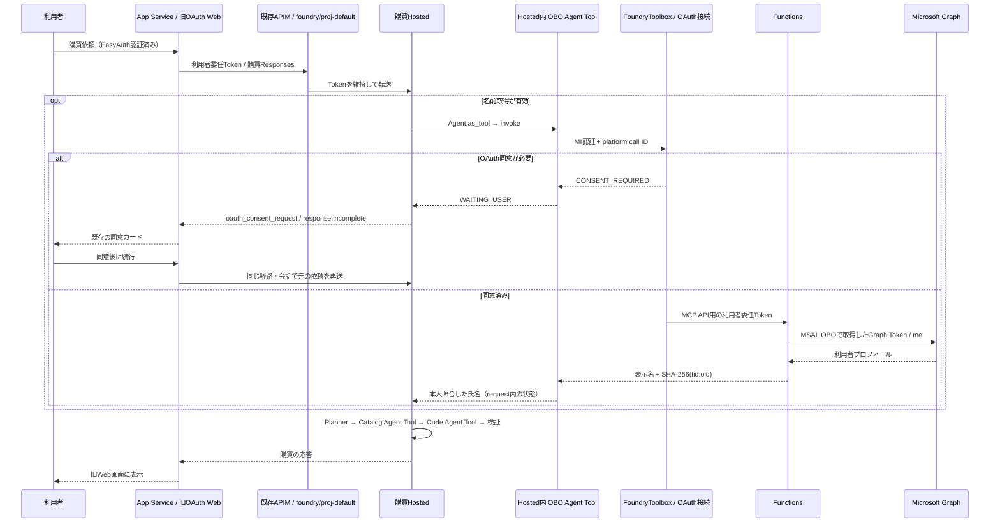

# OAuth Web復帰・Hosted内OBO Agent Tool 組み込みガイド

> 2026-09-12追加: Webの名前取得用metadataを削除し、メールのuser.id baggageと診断UIを追加しました。現行仕様とHostedの実装結果は[整理案](hosted-simplification-proposal-20260912.md)を参照してください。以下の旧OBO有効化契約は過去の記録です。

> 2026-09-12: WebAppの認証・通信を分割し、旧購買専用UIを削除しました。Webの最新のファイル構成・OTel仕様・配布手順は[WebApp README](../../../src/webapp-foundry-oauth/README.md)を参照してください。以下に残る旧Webパス・行番号・過去の検証件数は当時の記録です。

更新日: 2026-09-08。対象は現在の作業ツリーと配布済みHosted v33／OAuth Web／OBO Functions。本書はOAuth/OBO連携の実装詳細です。コンポーネント別の全体対応は[統合ガイド](../../observability-integration/README.md)、最新行番号とhashは[ソース索引](source-map.md)、Azureの実設定は[設定資料](../../deployment/configuration.md)を参照してください。

## 1. 今回の構成



追加のOBO用APIM APIは作りません。Webからの接続先は購買Hostedだけです。既存の遠隔OBO Agentインスタンスをそのまま `FoundryAgent.as_tool()` で呼ぶ構成ではありません。既存OBO Hosted sampleの **FoundryToolbox方式を再利用した専用Agent** を購買Hostedの内部に組み込みます。

Graph /meを呼ぶだけの専用Agentは、固定した処理を実行する `DeterministicChatClient` を使用します。LLMに利用者名を生成・抽出させません。名前取得を省略・失敗したturnでは氏名は `null` となり、以前の氏名を引き継ぎません。

## 2. 認証の区別

| 境界 | 使用する認証・情報 | 設定場所 |
|---|---|---|
| Browser → Web | EasyAuth cookie、EasyAuthが付与したtid/oid | App Service authsettingsV2 |
| Web → APIM → Hosted | Foundry利用者委任Token。既定はEasyAuth refresh tokenから取得 | `server._build_outbound_headers()` |
| Hosted → Toolbox | HostedのAzure credential＋`x-agent-foundry-call-id` | `FoundryToolbox` のSDK実装 |
| Toolbox → Functions | OAuth connectionが保管・取得するMCP API用Token | 新project connection `procurement-whoami` |
| Functions → Entra → Graph | 受信Tokenをuser_assertionとするMSAL OBO。client secretは既存App B | `acquire_graph_token_via_obo()` |
| 観測用利用者ID | SHA-256(lower(tid) + ':' + lower(oid)) | Web、Functions |

App Service MIにFoundry権限を付けるだけでは、利用者のOBOコンテキストは作られません。OBOを有効にする標準構成では利用者委任Tokenを入口に使います。利用者にも対象Foundry projectの実行権限が必要です。MI実行を選ぶ場合は `IDENTITY_LOOKUP_ENABLED=false` とし、新規会話を使用します。

`x-agent-foundry-call-id` はprotocol 2.0でプラットフォームが供給する不透明な識別子です。生のTokenをmetadata、Tool引数、prompt、baggageへ入れて代替しません。観測用hashは認証Tokenの代用品ではなく、Graph結果とWeb利用者の取り違えを検出するためにも使用します。

EntraアプリはResource Groupに所属しません。既存App B/Cは再利用し、App Cのredirect URIは新connection分を追加します。既存URIやcredentialは削除しません。今回のFunctionsはclient secret方式であり、FIC方式ではありません。

## 3. HostedAgentの組み込み箇所

| 用途 | ソース・関数 | 移植時に組み込む内容 |
|---|---|---|
| 依存ライブラリ | `requirements.txt`, `requirements-lock.txt` | Agent Framework/Foundry hosting、OTelの固定バージョン。追加pipパッケージは不要 |
| OTel初期化 | `hosted_app.main()` → `observability.configure_host_observability()` | SDK既定のProvider/exporterを初期化し、MCP例外内容の除去processorを追加 |
| アプリSpan | `observability.TelemetryRecorder.for_hosted_runtime()` | SDKが構成したglobal Providerを使用。Providerを別途作らない |
| OBO Agent Tool | `identity.build_identity_tool()` | 専用Agent作成、`Agent.as_tool(name="obo_identity_agent", propagate_session=False)` |
| OBO実行 | `identity.invoke_identity()` | 固定taskで `tool.invoke(arguments=..., context=...)`。購買の履歴・promptを渡さない |
| Toolbox接続 | `identity.build_identity_tool()` 内 `lookup()` | requestごとにToolboxを作成・close。MCP sessionや非同期taskの利用者コンテキストを共有しない |
| whoami実行 | 同上 | `toolbox.functions` の公開Toolを選び、その `FunctionTool.invoke()` を実行。SDKが保持するremote名とMCP metadataを使用 |
| Tool結果 | `identity.parse_whoami_result()` | MCP structuredContent優先、FastMCPのresult wrapperを正規化。textとの二重表現を処理 |
| 本人照合 | `identity.verified_name()` | `whoami`/`obo`/subjectHash/氏名を検査。要約文やEasyAuth表示名へfallbackしない |
| 同意bridge | `hosted_app.ProcurementResponsesHostServer._handle_response()` | Controllerの前にOBOを実行し、同意要求をnative Responses item＋incompleteとして返す |
| 相関metadata | `hosted_app._RequestCorrelationMiddleware` | hash、case、turn、Web trace ID、lookupフラグの取り込み |
| 名前・省略の反映 | `hosted._execute_hosted_components()` | SUCCESSで氏名設定、SKIPPED/FAILEDで氏名とsourceを消去 |
| nullableの業務契約 | `models.py`, `session_state.py`, `controller.py` | applicant_nameをnullableにし、購買準備完了条件から氏名を外す |

### 呼び出し順

1. `ProcurementResponsesHostServer` が `obo_identity_agent` を呼ぶ（有効時のみ）。
2. 同意が必要なら、この時点で応答を一時停止。Planner/Catalog/Codeはまだ動かない。
3. 取得済み・省略・失敗なら `ResponsesHostServer` の通常処理へ進む。
4. `ControllerContextProvider.before_run()` → `_execute_hosted_components()` でintake/planを作る。
5. ControllerがCatalog、Codeを順番に `tool.invoke()` で呼び、結果をmerge/validateする。
6. parentの決定的な応答clientがControllerの結果を返す。

Tool配列への登録順だけでは実行順は決まりません。OBOはprotocol adapter、Catalog/CodeはControllerが順序を制御します。Catalog/Codeの `FoundryAgent.as_tool(..., propagate_session=False)` と既存バージョン参照は維持します。

2026-09-08のAzure実測では、MCP Toolの公開名は `whoami_func___whoami` でした。ドット区切りの `whoami_func.whoami` を固定して `call_tool()` すると `-32602` で失敗しました。公開一覧からwhoamiのFunctionToolを選ぶことで、実際のremote名と `tools/list` のmetadataを維持します。実測の3個のアンダースコア形式と、公式資料のドット形式を実SDKの回帰テストで確認しています。

### OTelで記録する部分

既存の `plan.create`、`plan.step.execute`、`merge.validate` 等に加え、OBO全体に `identity.lookup` を追加します。Agent/Function/MCPの標準SpanはFrameworkが生成します。成功・失敗・同意待ちを `app.identity.lookup.status` に記録し、氏名・Token・Tool本文は記録しません。

接続失敗は `app.identity.error.stage`（connect/call/verify）、`app.identity.error.type`、`app.identity.error.rpc_code` で区別します。Toolの公開件数・公開名も診断属性として記録します。Tool名は対象Toolboxの構成情報であり、引数・結果・OAuth URLは記録しません。

GenAI contentを無効化してもSDKのMCP例外にはOAuth URLが含まれ得ます。`McpPrivacyProcessor` は固定したOTel SDK 1.43の `_on_ending` hookで、MCP Spanの例外message/stacktraceとstatus descriptionをexport前に除去します。例外型・error status・時間・IDは維持します。SDK更新時はこのhookとResponses同意bridgeの契約テストを実施します。

## 4. App Serviceの組み込み箇所

| 用途 | ソース・関数 | 今回の変更 |
|---|---|---|
| 起動 | `startup.sh` | `uvicorn server:app --workers 1` へ復帰 |
| 依存ライブラリ | ルート `requirements.txt`、backendの同名ファイル | MSAL/dotenvを追加。ASGI/HTTPX/Azure MonitorのOTel依存を維持。backendはルートを参照 |
| OTel初期化 | `backend/telemetry.py` の `lifespan()` | workerごとにProvider・Azure Monitor exporterを1回構成 |
| HTTP Span | `Instrumentation`, `http_client()` | ASGIおよび実際に作成した各HTTPX clientを計装 |
| 利用者ID | `server._get_request_user()` | EasyAuth tid/oidからhash。job/stateの所有者確認にも使用 |
| Browser境界 | `telemetry.BrowserBoundary`, `authenticated_api` | Browserからのtrace/baggageを破棄、認証とOrigin確認 |
| 委任Token | `server._build_outbound_headers()` | refresh/OBO/forwardで取得後、aud/tid/oid/scpを照合。TokenはHTTPヘッダーのみ |
| Web処理Span | `procurement_flow.run()` | `web.chat.job`, `auth.foundry.token`, `procurement.agent.invoke` |
| Hosted呼び出し | 同上 | 購買接続先1つ、Foundry Conversationを使用。名前・profileの取得や受け渡しはWebで行わない |
| 同意後の再開 | `server._stream_response()`, `/api/continue` | native `response.incomplete`＋consentをpauseとして保存。元の依頼を同じconversationへ再送 |
| パッケージ | `scripts/package-procurement.py` | server/flow/telemetryと元のHTML/JS/CSSだけをZIP化 |

HTML/JS/CSSは元のOAuth版をそのまま使用します。購買専用の `backend/procurement.py` と `procurement.*` UIは参考用に残しますが、このZIPには含めません。

APIは既存のjob/SSE形式です。`POST /api/chat` の `lookupApplicant` は任意で、省略時は環境設定を使います。`POST /api/continue` の `skipIdentity=true` で同意待ちを省略できます。Browserから氏名を指定するAPIはありません。Webの委任Token取得失敗では呼び出しを失敗とし、別主体のMIへ切り替えて同じconversationを再利用しません。

Webからのmetadataは `app.user.id`、`test.case.id`、`app.turn.number`、`app.web.trace_id`、`app.identity.lookup` です。表示名はHosted内のrequest状態からControllerへ渡します。

## 5. Functionsの組み込み箇所

| 用途 | ソース・関数 | 組み込み内容 |
|---|---|---|
| 依存ライブラリ | `src/functions-mcp-selfhosted/requirements.txt` | OTel SDK 1.43、Azure Monitor exporterを追加 |
| 初期化 | `mcp_telemetry.py` module初期化 | workerごとにProvider/exporterを1回構成。service.name=`procurement-obo-functions` |
| MCP相関 | `carrier_from_mcp()` | MCP request metadataのtraceparentを検査して使用 |
| MCP処理 | `create_mcp_server.whoami()` | `mcp.whoami` Span。業務結果を最小化して返す |
| OBO処理 | `build_whoami_response()` → `acquire_graph_token_via_obo()` | `auth.obo.exchange` Span、成否記録 |
| Graph処理 | `build_whoami_response()` → `call_graph_api()` | `graph.me` Span、成否記録 |
| 本人確認 | `build_whoami_response()` | inbound oidとGraph idが必須かつ一致。結果にはhashと表示名を返す |
| 結果属性 | `record_outcome()` | 成否と検証済みhashをSpan属性に付与 |
| 配布 | `deploy-functions-zip.sh`, `deploy-functions-zip.ps1` | `mcp_telemetry.py` を追加。秘密値を含むinfra/outputsは除外 |

Foundryの管理境界でtraceparentが伝播しない場合、単一Traceが成立したと判断してはいけません。`user.id`、時刻、case/response IDと実際のSpanを照合して評価します。Functions内のProvider初期化とSpan生成を追加したことと、Azure上で全境界の伝播を確認したことは別です。

## 6. 配備先と設定

Subscription: `d96eb8c2-2deb-4ed5-8cf2-f9fb178cb3ee`

Resource Group: `rg-ms-foundry-observability-verify`

| 対象 | リソース |
|---|---|
| Web | `web-procurement-observe-nkjm` |
| 購買Hosted | `observability-verify / proj-default / procurement-parent-agent` |
| APIM | `apim-procurement-stream-nkjm`、既存 `/foundry/proj-default` |
| Functions | `func-procurement-obo-nkjm` |
| Functions Plan | `func-procurement-obo-nkjm-plan`、Flex Consumption |
| Functions Storage | `stprocurementobonkjm` |
| OAuth connection | `procurement-whoami` |
| Toolbox | `procurement-identity-toolbox` v1、Functionsのwhoamiのみ。Azure公開名は `whoami_func___whoami` |
| Application Insights | `web-procurement-observe-nkjm-insights`へ集約 |

Webの設定例は `src/webapp-foundry-oauth/.env.example`。`FOUNDRY_USER_AUTH_MODE=refresh_token`、`IDENTITY_LOOKUP_ENABLED=true`、`FOUNDRY_TOKEN_SCOPES=https://ai.azure.com/.default` を使用します。EasyAuth tokenStoreとoffline_accessを有効にし、Web用EntraアプリへFoundryの委任scopeを追加します。

Hostedへ `PROCUREMENT_IDENTITY_TOOLBOX_ENDPOINT` を追加します。`scripts/deploy_foundry.py` が検証済みのidentity manifestから同じproject内のToolbox endpointを読み込み、ZIP新バージョンへ設定します。

Hosted実行identityにも対象projectで `Foundry User` を付与します。最終配備v33のprincipal `80a1bbc5-c4b4-49da-b78e-b817696fe464` にprojectスコープで付与済みです。

`scripts/deploy_identity.py functions` は既存Functionsから許可したOBO設定だけを秘密値非表示でコピーし、connection/Toolboxを作成します。`web` はWeb認証と既存APIM policyだけを更新します。APIMは署名・tenant・audienceを検証した後、Web MIか、Web用clientが取得したuser_impersonation付き委任Tokenだけを許可します。基盤全体のBicep再適用は不要です。

### Webの依存パッケージ同梱ZIP

今回のWeb配布ではOryxのvenv作成中にKuduが再起動したため、Python 3.13/Linuxの依存を同梱する方式に切り替えました。HostedとFunctionsは引き続きremote buildです。

```bash
uv pip install --python .venv/bin/python --target /tmp/procurement-web-vendor --only-binary :all: -r src/webapp-foundry-oauth/requirements.txt
python src/webapp-foundry-oauth/scripts/package-procurement.py /tmp/procurement-web.zip --vendor /tmp/procurement-web-vendor
```

Webの `SCM_DO_BUILD_DURING_DEPLOYMENT=false`、`ENABLE_ORYX_BUILD=false` と組み合わせます。Bicepは `webRemoteBuild=false` が既定です。`startup.sh` は `.python_packages/lib/site-packages` を読み込みます。同梱する依存の実体でもWeb回帰22件と2 subtestsを検証しました。zipの生成先には未使用のpathを指定します。

## 7. 検証と制約

ローカル検証は `tests/unit/test_identity_tool.py`、`test_obo_functions.py`、`test_oauth_procurement.py` と既存全体回帰を使用します。本人不一致、未取得、同意待ちと再開、同時turn拒否、他人のjob参照拒否、Browser偽装metadata、Token主体不一致、MCP二重表現、SDK同意例外のexport前除去を検証します。

Webのjobと再開情報は1workerのメモリ内です。再起動・再配布後は新しい会話を使います。永続化や複数workerへの拡張は今回の範囲に含めません。OAuth同意の実行は利用者のサインインが必要です。リソースの配備成功だけでは利用者の同意・Graph結果の取得成功を確認したことになりません。

配備バージョン・パッケージhash・Azure実行結果は `.foundry/agent-metadata.yaml` と `.local_state/deployment/identity-deployment.json`、[2026-09-08検証記録](../../report/validation-results-2026-09-08-obo.md) に記録します。

## 8. 公式仕様

- [Hosted AgentsとToolbox](https://learn.microsoft.com/en-us/azure/foundry/agents/concepts/hosted-agents)
- [Toolboxの作成とHosted統合](https://learn.microsoft.com/en-us/azure/foundry/agents/how-to/tools/toolbox)
- [MCPのOAuth認証](https://learn.microsoft.com/en-us/azure/foundry/agents/how-to/mcp-authentication)

統合ガイドと本書の関数単位で移植します。最新の行番号・依存・hashはソース索引で確認します。移植先の具体的なpathやSDKは、実際のsampleを確認して対応付けてください。

## 9. 実装ソースへのリンク

- [Hosted依存](../../../requirements.txt)
- [Hosted環境・Agent組立・Controller](../../../src/hosted-agent/procurement_agent/hosted.py)
- [OBO Agent Tool・MCP結果・本人照合](../../../src/hosted-agent/procurement_agent/identity.py)
- [HostedのOAuth同意bridge・metadata](../../../src/hosted-agent/procurement_agent/hosted_app.py)
- [Hosted OTel・機密例外除去](../../../src/hosted-agent/procurement_agent/observability.py)
- [Web依存](../../../src/webapp-foundry-oauth/requirements.txt)
- [Web認証・利用者ID・SSE・API](../../../src/webapp-foundry-oauth/backend/server.py)
- [Web単一接続先への実行](../../../src/webapp-foundry-oauth/backend/procurement_flow.py)
- [Web OTel](../../../src/webapp-foundry-oauth/backend/telemetry.py)
- [Functions依存](../../../src/functions-mcp-selfhosted/requirements.txt)
- [Functions MCP・OBO・Graph](../../../src/functions-mcp-selfhosted/mcp_server.py)
- [Functions OTel](../../../src/functions-mcp-selfhosted/mcp_telemetry.py)
- [既存APIM policy](../../../infra/apim-foundry-policy.xml)
- [OBO配備スクリプト](../../../scripts/deploy_identity.py)
